# 前言

2020版多线程与高并发

各位同学，大家好，这是首次使用比较口语化的文字形成一本书，其实也不知道效果如何，希望各位收到书本后能够多提意见和建议。同时也请大家体谅，由于时间关系和忙碌程度，暂时只能总结成为口语化的形式，后面时间充裕了，将会以书面语言的方式进行重新更新。

去年讲了一版多线程与高并发，今年又讲了很多次的公开课，发现了很多大家的问题点，结合着大家伙儿的问题，今年我又开始讲2020版的课程。

我发现大家对于多线程的理解不到位的很多地方的原因，是因为对于底层知识的不明确，比如CPU，内存，操作系统，线程，线程调度器，这些东西到底是如何配合工作的，因此，在这一版里，我会尝试带大家从最底层的角度开始理解线程。

首先我们从CPU开始

# 线程的基本概念

之前的硬件，只有一个CPU

之前的OS，只运行一个进程

随着多核CPU的出现，人们开始追求对CPU效率的极致压榨

多线程的程序随之诞生，但随之诞生的，也是非常难以应对的各种并发bug

## 进程 线程

1. 什么是进程：资源分配的基本单位（静态概念）
2. 什么是线程：资源调度的基本单位（动态概念）
   通俗说：一个程序中不同的执行路径

**示例：什么叫做线程**

```java
package com.mashibing.juc.c_000;

import java.util.concurrent.TimeUnit;

public class T01_WhatIsThread {
    private static class T1 extends Thread {
        @Override
        public void run() {
           for(int i=0; i<10; i++) {
               try {
                   TimeUnit.MICROSECONDS.sleep(1);
               } catch (InterruptedException e) {
                   e.printStackTrace();
               }
               System.out.println("T1");
           }
        }
    }

    public static void main(String[] args) {
        //new T1().run();
        new T1().start();
        for(int i=0; i<10; i++) {
            try {
                TimeUnit.MICROSECONDS.sleep(1);
            } catch (InterruptedException e) {
                e.printStackTrace();
            }
            System.out.println("main");
        }

    }
}

```

 观察上面程序的数据结果，你会看到字符串“T1”和“Main”的交替输出，这就是程序中有两条不同的执行路径在交叉执行，这就是直观概念上的线程，概念性的东西，理解就好，没有必要咬文嚼字的去背文字的定义。


## 为什么要写多线程程序

为了压榨CPU，提高资源利用率


# 启动线程的5种方法

1. new MyThread().start()
2. new Thread(r).start()
3. new Thread(lamda).start()
4. ThreadPool
5. Future Callable and FutureTask

# 常见线程方法

**我们来认识几个线程的方法**

sleep() yield() join() 

```java
package com.mashibing.juc.c_000;

public class T03_Sleep_Yield_Join {
    public static void main(String[] args) {
					//testSleep();
					//testYield();
        testJoin();
    } 
		/*Sleep,意思就是睡眠，当前线程暂停一段时间让给别的线程去运行。Sleep是怎么复活的？由你的睡眠时间而定，等睡眠到规定的时间自动复活*/
    static void testSleep() {
        new Thread(()->{
            for(int i=0; i<100; i++) {
                System.out.println("A" + i);
                try {
                    Thread.sleep(500);
                    //TimeUnit.Milliseconds.sleep(500)
                } catch (InterruptedException e) {
                    e.printStackTrace();
                }
            }
        }).start();
    }
		/*Yield,就是当前线程正在执行的时候停止下来进入等待队列（就绪状态，CPU依然有可能把这个线程拿出来运行），回到等待队列里在系统的调度算法里头呢还是依然有可能把你刚回去的这个线程拿回来继续执行，当然，更大的可能性是把原来等待的那些拿出一个来执行，所以yield的意思是我让出一下CPU，后面你们能不能抢到那我不管*/
    static void testYield() {
        new Thread(()->{
            for(int i=0; i<100; i++) {
                System.out.println("A" + i);
                if(i%10 == 0) Thread.yield();


            }
        }).start();

        new Thread(()->{
            for(int i=0; i<100; i++) {
                System.out.println("------------B" + i);
                if(i%10 == 0) Thread.yield();
            }
        }).start();
    }
		/*join， 意思就是在自己当前线程加入你调用Join的线程（），本线程等待。等调用的线程运行完了，自己再去执行。t1和t2两个线程，在t1的某个点上调用了t2.join,它会跑到t2去运行，t1等待t2运行完毕继续t1运行（自己join自己没有意义） */
    static void testJoin() {
        Thread t1 = new Thread(()->{
            for(int i=0; i<100; i++) {
                System.out.println("A" + i);
                try {
                    Thread.sleep(500);
                    //TimeUnit.Milliseconds.sleep(500)
                } catch (InterruptedException e) {
                    e.printStackTrace();
                }
            }
        });

        Thread t2 = new Thread(()->{

            try {
                t1.join();
            } catch (InterruptedException e) {
                e.printStackTrace();
            }

            for(int i=0; i<100; i++) {
                System.out.println("A" + i);
                try {
                    Thread.sleep(500);
                    //TimeUnit.Milliseconds.sleep(500)
                } catch (InterruptedException e) {
                    e.printStackTrace();
                }
            }
        });

        t1.start();
        t2.start();
    }
}

```


# 线程的状态

**小节说明：**

* 本节重要程度：中 （帮助理解线程问题，保障知识完整性，面试很少考）  
* 本节难度：低

**JAVA的6中线程状态:**

1. NEW ：                    线程刚刚创建，还没有启动
2. RUNNABLE ：         可运行状态，由线程调度器可以安排执行
   * 包括READY和RUNNING两种细分状态
3. WAITING：              等待被唤醒
4. TIMED WAITING： 隔一段时间后自动唤醒
5. BLOCKED：            被阻塞，正在等待锁
6. TERMINATED：      线程结束

**如下图：**


线程状态测试代码：

```java
package com.mashibing.juc.c_000_threadbasic;

import com.mashibing.util.SleepHelper;

import java.util.concurrent.TimeUnit;
import java.util.concurrent.locks.LockSupport;

/**
 * title:${file_name}
 * 关于线程状态的实验
 * @author  http://www.mashibing.com
 * @date ${date}
 * @version 2.0
 */

public class T04_ThreadState {

    static class MyThread extends Thread {
        @Override
        public void run() {
            System.out.println("2: " + this.getState());

            for (int i = 0; i < 10; i++) {
                try {
                    Thread.sleep(100);
                } catch (InterruptedException e) {
                    e.printStackTrace();
                }
                System.out.print(i + " ");
            }
            System.out.println();
        }
    }

    public static void main(String[] args) throws Exception {
        Thread t1 = new MyThread();
        System.out.println("1: " + t1.getState());
        t1.start();
        t1.join();
        System.out.println("3: " + t1.getState());

        Thread t2 = new Thread(() -> {
            try {
                LockSupport.park();
                System.out.println("t2 go on!");
                TimeUnit.SECONDS.sleep(5);

            } catch (InterruptedException e) {
                e.printStackTrace();
            }
        });

        t2.start();
        TimeUnit.SECONDS.sleep(1);
        System.out.println("4: " + t2.getState());

        LockSupport.unpark(t2);
        TimeUnit.SECONDS.sleep(1);
        System.out.println("5: " + t2.getState());

        final Object o = new Object();
        Thread t3 = new Thread(()->{
            synchronized (o) {
                System.out.println("t3 得到了锁 o");
            }
        });

        new Thread(()-> {
            synchronized (o) {
                SleepHelper.sleepSeconds(5);
            }
        }).start();

        SleepHelper.sleepSeconds(1);

        t3.start();
        SleepHelper.sleepSeconds(1);
        System.out.println("6: " + t3.getState());

    }
}
```

# 线程的打断(interrupt)

**小节说明：**

重要程度：中（面试不多）

小节难度：低

### interrupt相关的三个方法：

```java
//Thread.java  
public void interrupt()            //t.interrupt() 打断t线程（设置t线程某给标志位f=true，并不是打断线程的运行）
public boolean isInterrupted()     //t.isInterrupted() 查询打断标志位是否被设置（是不是曾经被打断过）
public static boolean interrupted()//Thread.interrupted() 查看“当前”线程是否被打断，如果被打断，恢复标志位
```

1. interrupt() ：实例方法，设置线程中断标志（打扰一下，你该处理一下中断）
2. isInterrupted()：实例方法，有没有人打扰我？
3. interrupted()：静态方法，有没有人打扰我（当前线程）？复位！

### interrupt和sleep() wait() join()

sleep()方法在睡眠的时候，不到时间是没有办法叫醒的，这个时候可以用interrupt设置标志位，然后呢必须得catch InterruptedException来进行处理，决定继续睡或者是别的逻辑，（自动进行中断标志复位）

### interrupt是否能中断正在竞争锁的线程

```java
package com.mashibing.juc.c_000_threadbasic;

import com.mashibing.util.SleepHelper;

/**
 * interrupt与sleep() wait() join()
 */
public class T09_Interrupt_and_sync {

    private static Object o = new Object();

    public static void main(String[] args) {
        Thread t1 = new Thread(()-> {
            synchronized (o) {
                SleepHelper.sleepSeconds(10);
            }
        });

        t1.start();

        SleepHelper.sleepSeconds(1);

        Thread t2 = new Thread(()-> {
            synchronized (o) {

            }
            System.out.println("t2 end!");
        });

        t2.start();

        t2.interrupt();
    }
}

```

interrupt()不能打断正在竞争锁的线程synchronized()

### 如果想打断正在竞争锁的线程，使用ReentrantLock的lockInterruptibly()

```java
package com.mashibing.juc.c_000_threadbasic;

import com.mashibing.util.SleepHelper;

import java.util.concurrent.locks.ReentrantLock;

/**
 * interrupt与lockInterruptibly()
 */
public class T11_Interrupt_and_lockInterruptibly {

    private static ReentrantLock lock = new ReentrantLock();

    public static void main(String[] args) {
        Thread t1 = new Thread(()-> {
            lock.lock();
            try {
                SleepHelper.sleepSeconds(10);
            } finally {
                lock.unlock();
            }
            System.out.println("t1 end!");
        });

        t1.start();

        SleepHelper.sleepSeconds(1);


        Thread t2 = new Thread(()-> {
            System.out.println("t2 start!");
            try {
                lock.lockInterruptibly();
            } catch (InterruptedException e) {
                e.printStackTrace();
            } finally {
                lock.unlock();
            }
            System.out.println("t2 end!");
        });

        t2.start();

        SleepHelper.sleepSeconds(1);
        
        t2.interrupt();

    }
}
```


# 优雅的结束线程

**小节说明：**

本节内容的重要程度：中（面试有可能被问）

小节难度：低

结束线程的方法：

1. 自然结束（能自然结束就尽量自然结束）
2. stop() suspend() resume()
3. volatile标志
   1. 不适合某些场景（比如还没有同步的时候，线程做了阻塞操作，没有办法循环回去）
   2. 打断时间也不是特别精确，比如一个阻塞容器，容量为5的时候结束生产者，
      但是，由于volatile同步线程标志位的时间控制不是很精确，有可能生产者还继续生产一段儿时间
4. interrupt() and isInterrupted（比较优雅）


# 线程组

（不重要，暂忽略。）

ThreadGroups - Thread groups are best viewed as an unsuccessful experiment , and you may simply ignore their existence! - Joshua Bloch  one of JDK designers

# 并发程序的特性

程序是什么？--> QQ.exe PowerPoint.exe

进程是什么？--> 程序启动 进入内存 资源分配的基本单位

线程是什么？--> 程序执行的基本单位

程序如何开始运行？--> CPU 读指令 - PC（存储指令地址） ，读数据 Register ，计算， 回写， -> 下一条

线程如何进行调度？--> linux 线程调度器（OS)操作系统

线程切换的概念是什么？--> Context Switch CPU保存现场 执行新线程，恢复现场，继续执行原线程这样的一个过程

## 线程的底层知识（可见性 有序性 原子性）

1. 线程的执行
2. 线程的调度（Context Switch）
   1. 一个核同一时刻，只能运行一个线程

**面试题：**

1. 是不是线程数越多，效率就越高？
2. 单个CPU设定多线程是否有意义？

## 可见性

### 线程间的可见性

**MESI**

多线程提高效率，本地缓存数据，造成数据修改不可见，

要想保证可见，要么触发同步指令，要么加上volatile，被修饰的内存，只要有修改，马上同步涉及到的每个线程

### 用volatile保障可见性

```java
/**
 * volatile 关键字，使一个变量在多个线程间可见
 * A B线程都用到一个变量，java默认是A线程中保留一份copy，这样如果B线程修改了该变量，则A线程未必知道
 * 使用volatile关键字，会让所有线程都会读到变量的修改值
 * 
 * 在下面的代码中，running是存在于堆内存的t对象中
 * 当线程t1开始运行的时候，会把running值从内存中读到t1线程的工作区，在运行过程中直接使用这个copy，并不会每次都去
 * 读取堆内存，这样，当主线程修改running的值之后，t1线程感知不到，所以不会停止运行
 * 
 * 使用volatile，将会强制所有线程都去堆内存中读取running的值
 * 
 * volatile并不能保证多个线程共同修改running变量时所带来的不一致问题，也就是说volatile不能替代synchronized
 *
 * @author mashibing
 */
package com.mashibing.juc.c_001_00_Visibility;

import com.mashibing.util.SleepHelper;

public class T01_HelloVolatile {
    private static volatile boolean running = true;

    private static void m() {
        System.out.println("m start");
        while (running) {
            //System.out.println("hello");
        }
        System.out.println("m end!");
    }

    public static void main(String[] args) {

        new Thread(T01_HelloVolatile::m, "t1").start();

        SleepHelper.sleepSeconds(1);

        running = false;
    }
}


```

### 缓存行对齐

* 缓存行对齐
  缓存行64个字节是CPU同步的基本单位，缓存行隔离会比伪共享效率要高
  Disruptor

* 认识缓存行对齐的编程技巧

  ```java
  package com.mashibing.juc.c_001_02_FalseSharing;
  
  import java.util.concurrent.CountDownLatch;
  
  public class T01_CacheLinePadding {
      public static long COUNT = 10_0000_0000L;
  
      private static class T {
          private long p1, p2, p3, p4, p5, p6, p7;
          public long x = 0L;
          private long p9, p10, p11, p12, p13, p14, p15;
      }
  
      public static T[] arr = new T[2];
  
      static {
          arr[0] = new T();
          arr[1] = new T();
      }
  
      public static void main(String[] args) throws Exception {
          CountDownLatch latch = new CountDownLatch(2);
  
          Thread t1 = new Thread(()->{
              for (long i = 0; i < COUNT; i++) {
                  arr[0].x = i;
              }
  
              latch.countDown();
          });
  
          Thread t2 = new Thread(()->{
              for (long i = 0; i < COUNT; i++) {
                  arr[1].x = i;
              }
  
              latch.countDown();
          });
  
          final long start = System.nanoTime();
          t1.start();
          t2.start();
          latch.await();
          System.out.println((System.nanoTime() - start)/100_0000);
      }
  }
  
  ```

  

* **需要注意，JDK8引入了@sun.misc.Contended注解，来保证缓存行隔离效果**
  要使用此注解，必须去掉限制参数：-XX:-RestrictContended

  ```java
  package com.mashibing.juc.c_001_02_FalseSharing;
  
  
  import sun.misc.Contended;
  //注意：运行这个小程序的时候，需要加参数：-XX:-RestrictContended
  import java.util.concurrent.CountDownLatch;
  
  public class T05_Contended {
      public static long COUNT = 10_0000_0000L;
  
  
      private static class T {
          @Contended  //只有1.8起作用 , 保证x位于单独一行中
          public long x = 0L;
      }
  
      public static T[] arr = new T[2];
  
      static {
          arr[0] = new T();
          arr[1] = new T();
      }
  
      public static void main(String[] args) throws Exception {
          CountDownLatch latch = new CountDownLatch(2);
  
          Thread t1 = new Thread(()->{
              for (long i = 0; i < COUNT; i++) {
                  arr[0].x = i;
              }
  
              latch.countDown();
          });
  
          Thread t2 = new Thread(()->{
              for (long i = 0; i < COUNT; i++) {
                  arr[1].x = i;
              }
  
              latch.countDown();
          });
  
          final long start = System.nanoTime();
          t1.start();
          t2.start();
          latch.await();
          System.out.println((System.nanoTime() - start)/100_0000);
      }
  }
  
  ```

  

* 

* 伪共享

## 有序性

### CPU的乱序执行

Disorder这个程序，证明乱序执行的确存在

为什么会乱序？主要是为了提高效率


### 线程的as-if-serial

单个线程，两条语句，未必是按顺序执行

单线程的重排序，必须保证最终一致性

as-if-serial：看上去像是序列化（单线程）

### 会产生的后果

多线程会产生不希望看到的结果

### 哪些指令可以互换顺序

hanppens-before原则（JVM规定重排序必须遵守的规则）

JLS17.4.5 （不需要记住）


•程序次序规则：同一个线程内，按照代码出现的顺序，前面的代码先行于后面的代码，准确的说是控制流顺序，因为要考虑到分支和循环结构。

•管程锁定规则：一个unlock操作先行发生于后面（时间上）对同一个锁的lock操作。

•**volatile变量规则：对一个volatile变量的写操作先行发生于后面（时间上）对这个变量的读操作。** 

•线程启动规则：Thread的start( )方法先行发生于这个线程的每一个操作。 

•线程终止规则：线程的所有操作都先行于此线程的终止检测。可以通过Thread.join( )方法结束、Thread.isAlive( )的返回值等手段检测线程的终止。 

•线程中断规则：对线程interrupt( )方法的调用先行发生于被中断线程的代码检测到中断事件的发生，可以通过Thread.interrupt( )方法检测线程是否中断 

•对象终结规则：一个对象的初始化完成先行于发生它的finalize()方法的开始。

•传递性：如果操作A先行于操作B，操作B先行于操作C，那么操作A先行于操作C

### 使用内存屏障阻止乱序执行

内存屏障是特殊指令：看到这种指令，前面的必须执行完，后面的才能执行

intel : lfence sfence mfence(CPU特有指令)

### JVM中的内存屏障

所有实现JVM规范的虚拟机，必须实现四个屏障

LoadLoadBarrier  LoadStore SL SS

### volatile的底层实现

volatile修饰的内存，不可以重排序，对volatile修饰变量的读写访问，都不可以换顺序


1: volatile i

2: ACC_VOLATILE

3: JVM的内存屏障

​	屏障两边的指令不可以重排！保障有序！

​    happends-before 

​    as - if - serial

4：hotspot实现

bytecodeinterpreter.cpp

```c++
int field_offset = cache->f2_as_index();
          if (cache->is_volatile()) {
            if (support_IRIW_for_not_multiple_copy_atomic_cpu) {
              OrderAccess::fence();
            }
```

orderaccess_linux_x86.inline.hpp

```c++
inline void OrderAccess::fence() {
  if (os::is_MP()) {
    // always use locked addl since mfence is sometimes expensive
#ifdef AMD64
    __asm__ volatile ("lock; addl $0,0(%%rsp)" : : : "cc", "memory");
#else
    __asm__ volatile ("lock; addl $0,0(%%esp)" : : : "cc", "memory");
#endif
  }
}
```

> **LOCK 用于在多处理器中执行指令时对共享内存的独占使用。
> 它的作用是能够将当前处理器对应缓存的内容刷新到内存，并使其他处理器对应的缓存失效。**
> **另外还提供了有序的指令无法越过这个内存屏障的作用。**

### 面试题

DCL单例要不要加volatile？


## 原子性

### 线程的原子性

从一个简单的小程序谈起：

```java
package com.mashibing.juc.c_001_sync_basics;

import java.util.concurrent.CountDownLatch;

public class T00_IPlusPlus {
    private static long n = 0L;

    public static void main(String[] args) throws Exception {

        Thread[] threads = new Thread[100];
        CountDownLatch latch = new CountDownLatch(threads.length);

        for (int i = 0; i < threads.length; i++) {
            threads[i] = new Thread(() -> {
                for (int j = 0; j < 10000; j++) {
                    //synchronized (T00_IPlusPlus.class) {
                    n++;
                    //}
                }
                latch.countDown();
            });
        }

        for (Thread t : threads) {
            t.start();
        }

        latch.await();

        System.out.println(n);

    }
}
```

**一些基本概念**


race condition => 竞争条件 ， 指的是多个线程访问共享数据的时候产生竞争

数据的不一致（unconsistency)，并发访问之下产生的不期望出现的结果

如何保障数据一致呢？--> 线程同步（线程执行的顺序安排好），

monitor （管程） ---> 锁

critical section -> 临界区

如果临界区执行时间长，语句多，叫做 锁的粒度比较粗，反之，就是锁的粒度比较细


具体： 保障操作的原子性（Atomicity)

1. 悲观的认为这个操作会被别的线程打断（悲观锁）synchronized（上一个小程序）

2. 乐观的认为这个做不会被别的线程打断（乐观锁 自旋锁 无锁）cas操作
   CAS = Compare And Set/Swap/Exchange

   ```java
   /**
    * 解决同样的问题的更高效的方法，使用AtomXXX类
    * AtomXXX类本身方法都是原子性的，但不能保证多个方法连续调用是原子性的
    * @author mashibing
    */
   package com.mashibing.juc.c_018_00_AtomicXXX;
   
   import java.util.ArrayList;
   import java.util.List;
   import java.util.concurrent.atomic.AtomicInteger;
   
   
   public class T01_AtomicInteger {
   	/*volatile*/ //int count1 = 0;
   	
   	AtomicInteger count = new AtomicInteger(0);
   
   	/* synchronized */void m() {
   		for (int i = 0; i < 10000; i++)
   			//if count1.get() < 1000
   			count.incrementAndGet(); //count1++
   	}
   
   	public static void main(String[] args) {
   		T01_AtomicInteger t = new T01_AtomicInteger();
   
   		List<Thread> threads = new ArrayList<Thread>();
   
   		for (int i = 0; i < 100; i++) {
   			threads.add(new Thread(t::m, "thread-" + i));
   		}
   
   		threads.forEach((o) -> o.start());
   
   		threads.forEach((o) -> {
   			try {
   				o.join();
   			} catch (InterruptedException e) {
   				e.printStackTrace();
   			}
   		});
   
   		System.out.println(t.count);
   
   	}
   
   }
   
   ```

   

我们平时所说的"上锁"，一般指的是悲观锁

### 上锁的本质

上锁的本质是把并发编程序列化

```java
package com.mashibing.juc.c_001_sync_basics;

import com.mashibing.util.SleepHelper;

public class T00_01_WhatIsLock {
    private static Object o = new Object();

    public static void main(String[] args) {
        Runnable r = () -> {
            //synchronized (o) { //打开注释试试看，对比结果
                System.out.println(Thread.currentThread().getName() + " start!");
                SleepHelper.sleepSeconds(2);
                System.out.println(Thread.currentThread().getName() + " end!");
            //}
        };

        for (int i = 0; i < 3; i++) {
            new Thread(r).start();
        }
    }
}

```


同时保障可见性

注意序列化并非其他程序一直没机会执行，而是有可能会被调度，但是抢不到锁，又回到Blocked或者Waiting状态（sync锁升级）

一定是锁定同一把锁（抢一个坑位）


```java
package com.mashibing.juc.c_001_sync_basics;

import com.mashibing.util.SleepHelper;

public class T00_02_SingleLockVSMultiLock {
    private static Object o1 = new Object();
    private static Object o2 = new Object();
    private static Object o3 = new Object();

    public static void main(String[] args) {
        Runnable r1 = () -> {
            synchronized (o1) {
                System.out.println(Thread.currentThread().getName() + " start!");
                SleepHelper.sleepSeconds(2);
                System.out.println(Thread.currentThread().getName() + " end!");
            }
        };

        Runnable r2 = () -> {
            synchronized (o2) {
                System.out.println(Thread.currentThread().getName() + " start!");
                SleepHelper.sleepSeconds(2);
                System.out.println(Thread.currentThread().getName() + " end!");
            }
        };

        Runnable r3 = () -> {
            synchronized (o3) {
                System.out.println(Thread.currentThread().getName() + " start!");
                SleepHelper.sleepSeconds(2);
                System.out.println(Thread.currentThread().getName() + " end!");
            }
        };

        new Thread(r1).start();
        new Thread(r2).start();
        new Thread(r3).start();
    }
}

```


### 什么样的语句（指令）具备原子性？

CPU级别汇编，需要查询汇编手册！

Java中的8大原子操作：（了解即可，无需背过）

1. lock：主内存，标识变量为线程独占
2. unlock：主内存，解锁线程独占变量
3. read：主内存，读取内存到线程缓存（工作内存）
4. load：工作内存，read后的值放入线程本地变量副本
5. use：工作内存，传值给执行引擎
6. assign：工作内存，执行引擎结果赋值给线程本地变量
7. store：工作内存，存值到主内存给write备用
8. write：主内存，写变量值

### JVM中的两种锁

重量级锁（经过操作系统的调度）synchronized早期都是这种锁（目前的实现中升级到最后也是这种锁）

轻量级锁（CAS的实现，不经过OS调度）(无锁 - 自旋锁 - 乐观锁)


### CAS的深度剖析

CAS的ABA问题解决方案 - Version

CAS操作本身的原子性保障

AtomicInteger:

```java
public final int incrementAndGet() {
        for (;;) {
            int current = get();
            int next = current + 1;
            if (compareAndSet(current, next))
                return next;
        }
    }

public final boolean compareAndSet(int expect, int update) {
        return unsafe.compareAndSwapInt(this, valueOffset, expect, update);
    }
```

Unsafe:

```java
public final native boolean compareAndSwapInt(Object var1, long var2, int var4, int var5);
```

运用：

```java
package com.mashibing.jol;

import sun.misc.Unsafe;

import java.lang.reflect.Field;

public class T02_TestUnsafe {

    int i = 0;
    private static T02_TestUnsafe t = new T02_TestUnsafe();

    public static void main(String[] args) throws Exception {
        //Unsafe unsafe = Unsafe.getUnsafe();

        Field unsafeField = Unsafe.class.getDeclaredFields()[0];
        unsafeField.setAccessible(true);
        Unsafe unsafe = (Unsafe) unsafeField.get(null);

        Field f = T02_TestUnsafe.class.getDeclaredField("i");
        long offset = unsafe.objectFieldOffset(f);
        System.out.println(offset);

        boolean success = unsafe.compareAndSwapInt(t, offset, 0, 1);
        System.out.println(success);
        System.out.println(t.i);
        //unsafe.compareAndSwapInt()
    }
}
```

jdk8u: unsafe.cpp:

cmpxchg = compare and exchange set swap

```c++
UNSAFE_ENTRY(jboolean, Unsafe_CompareAndSwapInt(JNIEnv *env, jobject unsafe, jobject obj, jlong offset, jint e, jint x))
  UnsafeWrapper("Unsafe_CompareAndSwapInt");
  oop p = JNIHandles::resolve(obj);
  jint* addr = (jint *) index_oop_from_field_offset_long(p, offset);
  return (jint)(Atomic::cmpxchg(x, addr, e)) == e;
UNSAFE_END
```

jdk8u: atomic_linux_x86.inline.hpp **93行**

is_MP = Multi Processors  

```c++
inline jint     Atomic::cmpxchg    (jint     exchange_value, volatile jint*     dest, jint     compare_value) {
  int mp = os::is_MP();
  __asm__ volatile (LOCK_IF_MP(%4) "cmpxchgl %1,(%3)"
                    : "=a" (exchange_value)
                    : "r" (exchange_value), "a" (compare_value), "r" (dest), "r" (mp)
                    : "cc", "memory");
  return exchange_value;
}
```

jdk8u: os.hpp is_MP()

```c++
  static inline bool is_MP() {
    // During bootstrap if _processor_count is not yet initialized
    // we claim to be MP as that is safest. If any platform has a
    // stub generator that might be triggered in this phase and for
    // which being declared MP when in fact not, is a problem - then
    // the bootstrap routine for the stub generator needs to check
    // the processor count directly and leave the bootstrap routine
    // in place until called after initialization has ocurred.
    return (_processor_count != 1) || AssumeMP;
  }
```

jdk8u: atomic_linux_x86.inline.hpp

```c++
#define LOCK_IF_MP(mp) "cmp $0, " #mp "; je 1f; lock; 1: "
```

最终实现：

cmpxchg = cas修改变量值

```assembly
lock cmpxchg 指令
```

硬件：

lock指令在执行的时候视情况采用缓存锁或者总线锁


#### 两种锁的效率

不同的场景：

临界区执行时间比较长 ， 等的人很多 -> 重量级

时间短，等的人少 -> 自旋锁

### synchronized如何保障可见性


### JVM中的线程和OS线程对应关系

JVM 1:1 -> LOOM -> M:N (golang)


### synchronized锁升级过程

```
链接：https://pan.baidu.com/s

```

# JUC的五花八门的新锁（java util cocurrent）

**超级面试重灾区**

synchrnized wait notify (经典同步机制)

## AtomicXXX -> AtomicInteger Long AtomicReference AtomicStampedReference AtomicMarkableReference AtomicFieldUpdator ...

## ReentrantLock

部分场合替代synchronized

* 手工释放锁

  * 标准写法：

    ```java
    lock.lock();
    try {
        xxxxx
    } finally {
        lock.unlock();
    }
    ```

    

* 可以是公平锁

  * 公平锁：线程抢锁先排队
  * 非公平锁：线程到了就插队抢

* 可被打断的上锁过程

  * tryLock()
  * lockInterruptibly()

* 锁上面的队列可以指定任意数量

  * 区分了不同条件下的等待队列（Condition）
  * ABC ABC 问题

## Latch

门闩

## Semaphore 

信号量（n个线程的限流）

## CyclicBarrier

栅栏

## Phaser

阶段同步器

## LockSupport

替代wait notify

## Exchanger

同步交换器

## 新型同步锁的原理CAS + AQS + volatile 

CAS Comapre And Swap （自旋锁 乐观锁 JVM自身解决问题 不需要OS老大的调度）

AQS (Template Method) + Abtract Queued Synchronizer 


//新旧版本分隔处
======================================================================

=========================================================


# 面试题

## 哲学家就餐问题（The Dinning Philosophers Problem）


```java
package com.mashibing.juc.c_33_TheDinningPhilosophersProblem;

public class ChopStick {
}

```


```java
package com.mashibing.juc.c_33_TheDinningPhilosophersProblem;


import com.mashibing.util.SleepHelper;

public class T01_DeadLock {
    public static void main(String[] args) {
        ChopStick cs0 = new ChopStick();
        ChopStick cs1 = new ChopStick();
        ChopStick cs2 = new ChopStick();
        ChopStick cs3 = new ChopStick();
        ChopStick cs4 = new ChopStick();

        Philosohper p0 = new Philosohper("p0", 0, cs0, cs1);
        Philosohper p1 = new Philosohper("p1", 1, cs1, cs2);
        Philosohper p2 = new Philosohper("p2", 2, cs2, cs3);
        Philosohper p3 = new Philosohper("p3", 3, cs3, cs4);
        Philosohper p4 = new Philosohper("p4", 4, cs4, cs0);

        p0.start();
        p1.start();
        p2.start();
        p3.start();
        p4.start();

    }

    public static class Philosohper extends Thread {

        private ChopStick left, right;
        private int index;

        public Philosohper(String name, int index, ChopStick left, ChopStick right) {
            this.setName(name);
            this.index = index;
            this.left = left;
            this.right = right;
        }

        @Override
        public void run() {
                synchronized (left) {
                    SleepHelper.sleepSeconds(1+index);
                    synchronized (right) {
                        SleepHelper.sleepSeconds(1);
                    }
                }

        }

    }
}

```

解决方案：

```java
package com.mashibing.juc.c_33_TheDinningPhilosophersProblem;


import com.mashibing.util.SleepHelper;

public class T02_DeadLockOpen {
    public static void main(String[] args) {
        ChopStick cs0 = new ChopStick();
        ChopStick cs1 = new ChopStick();
        ChopStick cs2 = new ChopStick();
        ChopStick cs3 = new ChopStick();
        ChopStick cs4 = new ChopStick();

        Philosohper p0 = new Philosohper("p0", 0, cs0, cs1);
        Philosohper p1 = new Philosohper("p1", 1, cs1, cs2);
        Philosohper p2 = new Philosohper("p2", 2, cs2, cs3);
        Philosohper p3 = new Philosohper("p3", 3, cs3, cs4);
        Philosohper p4 = new Philosohper("p4", 4, cs4, cs0);

        p0.start();
        p1.start();
        p2.start();
        p3.start();
        p4.start();

    }

    public static class Philosohper extends Thread {

        private ChopStick left, right;
        private int index;

        public Philosohper(String name, int index, ChopStick left, ChopStick right) {
            this.setName(name);
            this.index = index;
            this.left = left;
            this.right = right;
        }

        @Override
        public void run() {
            if (index == 0) {
                synchronized (left) {
                    SleepHelper.sleepSeconds(1+index);
                    synchronized (right) {
                        SleepHelper.sleepSeconds(1);
                        System.out.println(index + " 吃完了！");
                    }
                }
            } else {
                synchronized (right) {
                    SleepHelper.sleepSeconds(1+index);
                    synchronized (left) {
                        SleepHelper.sleepSeconds(1);
                        System.out.println(index + " 吃完了！");
                    }
                }
            }
        }

    }
}

```


## 我们用到的语言中的锁与并发在底层是怎么实现的？


# 第一节：线程的基本概念

首先给大家交代一下我们2019年这个版本给大家讲哪些内容，这个版本主要之中在多线程和高并发这两大块，这两大块儿是现在面试问的越来越多，也是相对一个初级的程序员向中高级迈进的必须要踏过的一个坎儿。

多线程与高并发大概讲六大块

- 第一：**基本的概念**，从什么是线程开始
- 第二：**JUC同步工具**，就是各种同步锁
- 第三：**同步容器**
- 第四：**线程池**
- 第五：**高频面试加分项**的一些面试用的东西，包括纤程
- 第六：**Disruptor**，不知道有多少同学听说过这个框架的，这个框架它也是一个MQ框架（Message Queue）叫做消息队列，消息队列非常多，后面还会给大家讲Kafka、RabbitMQ，Redis等这些都是消息队列。Disruptor是目前大家公认的在单机环境上效率最高的、性能最快的MQ.


**基本概念**

我们先从线程的基本概念开始，给大家复习一下，不知道有多少同学是基础不太好，说什么是线程都不知道的，如果这样的话，花时间去补初级内容的课。


什么是叫一个进程？ 什么叫一个线程？ 

- Program app ->QQ.exe

  **进程：**做一个简单的解释，你的硬盘上有一个简单的程序，这个程序叫QQ.exe，这是一个程序，这个程序是一个静态的概念，它被扔在硬盘上也没人理他，但是当你双击它，弹出一个界面输入账号密码登录进去了，OK，这个时候叫做一个进程。进程相对于程序来说它是一个动态的概念

  **线程：**作为一个进程里面最小的执行单元它就叫一个线程，用简单的话讲一个程序里不同的执行路径就叫做一个线程


## 与线程中断相关的方法

1. 

### 线程中断与InterruptedException

(TODO)

**线程状态**

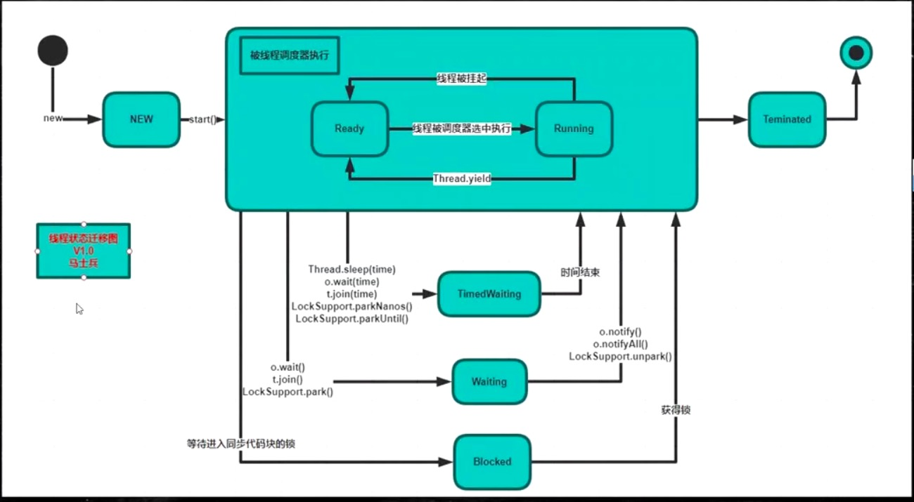

常见的线程状态有六种：

当我们new一个线程时，还没有调用start()该线程处于**新建状态**

线程对象调用 start（）方法时候，他会被线程调度器来执行，也就是交给操作系统来执行了，那么操作系统来执行的时候，这整个的状态叫Runnable，Runnable内部有两个状态**(1)Ready就绪状态**/**(2)Running运行状态**。就绪状态是说扔到CPU的等待队列里面去排队等待CPU运行，等真正扔到CPU上去运行的时候才叫Running运行状态。（调用yiled时候会从Running状态跑到Ready状态去，线程配调度器选中执行的时候又从Ready状态跑到Running状态去）

如果你线程顺利的执行完了就会进去**(3)Teminated结束状态**，（需要注意Teminated完了之后还可不可以回到new状态再调用start？这是不行的，完了这就是结束了） 

在Runnable这个状态里头还有其他一些状态的变迁**(4)TimedWaiting等待**、**(5)Waiting等待**、**(6)Blocked阻塞**，在同步代码块的情况就下没得到锁就会**阻塞状态**，获得锁的时候是就绪状态运行。在运行的时候如果调用了o.wait()、t.join()、LockSupport.park()进入**Waiting状态**，调用o.notify()、o.notifiAll()、LockSupport.unpark()就又回到Running状态。**TimedWaiting**按照时间等待，等时间结束自己就回去了，Thread.sleep(time)、o.wait(time)、t.jion(time)、LockSupport.parkNanos()、LockSupport.parkUntil()这些都是关于时间等待的方法。

**问题1：哪些是JVM管理的？哪些是操作系统管理的？**

上面这些状态全是由JVM管理的，因为JVM管理的时候也要通过操作系统，所以呢，那个是操作系统和那个是JVM他俩分不开，JVM是跑在操作系统上的一个普通程序

**问题2：线程什么状态时候会被挂起？挂起是否也是一个状态？**

Running的时候，在一个cpu上会跑很多个线程，cpu会隔一段时间执行这个线程一下，在隔一段时间执行那个线程一下，这个是cpu内部的一个调度，把这个状态线程扔出去，从running扔回去就叫线程被挂起，cpu控制它。

来看一下ThreadState这段代码

```java
package com.mashibing.juc.c_000;

public class T04_ThreadState {

    static class MyThread extends Thread {
        @Override
        public void run() {
            System.out.println(this.getState());

            for(int i=0; i<10; i++) {
                try {
                    Thread.sleep(500);
                } catch (InterruptedException e) {
                    e.printStackTrace();
                }

                System.out.println(i);
            }
        }
    }

    public static void main(String[] args) {
        Thread t = new MyThread();
				//怎么样得到这个线程的状态呢？就是通过getState()这个方法
        System.out.println(t.getState());//他是一个new状态

        t.start();//到这start完了之后呢是Runnable的状态

        try {
            t.join();
        } catch (InterruptedException e) {
            e.printStackTrace();
        }
					//然后join之后，结束了是一个Timenated状态
        System.out.println(t.getState());

    }
}

```


## synchronized

下面我们来讲synchronized关键字，有不少同学已经耳熟能详了，不过作为复习还是要复习一下。第一个是多个线程去访问同一个资源的时候对这个资源上锁。

为什么要上锁呢？访问某一段代码或者某临界资源的时候是需要有一把锁的概念在这儿的。


比如：我们对一个数字做递增，两个程序对它一块儿来做递增，递增就是把一个程序往上加1啊，如果两个线程共同访问的时候，第一个线程一读它是0，然后把它加1，在自己线程内部内存里面算还没有写回去的时候而第二个线程读到了它还是0，加1在写回去，本来加了两次，但还是1，那么我们在对这个数字递增的过程当中就上把锁，就是说第一个线程对这个数字访问的时候是独占的，不允许别的线程来访问，不允许别的线程来对它计算，我必须加完1收释放锁，其他线程才能对它继续加。

实质上，这把锁并不是对数字进行锁定的， 你可以任意指定，想锁谁就锁谁。


我第一个小程序是这么写的 ，如果说你想上了把锁之后才能对count进行减减访问，你可以new一个Object，所以这里锁定就是o，当我拿到这把锁的时候才能执行这段代码。是锁定的某一个对象，synchronized有一个锁升级的概念，我们一会儿会讲到

```java
/**
*synchronized关键字
*对某个对象加锁
*@author mashibing
*/
package com.mashibing.juc.c_001;

public class T {
	
	private int count = 10;
	private Object o = new Object();
	
	public void m() {
		synchronized(o) { //任何线程要想执行下面的代码，必须先拿到o的锁
			count--;
			System.out.println(Thread.currentThread().getName() + " count = " + count);
		}
	}
	
}
```

​       

我们来谈一下synchronized它的一些特性。如果说你每次都定义个一个锁的对象Object o 把它new出来那加锁的时候太麻烦每次都要new一个新的对象出来，所以呢，有一个简单的方式就是**synchronized(this)**锁定当前对象就行

```java
/**
 * synchronized关键字
 * 对某个对象加锁
 * @author mashibing
 */
package com.mashibing.juc.c_002;

public class T {
	
	private int count = 10;
	
	public void m() {
		synchronized(this) { ߳//任何线程想要执行那个下面的代码，必须先要拿到this的锁
      count--;
			System.out.println(Thread.currentThread().getName() + " count = " + count);
		}
	}
	
}
```

如果你要是锁定当前对象呢，你也可以写成如下方法。synchronized方法和synchronized(this)执行这段代码它是等值的

```java
package com.mashibing.juc.c_003;

public class T {

	private int count = 10;
	
	public synchronized void m() { //等同于在方法的代码执行时要synchronized(this)
		count--;
		System.out.println(Thread.currentThread().getName() + " count = " + count);
	}
}

```

我们知道静态方法static是没有this对象的，你不需要new出一个对象来就能执行这个方法，但如果这个这个上面加一个synchronized的话就代表synchronized(T.class)。这里这个synchronized(T.class)锁的就是T类的对象

```java
package com.mashibing.juc.c_004;

public class T {

	private static int count = 10;
	
	public synchronized static void m() { //这里等同于synchronized(T.class)
		count--;
		System.out.println(Thread.currentThread().getName() + " count = " + count);
	}
	
	public static void mm() {
		synchronized(T.class) { //考虑一下这里写synchronized(this)是否可以？
			count --;
		}
	}
}
```


**问题：T.class是单例的吗？**

一个class load到内存它是不是单例的，想想看。一般情况下是，如果是在同一个ClassLoader空间那它一定是。不是同一个类加载器就不是了，不同的类加载器互相之间也不能访问。所以说你能访问它，那他一定就是单例


下面程序：很有可能读不到别的线程修改过的内容，除了这点之外count减减完了之后下面的count输出和你减完的结果不对，很容易分析：如果有一个线程把它从10减到9了，然后又有一个线程在前面一个线程还没有输出呢进来了把9又减到了8，继续输出的8，而不是9。如果你想修正它，前面第一个是在上面加volatile，改了马上就能得到。

```java
/**
 * 分析一下这个程序的输出
 * @author mashibing
 */
package com.mashibing.juc.c_005;

public class T implements Runnable {

	private /*volatile*/ int count = 100;
	
	public /*synchronized*/ void run() { 
		count--;
		System.out.println(Thread.currentThread().getName() + " count = " + count);
	}
	
	public static void main(String[] args) {
		T t = new T();
		for(int i=0; i<100; i++) {
			new Thread(t, "THREAD" + i).start();
		}
	}
	
}

```

另外这个之外还可以加synchronized，加了synchronized就没有必要在加volatile了，因为synchronized既保证了原子性，又保证了可见性。

```java
//对比上一个小程序
package com.mashibing.juc.c_006;
public class T implements Runnable {

	private int count = 10;
	
	public synchronized void run() { 
		count--;
		System.out.println(Thread.currentThread().getName() + " count = " + count);
	}
	
	public static void main(String[] args) {
		
		for(int i=0; i<5; i++) {
			T t = new T();
			new Thread(t, "THREAD" + i).start();
		}
	}
	
}

```


如下代码：同步方法和非同步方法是否可以同时调用？就是我有一个synchronized的m1方法，我调用m1的时候能不能调用m2，拿大腿想一想这个是肯定可以的，线程里面访问m1的时候需要加锁，可是访问m2的时候我又不需要加锁，所以允许执行m2。

这些小实验的设计是比较考验功力的，学习线程的时候自己要多动手进行试验，任何一个理论，都可以进行验证。

```java
/**
 *同步和非同步方法是否可以同时调用？
 * @author mashibing
 */
package com.mashibing.juc.c_007;
public class T {

	public synchronized void m1() { 
		System.out.println(Thread.currentThread().getName() + " m1 start...");
		try {
			Thread.sleep(10000);
		} catch (InterruptedException e) {
			e.printStackTrace();
		}
		System.out.println(Thread.currentThread().getName() + " m1 end");
	}
	
	public void m2() {
		try {
			Thread.sleep(5000);
		} catch (InterruptedException e) {
			e.printStackTrace();
		}
		System.out.println(Thread.currentThread().getName() + " m2 ");
	}
	
	public static void main(String[] args) {
		T t = new T();
		
		/*new Thread(()->t.m1(), "t1").start();
		new Thread(()->t.m2(), "t2").start();*/
		
		new Thread(t::m1, "t1").start();
		new Thread(t::m2, "t2").start();
		
		/*
		//1.8之前的写法
		new Thread(new Runnable() {

			@Override
			public void run() {
				t.m1();
			}
		});
		*/
	}
}


```


我们在来看一个synchronized应用的例子

我们定义了一个class账户，有名称、余额。写方法给哪个用户设置它多少余额，读方法通过这个名字得到余额值。如果我们给写方法加锁，给读方法不加锁，你的业务允许产生这种问题吗？业务说我中间读到了一些不太好的数据也没关系，如果不允许客户读到中间不好的数据那这个就有问题。正因为我们加了锁的方法和不加锁的方法可以同时运行。

**问题**比如说：张三，给他设置100块钱启动了，睡了1毫秒之后呢去读它的值，然后再睡2秒再去读它的值这个时候你会看到读到的值有问题，原因是在设定的过程中this.name你中间睡了一下，这个过程当中我模拟了一个线程来读，这个时候调用的是getBalance方法，而调用这个方法的时候是不用加锁的，所以说我不需要等你整个过程执行完就可以读到你中间结果产生的内存，这个现象就叫做脏读。这问题的产生就是synchronized方法和非synchronized方法是同时运行的。**解决**就是把getBalance加上synchronized就可以了，如果你的业务允许脏读，就可以不用加锁，加锁之后的效率低下。

```java
/**
 * 面试题：模拟银行账户
 * 对业务写方法加锁
 * 对业务读方法不加锁
 * 这样行不行？
 *
 * 容易产生脏读问题（dirtyRead）
 */
package com.mashibing.juc.c_008;

import java.util.concurrent.TimeUnit;

public class Account {
	String name;
	double balance;
	
	public synchronized void set(String name, double balance) {
		this.name = name;

		try {
			Thread.sleep(2000);
		} catch (InterruptedException e) {
			e.printStackTrace();
		}
		
		this.balance = balance;
	}
	
	public /*synchronized*/ double getBalance(String name) {
		return this.balance;
	}
	
	public static void main(String[] args) {
		Account a = new Account();
		new Thread(()->a.set("zhangsan", 100.0)).start();
		
		try {
			TimeUnit.SECONDS.sleep(1);
		} catch (InterruptedException e) {
			e.printStackTrace();
		}
		
		System.out.println(a.getBalance("zhangsan"));
		
		try {
			TimeUnit.SECONDS.sleep(2);
		} catch (InterruptedException e) {
			e.printStackTrace();
		}
		
		System.out.println(a.getBalance("zhangsan"));
	}
}


```


再来看synchronized的另外一个属性：可重入，是synchronized必须了解的一个概念。

如果是一个同步方法调用另外一个同步方法，有一个方法加了锁，另外一个方法也需要加锁，加的是同一把锁也是同一个线程，那这个时候申请仍然会得到该对象的锁。比如说是synchronized可重入的，有一个方法m1 是synchronized有一个方法m2也是synchrionzed，m1里能不能调m2。我们m1开始的时候这个线程得到了这把锁，然后在m1里面调用m2，如果说这个时候不允许任何线程再来拿这把锁的时候就死锁了。这个时候调m2它发现是同一个线程，因为你m2也需要申请这把锁，它发现是同一个线程申请的这把锁，允许，可以没问题，这就叫可重入锁。

```java
/**
 * 一个同步方法可以调用另外一个同步方法，一个线程已经拥有某个对象的锁，再次申请的时候仍然会得到该对象的锁。
 * 也就是说synchronized获得锁是可重入的
 * synchronized
 * @author mashibing
 */
package com.mashibing.juc.c_009;

import java.util.concurrent.TimeUnit;

public class T {
	synchronized void m1() {
		System.out.println("m1 start");
		try {
			TimeUnit.SECONDS.sleep(1);
		} catch (InterruptedException e) {
			e.printStackTrace();
		}
		m2();
		System.out.println("m1 end");
	}
	
	synchronized void m2() {
		try {
			TimeUnit.SECONDS.sleep(2);
		} catch (InterruptedException e) {
			e.printStackTrace();
		}
		System.out.println("m2");
	}

	public static void main(String[] args) {
		new T().m1();
	}
}

```


模拟一个父类子类的概念，父类synchronized，子类调用super.m的时候必须得可重入，否则就会出问题（调用父类是同一把锁）。所谓的重入锁就是你拿到这把锁之后不停加锁加锁，加好几道，但锁定的还是同一个对象，去一道就减个1，就是这么个概念。

```java
package com.mashibing.juc.c_010;

import java.util.concurrent.TimeUnit;

public class T {
	synchronized void m() {
		System.out.println("m start");
		try {
			TimeUnit.SECONDS.sleep(1);
		} catch (InterruptedException e) {
			e.printStackTrace();
		}
		System.out.println("m end");
	}
	
	public static void main(String[] args) {
		new TT().m();
	}
}

class TT extends T {
	@Override
	synchronized void m() {
		System.out.println("child m start");
		super.m();
		System.out.println("child m end");
	}
}

```


下面再看，异常锁

看这个小程序，加了锁*synchronized void m()*，*while(true)*不断执行，线程启动，count++ 如果等于5的时候认为的产生异常。这时候如果产生任何异常，就会出现什么情况呢？ 就会被原来的那些个准备拿到这把锁的程序乱冲进来，程序乱入。这是异常的概念。

```java
/**
 * 程序在执行过程中，如果出现异常，默认情况锁会被释放
 * 所以，在并发处理的过程中，有异常要多加小心，不然可能会发生不一致的情况。
 * 比如，在一个web app处理过程中，多个servlet线程共同访问同一个资源，这时如果异常处理不合适，
 * 在第一个线程中抛出异常，其他线程就会进入同步代码区，有可能会访问到异常产生时的数据。
 * 因此要非常小心的处理同步业务逻辑中的异常
 * @author mashibing
 */
package com.mashibing.juc.c_011;

import java.util.concurrent.TimeUnit;

public class T {
	int count = 0;
	synchronized void m() {
		System.out.println(Thread.currentThread().getName() + " start");
		while(true) {
			count ++;
			System.out.println(Thread.currentThread().getName() + " count = " + count);
			try {
				TimeUnit.SECONDS.sleep(1);
				
			} catch (InterruptedException e) {
				e.printStackTrace();
			}
			
			if(count == 5) {
				int i = 1/0; //此处抛出异常，锁将被释放，要想不被释放，可以在这里进行catch，然后让循环继续
				System.out.println(i);
			}
		}
	}
	
	public static void main(String[] args) {
		T t = new T();
		Runnable r = new Runnable() {

			@Override
			public void run() {
				t.m();
			}
			
		};
		new Thread(r, "t1").start();
		
		try {
			TimeUnit.SECONDS.sleep(3);
		} catch (InterruptedException e) {
			e.printStackTrace();
		}
		
		new Thread(r, "t2").start();
	}
}

```

 

**synchronized的底层实现**

- 早期，jdk早期的时候，这个synchronized的底层实现是重量级的，重量级到这个synchronized都是要去找操作系统去申请锁的地步，这就会造成synchronized效率非常低，java后来越来越开始处理高并发的程序的时候，很多程序员都不满意，说这个synchrionized用的太重了，我没办法，就要开发新的框架，不用你原生的了

- 改进，后来的改进才有了锁升级的概念

  ​	关于这个锁升级的概念，我写过一篇文章《我就是厕所所长一、二》，大家可以去找一下，公众号里也有，专门以小说的形式讲了这个锁升级到底是怎么样的一个概念

这个锁升级的概念呢，是这样的，原来呢都要去找操作系统，要找内核去申请这把锁，到后期做了对synchronized的一些改进，他的效率比原来要改变了不少，改进的地方。当我们使用synchronized的时候HotSpot的实现是这样的：上来之后第一个去访问某把锁的线程 比如sync (Object) ，来了之后先在这个Object的头上面markword记录这个线程。（如果只有第一个线程访问的时候实际上是没有给这个Object加锁的，在内部实现的时候，只是记录这个线程的ID（**偏向锁**））。

偏向锁如果有线程争用的话，就升级为**自旋锁**，概念就是（有一个哥们儿在蹲马桶 ，另外来了一个哥们，他就在旁边儿等着，他不会跑到cpu的就绪队列里去，而就在这等着占用cpu，用一个while的循环在这儿转圈玩儿， 很多圈之后不行的话就再一次进行升级）。

自旋锁转圈十次之后，升级为**重量级锁**，重量级锁就是去操作系统那里去申请资源。这是一个锁升级的过程。

参考：https://blog.csdn.net/baidu_38083619/article/details/82527461

需要注意并不是CAS的效率就一定比系统锁要高，这个要区分实际情况：

**执行时间短（加锁代码），线程数少，用自旋**
**执行时间长，线程数多，用系统锁**

关于效率方面的内容如果暂时不能理解的，等讲到CAS锁的时候再说。

**内容回顾**

- 线程的概念、启动方式、常用方法

- synchronized(Object) 不能用String常量 Integer Long

- 线程同步 -synchronized

  -锁的是对象不是代码

  -this XX.class

  -锁定方法 非锁定方法 同时执行

  -锁升级  

  ​	偏向锁 记录这个线程的ID

  ​	自旋锁 如果线层争用，就升级为自旋锁（线程数量少）

  ​	重量级锁 10次（线程数量多）


## 超线程

一个ALU单元 + 2组Registers + PC

## 线程拾遗

1. Daemon线程中finally不会执行，因为Daemon线程会在所有线程结束后被JVM直接terminate
2. 线程池中的SingleThreadPool有自己特有的用途--用作很多任务的顺序执行，省了synchronized的管理
3. ThreadGroups - Thread groups are best viewed as an unsuccessful experiment , and you may simply ignore their existence! - Joshua Bloch  one of JDK designers

# 第二节：volatile与CAS

## volatile

我们先来看这个volatile的概念，volatile它是什么意思，现在像大的互联网企业的面试，基本上volatile是必会的，有时候他也不会太问，认为你应该会，但是中小企业也就开始问这方面的问题。

我们来看一下这个小程序，写了一个方法啊，首先定义了一个变量布尔类型等于true，这里模拟的是一个服务器的操作，我的值为true你就给我不间断的运行，什么时候为false你再停止。 测试new Thread启动一个线程，调用m方法，睡了一秒，最后running等于false，运行方法他是不会停止的。 如果你要吧volatile打开，那么结果就是启动程序一秒之后他就会m end停止。（volatile就是不停的追踪这个值，时刻看什么时候发生了变化）

```java
/**
 * volatile 关键字，使一个变量在多个线程间可见
 * A B线程都用到一个变量，java默认是A线程中保留一份copy,这样如果B线程修改了该变量，则A线程未必知道
 * 使用volatile关键字，会让所有线程都会读到变量的修改值
 *
 * 在下面的代码中，running是存在于堆内存的t对象中
 * 当线程t1开始运行的时候，会把running值从内存中读到t1线程的工作区，在运行过程中直接使用这个copy,并不会每次都去
 * 读取堆内存，这样，当线程修改running的值之后，t1线程感知不到，所以不会停止运行
 *
 * 使用volatile，将会强制所有线程都会去堆内存中读取running的值
 *
 * 可以阅读这个文章加深讲解
 * http://www.cnblogs.com/nexiyi/p/java_memory_model_and_thread.html
 * 
 * volatile并不能保证多个线程共同修改running变量时所带来的不一致问题，也就是说volatile不能替代synchronized
 * @author mashibing
 */
package com.mashibing.juc.c_012_Volatile;

import java.util.concurrent.TimeUnit;

public class T01_HelloVolatile {
	/*volatile*/ boolean running = true; //对比一下有无volatile的情况下，整个程序运行结果的区别
	void m() {
		System.out.println("m start");
		while(running) {
		}
		System.out.println("m end!");
	}
	
	public static void main(String[] args) {
		T01_HelloVolatile t = new T01_HelloVolatile();
		
		new Thread(t::m, "t1").start();

		try {
			TimeUnit.SECONDS.sleep(1);
		} catch (InterruptedException e) {
			e.printStackTrace();
		}
    
		t.running = false;
	}
}
```


volatile作用（由于面试常考到，必须记着）

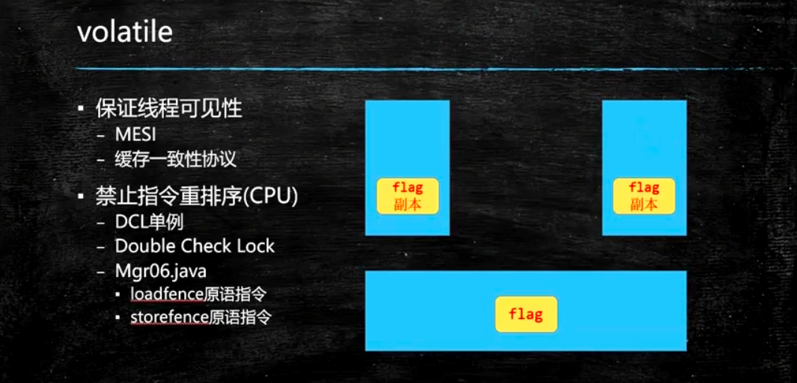

**1：保证线程的可见性**

大家知道java里面是有堆内存的，堆内存是所有线程共享里面的内存，除了共享的内存之外呢，每个线程都有自己的专属的区域，都有自己的工作内存，如果说在共享内存里有一个值的话，当我们线程，某一个线程都要去访问这个值的时候，会将这个值copy一份，copy到自己的这个工作空间里头，然后对这个值的任何改变，首先是在自己的空间里进行改变，什么时候写回去，就是改完之后会马上写回去。什么时候去检查有没有新的值，也不好控制。

在这个线程里面发生的改变，并没有及时的反应到另外一个线程里面，这就是线程之间的不可见 ，对这个变量值加了volatile之后就能够保证 一个线程的改变，另外一个线程马上就能看到。

大家可以去查这个词：MESI ，他的本质上是使用了cpu的一个叫做 高速缓存一致性协议

注：在和面《JVM》的课程中，老师深入讲解了MESI协议和volatile的底层实现。


**2：禁止指令重新排序**

指令重排序也是和cpu有关系，每次写都会被线程读到，加了volatile之后。cpu原来执行一条指令的时候它是一步一步的顺序的执行，但是现在的cpu为了提高效率，它会把指令并发的来执行，第一个指令执行到一半的时候第二个指令可能就已经开始执行了，这叫做流水线式的执行。在这种新的架构的设计基础之上呢想充分的利用这一点，那么就要求你的编译器把你的源码编译完的指令之后呢可能进行一个指令的重新排序。

这个是通过实际工程验证了，不仅提高了，而且提高了很多。


-DCL单例

我们来聊一聊什么是单例，单例的意思就是我保证你在JVM的内存里头永远只有某一个类的一个实例，其实这个很容易理解，在我们工程当中有一些类真的没有必要new好多个对象，比如说权限管理者。

单例最简单的写法就是下面这种写法，是说我有一个类，定义了这个类的一个对象，然后一个对象呢是在个类的内部的，同时我把Mgr01()这个类的构造方法设置成private意思就是别的不要去new我，只有我自己能new，理论上来说我就只有自己一个实例了，通过getInstance()访问这个实例，所以无论你调用多少次的getInstanc()本质上它就只有这一个对象，这种写法非常简洁也很容易理解，由JVM来保证永远只有这一个实例。

```java
package com.mashibing.dp.singleton;
/**
* 饿汉式
* 类加载到内存后，被实例化一个单例，JVM保证线程安全
* 简单实用，推荐使用！
* 唯一缺点，不管用到与否，类装载时就完成实例化
* Class.forName("")
**/
public class Mgr01{
  private static final Mgr01 INSTANCE = new Mgr01();
  
  private Mgr01(){};
  
  public static Mgr01 getInstance(){return INSTANCE;}
  
  public void m(){System.out.println("m");}
  
  public static void main(String[] args){
    Mgr01 m1=Mgr01.getInstance();
    Mgr01 m2=Mgr02.getInstance();
    System.out.println(m1==m2);
  }
}
```

但是有的人他会吹毛求疵，他会说我还没开始用这个对象呢，没用这个对象调这个方法你干嘛把他初始化了，你能不能什么时候开始用，调这个方法的时候你再给我初始化。所以呢，下面代码这个是和上一种一样的写法。

```java
package com.mashibing.dp.singleton;
/**
* 跟01是一个意思
**/
public class Mgr02{
  private static final Mgr02 INSTANCE;
  
  static {
    INSTANCE == new Mgr02();
  }
  
  private Mgr02(){};
  
  public static Mgr02 getInstance(){return INSTANCE;}
  
  public void m(){System.out.println("m");}
  
  public static void main(String[] args){
    Mgr02 m1=Mgr02.getInstance();
    Mgr02 m2=Mgr02.getInstance();
    System.out.println(m1==m2);
  }
}
```

所以另外产生这种懒汉式的单例，意思是说我getInstance()，什么时候我开始调用这个getInstace()的时候，我才对它进行初始化。当然，这个不要对它进行初始化两次，只能初始化一次才对，不然就成了俩对象了吗，所以上来之后先判断*INSTANCE == null* 的话我才初始化。

不过，更加吹毛求疵的事情又来了，我不单要求你我用的时候才进行初始化，我还要求你线程安全。显然我们下面03这个是不保证线程安全的，所以你多个线程访问的时候它一定会出问题，下来你自己可以实验实验。

```java
/**
* 懒汉式单例
*/
public class Mgr03{
  	private static Mgr03 INSTANCE;
  	
  	private Mgr03(){
    }
  
  	public static Mgr03 getInstance(){
      	if(INSTANCE == null){
          	try{
              	Thread.sleep(1);
            }catch(InterruptedException e){
              	e.printStace();
            }
          	INSTANCE = new Mgr03(); 
        }
      	public void m(){System.out.println("m");}
      
      	public static void main(String[] args){
          	for(int i=0; i<100; i++){
              	new Thread(()->
                          	System.out.println(Mgr03.getInstance().hashCode())
                          ).start();
            }
        }
    }
}
```

所以他要怎么做呢，我们要加一个synchronized解决，加一把锁嘛*public static synchronized* 这句话一旦加上就没问题了，因为这个里面从头到尾就只有一个线程运行，第一个线程发现它为空给它new了，第二个线程他无论怎么访问这个值已经永远不可能为空了，它只能是拿原来第一个线程初始化的部分，这是没问题的

```java
/**
* lazy loading
* 也称懒汉式
* 虽然达到了按需初始化的目的，但却能带来线程不安全的问题
* 可以通过synchronized解决，但也带来了效率下降
*/
public class Mgr04{
  	private static Mgr04 INSTANCE;
  	
  	private Mgr04(){
    }
  
  	public static synchronized Mgr04 getInstance(){
      	if(INSTANCE == null){
          	try{
              	Thread.sleep(1);
            }catch(InterruptedException e){
              	e.printStace();
            }
          	INSTANCE = new Mgr04(); 
        }
      	public void m(){System.out.println("m");}
      
      	public static void main(String[] args){
          	for(int i=0; i<100; i++){
              	new Thread(()->
                          	System.out.println(Mgr03.getInstance().hashCode())
                          ).start();
            }
        }
    }
}
```

开始进一步的吹毛求疵synchronized一下加在方法上这个代码太长了，说不定里面还有其他的业务逻辑，对于加锁这个事情，代码能锁的少的就要尽量锁的少。那么通过进一步的吹毛求疵又有了新的写法如下代码：线程判断，先别加锁，判断是否为空，如果为空在加锁初始化，更细粒度的一个锁，这叫做锁细化，也是锁优化的一步。很不幸的是这个写法是不对的，我们分析一下，第一个线程判断它为空，还没有执行下面的过程第二个线程来了，也判断它为空。第一个线程对它进行了加锁，synchronized完了之后呢把锁释放了，而第二个线程也是判断为空拿到这把锁也初始化了一遍，所以这种写法是有问题的。

```java
public class Mgr05{
  	private static Mgr05 INSTANCE;
  	
  	private Mgr05(){
    }
  
  	public static Mgr05 getInstance(){
      	if(INSTANCE == null){
          	//妄图通过减小同步代码块的方式提高效率，然后不可行
          	synchronized （Mgr05.class）{
              	try{
              	Thread.sleep(1);
                }catch(InterruptedException e){
                  e.printStace();
                }
              INSTANCE = new Mgr05(); 
            }
          	return INSTANCE;
        }
      	public void m(){System.out.println("m");}
      
      	public static void main(String[] args){
          	for(int i=0; i<100; i++){
              	new Thread(()->
                          	System.out.println(Mgr03.getInstance().hashCode())
                          ).start();
            }
        }
    }
}
```

所以就产生了，我们今天要讲的volatile这个问题，这个问题是这样来产生的，看下面代码，叫做双重检查锁或者叫双重检查的单例，在这种双重检查判断的情况下刚才上面的说的线程问题就不会再有了，分析一下：第一个线程来了判断ok，你确实是空值，然后进行下面的初始化过程，假设第一个线程把这个INSTANCE已经初始化了，第二个线程，第一个线程检查等于空的时候第二个线程检查也等于空，所以第二个线程在 *if(INSTANCE == null)*  这句话的时候停住了，暂停之后呢第一个线程已经把它初始化完了释放锁，第二个线程继续往下运行，往下运行的时候它会尝试拿这把锁，第一个线程已经释放了，它是可以拿到这把锁的，注意，拿到这把锁之后他还会进行一次检查，由于第一个线程已经把INSTANCE初始化了所以这个检查通过了，它不会在重新new一遍。因次，双重检查这个事儿是能够保证线程安全的。

就这个程序无论你运行多少遍，就算你在高并发的情况下运行，拿一百台机器同时访问这一台机子上的getInstance()，每个机器上跑个一万个线程，使劲儿跑，ok，这个程序运行的结果也会是正确的。

好，那么会有同学会说要不要加volatile？ 这是一道面试题：**你听说过单例模式吗，单例模式里面有一种叫双重检查的你了解吗，这个单例要不要加volatile？**答案是要加的，我们这个实验很难做出来让它出错的情况，所以以前很多人就不加这个volatile他也不会出问题，不加volatile问题就会出现在指令重排序上，

第一个线程 *INSTANCE = new Mgr06()*经过我们的编译器编译之后呢的指令呢是分成三步 1.给指令申请内存 2.给成员变量初始化 3.是把这块内存的内容赋值给INSTANCE。既然有这个值了你在另外一个线程里头上来先去检查，你会发现这个值已经有了，你根本就不会进入锁那部分的代码。

加了volatile会怎么样呢，加了volatile指令重排序就不允许存在了。对这个对象上的指令重排序不允许存在，所以在这个时候一定是保证你初始化完了之后才会赋值给你这个变量，ok 这是volatile的含义。

```java
/**
* lazy loading
* 也称懒汉式
* 虽然达到了按需求初始化的目的，但却能带来线程不安全的问题
* 可以通过synchronized解决，但也带来效率下降
*/
public class Mgr06{
  	private static /*volatile*/ Mgr06 INSTANCE;
  	
  	private Mgr06(){
    }
  
  	public static Mgr06 getInstance(){
      	if(INSTANCE == null){
          	//双重检查
          	synchronized （Mgr06.class）{
              	try{
              		Thread.sleep(1);
                }catch(InterruptedException e){
                  e.printStace();
                }
              INSTANCE = new Mgr06(); 
            }
          	return INSTANCE;
        }
      	public void m(){System.out.println("m");}
      
      	public static void main(String[] args){
          	for(int i=0; i<100; i++){
              	new Thread(()->
                          	System.out.println(Mgr03.getInstance().hashCode())
                          ).start();
            }
        }
    }
}
```

三个步骤顺序有严格的规定吗，在JVM里面规定了八种原则，除了这些之外其他的指令都可以有重排序，保证原子性只是保证这些操作必须要么都完成之后其他才能访问，但是保证了原子性和保证重排序是两回事儿

到现在为止，volatile的两个含义已经说完了。


下面这个程序，如果不加volatile是一定会有问题的，结果是到不了10万的，原因很简单，count值改变之后只是被别的线程所看见，但是光看见没用，count++本身它不是一个原子性的操作，所以说volatile保证线程的可见性，并不能替代synchronized，保证不了原子性。要想解决这个问题，加上synchronized。

```java
/**
* volatile并不能保证多个线程共同修改running变量时所带来的的不一致问题，也就是说volatile不能替代synchronized
* 运行下面的程序，并分析结果
* @author mashibing
*/
package com.mashibing.juc.c_013;

import java.util.ArrayList;
import java.util.List;

public class T{
  	volatile int count = 0;
  	/*synchronized*/ void m(){ for (int i=0; i<10000; i++ ) count++; }
  	
  	public static void main(String[] args){
      	T t=new T();
      
      	List<Thread> threads = new ArrayList<>();
      
      	for( int i=0; i<10; i++){
          	threads.forEach((o)->{
              	try{
                  	o.join();
                }catch(InterruptedException e){
                  	e.printStackTrace();
                }
            });
          System.out.println(t.count);
        }
    }
}
```


好，我们来看锁优化的一些问题，这个锁优化内容非常多啊，线程这块儿的内容也特别好玩儿，按顺序来讲是可能是1、2、3、4、5、6、7这样的内容，但是你要按照优化来讲，它这些优化可能会分布在不同的这个步骤之上，所以讲到某个优化的问题的时候我们就谈一次，讲到就谈一次。

锁优化其中有一个叫做把锁粒度变细 ，还有一个叫把锁粒度变粗，其实说的是一回事儿，什么意思呢，作为synchronized来说你这个锁呢征用不是很剧烈的前提下，你这个锁呢，粒度最好还是小一些。

下面程序是什么意思，如果是说m1方法他前面有一堆业务逻辑，后面有一堆业务逻辑，这个业务逻辑我用sleep来模拟了它，那么中间是你需要加锁的代码，那这个时候你不应该把锁加在整个方法上，只应该加在count++上（参见m2），这很简单就叫做锁的细化。那什么时候需要将锁粗化呢，在征用特别频繁，由于你锁的粒度越变越细，好多小的细锁跑在你这个上面，这个方法，或者某一段业务逻辑里头，好，那你干脆不如弄成一把大锁，他的征用反而就没有那么频繁了，程序写的好，不会发生死锁。

```java
/**
 * synchronized优化
 * 同步代码块中的语句越少越好
 * 比较m1和m2
 * @author mashibing
 */
package com.mashibing.juc.c_016_LockOptimization;

import java.util.concurrent.TimeUnit;


public class FineCoarseLock {
	
	int count = 0;

	synchronized void m1() {
		//do sth need not sync
		try {
			TimeUnit.SECONDS.sleep(2);
		} catch (InterruptedException e) {
			e.printStackTrace();
		}
		//业务逻辑中只有下面这句需要sync，这时不应该给整个方法上锁
		count ++;
		
		//do sth need not sync
		try {
			TimeUnit.SECONDS.sleep(2);
		} catch (InterruptedException e) {
			e.printStackTrace();
		}
	}
	
	void m2() {
		//do sth need not sync
		try {
			TimeUnit.SECONDS.sleep(2);
		} catch (InterruptedException e) {
			e.printStackTrace();
		}
		//业务逻辑中只有下面这句需要sync，这时不应该给整个方法上锁
		//采用细粒度的锁，可以使线程争用时间变短，从而提高效率
		synchronized(this) {
			count ++;
		}
		//do sth need not sync
		try {
			TimeUnit.SECONDS.sleep(2);
		} catch (InterruptedException e) {
			e.printStackTrace();
		}
	}
}
```


下面有一个小概念，你在某一种特定的不小心的情况下你把o变成了别的对象了，这个时候线程的并发就会出问题。锁是在对象的头上两位来作为代表的，你这线程本来大家都去访问这两位了，结果突然把这把锁变成别的对象，去访问别的对象的两位了，这俩之间就没有任何关系了。因此，以对象作为锁的时候不让它发生改变，加final。

```java
/**
* 锁定某对象o，如果o的属性发生改变，不影响锁的使用
* 但是如果o变成另外一个对象，则锁定的对象发生改变
* 应该是避免将锁定对象的引用变成另外的对象
* @author mashibing
*/

package com.mashibing.juc.c_017;

import java.util.concurrent.TimeUnit;

public class T{
  	
  	final Object o = new Object();
  	
  	void m(){
      	synchronized(o){
          	while(true){
              	try{
                  	TimeUnit.SECONDS.sleep(1);
                }catch(InterruptedException e){
                  	e.printStace();
                }
              	System.out.println(Thread.currentThread().getName());
            }
        }
    }
  	
  	public static void main(String[] args){
      	T t =new T();
      	//启动第一个线程
        new Thread(t::m,"t1").start();
      
      	try{
          	TimeUnit.SECONDS.sleep(3);
        }catch(InterruptedException e){
          	e.printStackTrace();
        }
      	//创建第二个线程
      	Thread t2 =new Thread(t::m,"t2");
      
      	t.o=new Object();//锁对象发生改变，所以t2线程得以执行，如果注释掉这句话，线程2将永远得不到执行机会
      
      	t2.start();
    }
}

```


好，那么倒现在为止，我们volatile和synchronized都已经基本讲完了，稍微简单的回顾一下。

- synchronized锁的是对象而不得代码，锁方法锁的是this，锁static方法锁的是class，锁定方法和非锁定方法是可以同时执行的，锁升级从偏向锁到自旋锁到重量级锁
- volatile 保证线程的可见性，同时防止指令重排序。线程可见性在CPU的级别是用缓存一直性来保证的；禁止指令重排序CPU级别是你禁止不了的，那是人家内部运行的过程，提高效率的。但是在虚拟机级别你家volatile之后呢，这个指令重排序就可以禁止。严格来讲，还要去深究它的内部的话，它是加了读屏障和写屏障，这个是CPU的一个原语。

注：关于synchronized和volatile的底层实现，在老师的JVM课程中会有深入到CPU级别的讲解


## CAS

cas号称是无锁优化，或者叫自旋。这个名字无所谓，理解它是干什么的就行，概念这个东西是人为了描述问题解决问题而定义出来的，所以怎么定义不是很重要，重点是在解决问题上

我们通过Atomic类（原子的）。由于某一些特别常见的操作，老是来回的加锁，加锁的情况特别多，所以干脆java就提供了这些常见的操作这么一些个类，这些类的内部就自动带了锁，当然这些锁的实现并不是synchronized重量级锁，而是CAS的操作来实现的（号称无锁）。

我们来举例几个简单的例子，凡是以Atomic开头的都是用CAS这种操作来保证线程安全的这么一些个类。AtomicInteger的意思就是里面包了一个Int类型，这个int类型的自增 *count++* 是线程安全的，还有拿值等等是线程安全的，由于我们在工作开发中经常性的有那种需求，一个值所有的线程共同访问它往上递增 ，所以jdk专门提供了这样的一些类。使用方法AtomicInteger如下代码

```java
/**
 * 解决同样的问题的高效方法，使用AtomXXX类
 * AtomXXX类的本身方法都是原子性的，但不能保证多个方法连续调用都是原子性的
 * @author mashibing
 */
package com.mashibing.juc.c_018_00_AtomicXXX;

import java.util.ArrayList;
import java.util.List;
import java.util.concurrent.atomic.AtomicInteger;


public class T01_AtomicInteger {
	/*volatile*/ //int count1 = 0;
	
	AtomicInteger count = new AtomicInteger(0); 

	/*synchronized*/ void m() { 
		for (int i = 0; i < 10000; i++)
			//if count1.get() < 1000
			count.incrementAndGet(); //count1++
	}

	public static void main(String[] args) {
		T01_AtomicInteger t = new T01_AtomicInteger();

		List<Thread> threads = new ArrayList<Thread>();

		for (int i = 0; i < 10; i++) {
			threads.add(new Thread(t::m, "thread-" + i));
		}

		threads.forEach((o) -> o.start());

		threads.forEach((o) -> {
			try {
				o.join();
			} catch (InterruptedException e) {
				e.printStackTrace();
			}
		});

		System.out.println(t.count);

	}

}
```


好，我们来分许分析，它的内部实现的原理，主要是聊原理，它的用法看看API都会用。这个原理叫CAS操作，incrementAndGet() 调用了getAndAddInt

```java
public final int incrementAndGet() { return U.getAndAddInt(this,VALUE,1)+1;}
```

当然这个也是一个CompareAndSetInt操作

```java
@HotSportIntrinsicCandidate
public final int getAndAddInt(Object o,long offset, int delta){
  	int v;
  	do{
      	v=getIntVolatile(o,offset);
    }while(!weakCompareAndSetInt(o,offset,v,v + delta));
  	return v;
}
```

进一步跟进weakCompareAndSetInt

```
public final boolean weakCompareAndSetInt(Object o, long offset,int expected, int x) {       return compareAndSetInt(o, offset, expected, x);
}
```

它的内部调调调，就会跑到Unsafe类去（不安全的）。也就是说AtomicInteger它的内部是调用了 Unsafe这个类里面的方法CompareAndSetInt（CAS）,说一下字面意思，比较并且设定。这个比较并且设定的意思是什么呢，我原来想改变某一个值0 ，我想把它变成1，但是其中我想做到线程安全，就只能加锁synchronized ，不然线程就不安全。我现在可以用另外一种操作来替代这把锁，就是cas操作，你可以把它想象成一个方法，这个方法有三个参数，cas（V，Expected，NewValue）。 


V第一个参数是要改的那个值；Expected第二个参数是期望当前的这个值会是几；NewValue要设定的新值。当前这个线程想改这个值的时候我期望你这值就是0，你不能是个1，如果是1就说明我这值不对，然后想把你变成1。这句话说的是什么意思呢，比如原来这个值变成3了，我这个线程想改这个值的时候我一定期望你现在是3 ，是3我才改，如果你在我该的过程中变成4了，那你跟我的期望值就对不上了，说明有另外一个线程改了这个值了，那我这个cas就重新在试一下，再试的时候我希望你这个值是4，在修改的时候期望值是4，没有其他的线程修改这个值，那好，我给你改成5，这就是cas操作，在本质上就是这么一个意思。

Expected如果对的上期望值，NewValue才会去对其修改，进行新的值设定的时候，这个过程之中来了一个线程把你的值改变了怎么办，我就可以再试一遍，或者失败，这个是cas操作。

当你判断的时候，发现是我期望的值，还没有进行新值设定的时候值发生了改变怎么办，cas是cpu的原语支持，也就是说cas操作是cpu指令级别上的支持，中间不能被打断。


**ABA问题**

一般的面试会问一下，了解这个ABA问题吗？

这个ABA问题是这样的，假如说你有一个值，我拿到这个值是1，想把它变成2，我拿到1用cas操作，期望值是1，准备变成2，这个对象Object，在这个过程中，没有一个线程改过我肯定是可以更改的，但是如果有一个线程先把这个1变成了2后来又变回1，中间值更改过，它不会影响我这个cas下面操作，这就是ABA问题。

这种问题怎么解决。如果是int类型的，最终值是你期望的，也没有关系，这种没关系可以不去管这个问题。如果你确实想管这个问题可以加版本号，做任何一个值的修改，修改完之后加一，后面检查的时候连带版本号一起检查。

如果是基础类型：无所谓。不影响结果值；

如果是引用类型：就像是你的女朋友和你分手之后又复合，中间经历了别的男人。


**Unsafe**

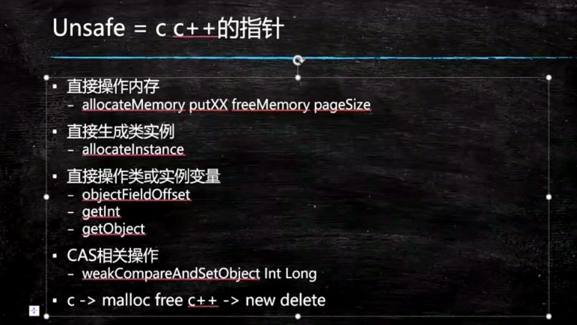

不需要加锁是怎么做到的呢，原因是使用了Unsafe这个类，关于这个类呢，你了解就行了，这个类里面的方法非常非常多，而且这个类除了用反射使用之外，其他不能直接使用，不能直接使用的原因，和ClassLoader是有关系的。先简单了解这个类。所有的Atomic操作内部下面都是CompareAndSetI这样的操作，那个CompareAndSetI就是在Unsafe这个类里面完成的。

回顾我们今天将的内容，我们讲了volatile（1线程可见性，2指令重排序）；我们讲了CAS的原理，有人叫它无锁优化，有人叫乐观锁，cas会产生ABA问题；Unsafe了解。


# 第三节：Atomic类和线程同步新机制


今天，我们继续讲一个Atomic的问题，然后开始讲除synchronized之外的别的锁。在前面内容我们讲了synchronized、volatile、Atomic和CAS，Atomic我们只是讲了一个开头还没有讲完，今天我们继续。

像原来我们写m++你得加锁，在多线程访问的情况下，那现在我们可以用AtomicInteger了，它内部就已经帮我们实现了原子操作，直接写 *count.incrementAndGet(); //count1++*  这个就相当于count++。原来我们对count是需要加锁的，现在就不需要加锁了。

我们看下面小程序，模拟，我们计一个数，所有的线程都要共同访问这个数count值，大家知道如果所有线程都要访问这个数的时候，如果每个线程给它往上加了10000，你这个时候是需要加锁的，不加锁会出问题。但是，你把它改成AtomicInteger之后就不用在做加锁的操作了，因为incrementAndGet内部用了cas操作，直接无锁的操作往上递增，有同学可能会讲为什么要用无锁操作啊，原因是无锁的操作效率会更高。

```java
/**
 * 解决同样的问题的更高效的方法，使用AtomXXX类
 * AtomXXX类本身方法都是原子性的，但不能保证多个方法连续调用是原子性的
 * @author mashibing
 */
package com.mashibing.juc.c_018_00_AtomicXXX;

import java.util.ArrayList;
import java.util.List;
import java.util.concurrent.atomic.AtomicInteger;


public class T01_AtomicInteger {
	/*volatile*/ //int count1 = 0;
	
	AtomicInteger count = new AtomicInteger(0); 

	/*synchronized*/ void m() { 
		for (int i = 0; i < 10000; i++)
			//if count1.get() < 1000
			count.incrementAndGet(); //count1++
	}

	public static void main(String[] args) {
		T01_AtomicInteger t = new T01_AtomicInteger();

		List<Thread> threads = new ArrayList<Thread>();

		for (int i = 0; i < 10; i++) {
			threads.add(new Thread(t::m, "thread-" + i));
		}

		threads.forEach((o) -> o.start());

		threads.forEach((o) -> {
			try {
				o.join();
			} catch (InterruptedException e) {
				e.printStackTrace();
			}
		});

		System.out.println(t.count);

	}
}
```

大家再看这个小程序，我做了一个很粗糙的测试，这个测试基本上能说明问题 ，就是我们模拟了很多个线程对一个数进行递增。很多线程对一个数进行递增我们现在学了至少有两种方法：

第一种是我们一个long类型的数，递增的时候我们加锁；

第二种，我们使用AtomicLong可以让它不断的往上递增，这是第二种；

其实，还有第三种叫LongAdder;

由于呢，很多线程对一个数进行递增这个事儿，我们工作当中经常会碰上，比如说在秒杀的时候。那么，这三种哪个效率更高一些呢，很多测试来看AtomicLong还比不上第一种，但是在我的测试上来看，起码像现在这种测试的条件下AtomicLong他的效率还是比synchronized效率要高。我们来看程序，count1、conut2、count3分别是以不同的方式进行实现递增，一上来启动了1000个线程，比较多算是，因为少的话模拟不了那么高的并发。

- 每一个线程都new出来，之后每一个线程都做了十万次递增，第一种方式，打印起始时间->线程开始->所有线程结束->打印结束时间->计算最后花了多少时间；

- 第二种方式是我用synchronized，用一个lock，Object lock = new Object();，然后new Runnable(), 依然是一样的，在递增的时候我写的是synchronized (lock)，这里是替代了AtomicLong，上面是AtomicLong，下面是synchronized，在同样的就是计算时间；

- 第三种1000个线程，每个线程十万次递增，第三种呢用的是LongAdder，这个LongAdder里面直接就是count3.increment()；

我们跑起来对比LongAdder是效率最高的，你要是自己做实验的时候，把线程数变小了LongAdder未必有优势，循环数量少了LongAdder也未必有优势，所以，实际当中用哪种你要考虑一下你的并发有多高。

```java
package com.mashibing.juc.c_018_00_AtomicXXX;

import java.util.concurrent.TimeUnit;
import java.util.concurrent.atomic.AtomicLong;
import java.util.concurrent.atomic.LongAdder;

public class T02_AtomicVsSyncVsLongAdder {
    static long count2 = 0L;
    static AtomicLong count1 = new AtomicLong(0L);
    static LongAdder count3 = new LongAdder();

    public static void main(String[] args) throws Exception {
        Thread[] threads = new Thread[1000];

        for(int i=0; i<threads.length; i++) {
            threads[i] =
                    new Thread(()-> {
                        for(int k=0; k<100000; k++) count1.incrementAndGet();
                    });
        }

        long start = System.currentTimeMillis();

        for(Thread t : threads ) t.start();

        for (Thread t : threads) t.join();

        long end = System.currentTimeMillis();

        //TimeUnit.SECONDS.sleep(10);

        System.out.println("Atomic: " + count1.get() + " time " + (end-start));
        //-----------------------------------------------------------
        Object lock = new Object();

        for(int i=0; i<threads.length; i++) {
            threads[i] =
                new Thread(new Runnable() {
                    @Override
                    public void run() {

                        for (int k = 0; k < 100000; k++)
                            synchronized (lock) {
                                count2++;
                            }
                    }
                });
        }

        start = System.currentTimeMillis();

        for(Thread t : threads ) t.start();

        for (Thread t : threads) t.join();

        end = System.currentTimeMillis();


        System.out.println("Sync: " + count2 + " time " + (end-start));


        //----------------------------------
        for(int i=0; i<threads.length; i++) {
            threads[i] =
                    new Thread(()-> {
                        for(int k=0; k<100000; k++) count3.increment();
                    });
        }

        start = System.currentTimeMillis();

        for(Thread t : threads ) t.start();

        for (Thread t : threads) t.join();

        end = System.currentTimeMillis();

        //TimeUnit.SECONDS.sleep(10);

        System.out.println("LongAdder: " + count1.longValue() + " time " + (end-start));

    }

    static void microSleep(int m) {
        try {
            TimeUnit.MICROSECONDS.sleep(m);
        } catch (InterruptedException e) {
            e.printStackTrace();
        }
    }

}
```

**为什么Atomic要比Sync快？**

因为不加锁，刚刚我们说了synchronized是要加锁的，有可能它要去操作系统申请重量级锁，所以synchronized效率偏低，在这种情形下效率偏低。

**LongAdder为什么要比Atomicx效率要高呢？**

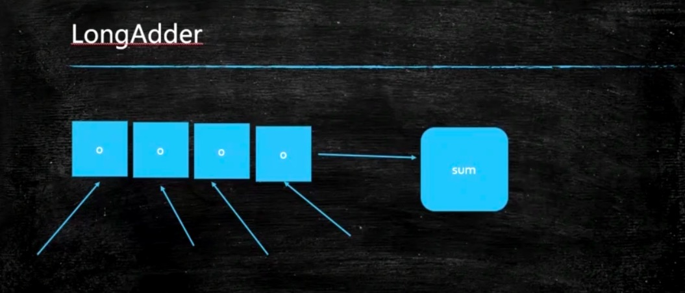

是因为LongAdder的内部做了一个分段锁，类似于分段锁的概念。在它内部的时候，会把一个值放到一个数组里，比如说数组长度是4，最开始是0，1000个线程，250个线程锁在第一个数租元素里，以此类推，每一个都往上递增算出来结果在加到一起。


**间歇性复习**

我们讲了synchronized的一些细节；

volatile；

atomicXXX他的原理就是CAS;

在这个基础之上有给大家讲了递增increment，他有好几种方式sync、atomicXXX、LongAdder;

并不是很多，我们继续...


老类型的锁就是synchronized我们已经讲完了，下面我们来讲基于CAS的一些新类型的锁，讲这些锁的用法，再来 讲这些锁的原理。

**ReentrantLock**

第一种锁比较新鲜可重入锁ReentranLlock，synchronized本身就是可重入锁的一种，什么叫可重入，意思就是我锁了一下还可以对同样这把锁再锁一下，synchronized必须是可重入的，不然的话子类调用父类是没法实现的，看下面这个小程序是这样写的，m1方法里面做了一个循环每次睡1秒钟，每隔一秒种打印一个。接下来调m2，是一个synchronized方法也是需要加锁的，我们来看主程序启动线程m1，一秒钟后再启动线程m2。分析下这个执行过程在第一个线程执行到一秒钟的时候第二个线程就会起来，假如我们这个锁是不可重入的会是什么情况，第一个线程申请这把锁，锁的这个对象，然后这里如果是第二个线程来进行申请的话，他start不了，必须要等到第一个线程结束了，因为这两个是不同的线程。两个线程之间肯定会有争用，可以在m1里面调用m2就可以，synchronized方法是可以调用synchronized方法的。锁是可重入的。

```java
/**
 * reentrantlock用于替代synchronized
 * 本例中由于m1锁定this，只有m1ִ执行完毕的时候,m2才能执行
 * 这里是复习synchronized最原始的语义
 * @author mashibing
 */
package com.mashibing.juc.c_020;

import java.util.concurrent.TimeUnit;

public class T01_ReentrantLock1 {
	synchronized void m1() {
		for(int i=0; i<10; i++) {
			try {
				TimeUnit.SECONDS.sleep(1);
			} catch (InterruptedException e) {
				e.printStackTrace();
			}
			System.out.println(i);
			if(i == 2) m2();
		}
		
	}
	
	synchronized void m2() {
		System.out.println("m2 ...");
	}
	
	public static void main(String[] args) {
		T01_ReentrantLock1 rl = new T01_ReentrantLock1();
		new Thread(rl::m1).start();
		try {
			TimeUnit.SECONDS.sleep(1);
		} catch (InterruptedException e) {
			e.printStackTrace();
		}
		//new Thread(rl::m2).start();
	}
}

```

子类和父类如果是synchronized(this)就是同一把锁，同一个this当然是同一把锁。

ReentrantLock是可以替代synchronized的，怎么替代呢，看如下代码，原来写synchronized的地方换写lock.lock()，加完锁之后需要注意的是记得lock.unlock()解锁，由于synchronized是自动解锁的，大括号执行完就结束了。lock就不行，lock必须得手动解锁，手动解锁一定要写在try...finally里面保证最好一定要解锁，不然的话上锁之后中间执行的过程有问题了，死在那了，别人就永远也拿不到这把锁了。

```java
/**
 * reentrantlock用于替代synchronized
 * 由于m1锁定this，只有m1ִ执行完毕的时候,m2才能执行
 * 这个里是复习synchronized最原始的语义
 * 
 * 使用reentrantlock可以完成同样的功能
 * 需要注意的是，必须要必须要必须要手动释放锁（重要的事情说三遍）
 * 使用syn锁定的话如果遇到异常，jvm会手动释放锁，但是lock必须手动释放锁
 * @author mashibing
 */
package com.mashibing.juc.c_020;

import java.util.concurrent.TimeUnit;
import java.util.concurrent.locks.Lock;
import java.util.concurrent.locks.ReentrantLock;

public class T02_ReentrantLock2 {
	Lock lock = new ReentrantLock();

	void m1() {
		try {
			lock.lock(); //synchronized(this)
			for (int i = 0; i < 10; i++) {
				TimeUnit.SECONDS.sleep(1);

				System.out.println(i);
			}
		} catch (InterruptedException e) {
			e.printStackTrace();
		} finally {
			lock.unlock();
		}
	}

	void m2() {
		try {
			lock.lock();
			System.out.println("m2 ...");
		} finally {
			lock.unlock();
		}

	}

	public static void main(String[] args) {
		T02_ReentrantLock2 rl = new T02_ReentrantLock2();
		new Thread(rl::m1).start();
		try {
			TimeUnit.SECONDS.sleep(1);
		} catch (InterruptedException e) {
			e.printStackTrace();
		}
		new Thread(rl::m2).start();
	}
}

```


可能有同学会说reentrantlock既然和synchronized差不多的话，那我们要它有什么用呢，ReentrantLock有一些功能还是要比synchronized强大的，强大的地方，你可以使用**tryLock进行尝试锁定**，不管锁定与否，方法都将继续执行，synchronized如果搞不定的话他肯定就阻塞了，但是用ReentrantLock你自己就可以决定你到底要不要wait。

下面程序 就是说比如5秒钟你把程序执行完就可能得到这把锁，如果得不到就不行。由于我的第一个线程跑了10秒钟，所以你在第二个线程里申请5秒肯定是那不到的，把循环次数减少就可以能拿到了。

```java
package com.mashibing.juc.c_020;

import java.util.concurrent.TimeUnit;
import java.util.concurrent.locks.Lock;
import java.util.concurrent.locks.ReentrantLock;

public class T03_ReentrantLock3 {
	Lock lock = new ReentrantLock();

	void m1() {
		try {
			lock.lock();
			for (int i = 0; i < 3; i++) {
				TimeUnit.SECONDS.sleep(1);

				System.out.println(i);
			}
		} catch (InterruptedException e) {
			e.printStackTrace();
		} finally {
			lock.unlock();
		}
	}

	/**
	 * 使用tryLock进行尝试锁定，不管锁定与否，方法都将继续执行
	 * 可以根据tryLock的返回值来判断是否锁定
	 * 也可以指定tryLock的时间
	 */
	void m2() {
		/*
		boolean locked = lock.tryLock();
		System.out.println("m2 ..." + locked);
		if(locked) lock.unlock();
		*/
		boolean locked = false;
		
		try {
			locked = lock.tryLock(5, TimeUnit.SECONDS);
			System.out.println("m2 ..." + locked);
		} catch (InterruptedException e) {
			e.printStackTrace();
		} finally {
			if(locked) lock.unlock();
		}
		
	}

	public static void main(String[] args) {
		T03_ReentrantLock3 rl = new T03_ReentrantLock3();
		new Thread(rl::m1).start();
		try {
			TimeUnit.SECONDS.sleep(1);
		} catch (InterruptedException e) {
			e.printStackTrace();
		}
		new Thread(rl::m2).start();
	}
}
```

当然除了这个之外呢，ReentrantLock还可以用lock.lockInterruptibly() 这个类，对interrupt()方法做出相应，可以被**打断的加锁**，如果以这种方式加锁的话我们可以调用一个 t2.interrupt(); 打断线程2的等待。 线程1 上来之后加锁，加锁之后开始睡，睡的没完没了的，被线程1拿到这把锁的话，线程2如果说在想拿到这把锁不太可能，拿不到锁他就会在哪儿等着，如果我们使用原来的这种lock.lock()是打断不了它的，那么我们就可以用另外一种方式lock.lockInterruptibly() 这个类可以被打断的，当你要想停止线程2就可以用 interrupt() ，这也是ReentrantLock比synchronized好用的一个地方。

```java
package com.mashibing.juc.c_020;

import java.util.concurrent.TimeUnit;
import java.util.concurrent.locks.Lock;
import java.util.concurrent.locks.ReentrantLock;
import java.util.function.Function;

public class T04_ReentrantLock4 {
		
	public static void main(String[] args) {
		Lock lock = new ReentrantLock();
		
		Thread t1 = new Thread(()->{
			try {
				lock.lock();
				System.out.println("t1 start");
				TimeUnit.SECONDS.sleep(Integer.MAX_VALUE);
				System.out.println("t1 end");
			} catch (InterruptedException e) {
				System.out.println("interrupted!");
			} finally {
				lock.unlock();
			}
		});
		t1.start();
		
		Thread t2 = new Thread(()->{
			try {
				//lock.lock();
				lock.lockInterruptibly(); //可以对interrupt()方法做出相应
				System.out.println("t2 start");
				TimeUnit.SECONDS.sleep(5);
				System.out.println("t2 end");
			} catch (InterruptedException e) {
				System.out.println("interrupted!");
			} finally {
				lock.unlock();
			}
		});
		t2.start();
		
		try {
			TimeUnit.SECONDS.sleep(1);
		} catch (InterruptedException e) {
			e.printStackTrace();
		}
		t2.interrupt();//打断线程2的等待
	}
}
```

ReentrantLock还可以指定为**公平锁**，公平锁的意思是当我们new一个ReentrantLock你可以传一个参数为true，这个true表示公平锁，公平锁的意思是谁等在前面就先让谁执行，而不是说谁后来了之后就马上让谁执行。如果说这个锁不公平，来了一个线程上来就抢，它是有可能抢到的，如果说这个锁是个公平锁，这个线程上来会先检查队列里有没有原来等着的，如果有的话他就先进队列里等着别人先运行，这是公平锁的概念。

ReentrantLock默认是非公平锁。

```java
/**
 * ReentrantLock还可以指定为公平锁
 * @author mashibing
 */
package com.mashibing.juc.c_020;

import java.util.concurrent.locks.ReentrantLock;

public class T05_ReentrantLock5 extends Thread {
		
	private static ReentrantLock lock=new ReentrantLock(true); //参数为true表示为公平锁，请对比输出结果
    public void run() {
        for(int i=0; i<100; i++) {
            lock.lock();
            try{
                System.out.println(Thread.currentThread().getName()+"获得锁");
            }finally{
                lock.unlock();
            }
        }
    }
    public static void main(String[] args) {
        T05_ReentrantLock5 rl=new T05_ReentrantLock5();
        Thread th1=new Thread(rl);
        Thread th2=new Thread(rl);
        th1.start();
        th2.start();
    }
}
```


**我们稍微回顾一下: Reentrantlock vs synchronized**

ReentrantLock可以替代synchronized这是没问题的，他也可以重入，可以锁定的。本身的底层是cas 

trylock：自己来控制，我锁不住该怎么办

lockInterruptibly：这个类，中间你还可以被打断

它还可以公平和非公平的切换

现在除了synchronized之外，多数内部都是用的cas。当我们聊这个AQS的时候实际上它内部用的是park和unpark，也不是全都用的cas,他还是做了一个锁升级的概念，只不过这个锁升级做的比较隐秘，在你等待这个队列的时候如果你拿不到还是进入一个阻塞的状态，前面至少有一个cas的状态，他不像原先就直接进入阻塞状态了。


**CountDownLatch**

CountDown叫倒数，Latch是门栓的意思（倒数的一个门栓，5、4、3、2、1数到了，我这个门栓就开了）

看下面的小程序，这小程序叫usingCountDownLatch，new了100个线程，接下来，又来了100个数量的CountDownLatch，什么意思，就是，这是一个门栓，门栓上记了个数threads.length是100，每一个线程结束的时候我让 latch.countDown()，然后所有线程start()，再latch.await()，最后结束。那CountDown是干嘛使得呢，看latch.await()，它的意思是说给我看住门，给我插住不要动。每个线程执行到latch.await()的时候这个门栓就在这里等着，并且记了个数是100，每一个线程结束的时候都会往下CountDown，CountDown是在原来的基础上减1，一直到这个数字变成0的时候门栓就会被打开，这就是它的概念，它是用来等着线程结束的。

用join实际上不太好控制，必须要你线程结束了才能控制，但是如果是一个门栓的话我在线程里不停的CountDown，在一个线程里就可以控制这个门栓什么时候往前走，用join我只能是当前线程结束了你才能自动往前走，当然用join可以，但是CountDown比它要灵活。

```java
package com.mashibing.juc.c_020;

import java.util.concurrent.CountDownLatch;

public class T06_TestCountDownLatch {
    public static void main(String[] args) {
        usingJoin();
        usingCountDownLatch();
    }

    private static void usingCountDownLatch() {
        Thread[] threads = new Thread[100];
        CountDownLatch latch = new CountDownLatch(threads.length);

        for(int i=0; i<threads.length; i++) {
            threads[i] = new Thread(()->{
                int result = 0;
                for(int j=0; j<10000; j++) result += j;
                latch.countDown();
            });
        }

        for (int i = 0; i < threads.length; i++) {
            threads[i].start();
        }

        try {
            latch.await();
        } catch (InterruptedException e) {
            e.printStackTrace();
        }

        System.out.println("end latch");
    }

    private static void usingJoin() {
        Thread[] threads = new Thread[100];

        for(int i=0; i<threads.length; i++) {
            threads[i] = new Thread(()->{
                int result = 0;
                for(int j=0; j<10000; j++) result += j;
            });
        }

        for (int i = 0; i < threads.length; i++) {
            threads[i].start();
        }

        for (int i = 0; i < threads.length; i++) {
            try {
                threads[i].join();
            } catch (InterruptedException e) {
                e.printStackTrace();
            }
        }

        System.out.println("end join");
    }
}
```

**CyclicBarrier**

来讲这个同步工具叫CyclicBarrier，意思是循环栅栏，这有一个栅栏，什么时候人满了就把栅栏推倒，哗啦哗啦的都放出去，出去之后扎栅栏又重新起来，再来人，满了，推倒之后又继续。

下面程序，两个参数，第二个参数不传也是可以的，就是满了之后不做任何事情。第一个参数是20，满了之后帮我调用第二个参数指定的动作，我们这个指定的动作就是一个Runnable对象，打印满人，发车。什么barrier.await()会被放倒，就是等够20个人了，后面也可以写你要做的操作 s。什么时候满了20人了就发车。下面第一种写法是满了之后我什么也不做，第二种写法是用Labda表达式的写法。这个意思就是线程堆满了，我们才能往下继续执行。

举例：CyclicBarrier的概念呢比如说一个复杂的操作，需要访问 数据库，需要访问网络，需要访问文件，有一种方式是顺序执行，挨个的都执行完，效率非常低，这是一种方式，还有一种可能性就是并发执行，原来是1、2、3顺序执行，并发执行是不同的线程去执行不同的操作，有的线程去数据库找，有的线程去网络访问，有的线程去读文件，必须是这三个线程全部到位了我才能去进行，这个时候我们就可以用CyclicBarrier。

```java
package com.mashibing.juc.c_020;

import java.util.concurrent.BrokenBarrierException;
import java.util.concurrent.CyclicBarrier;

public class T07_TestCyclicBarrier {
    public static void main(String[] args) {
        //CyclicBarrier barrier = new CyclicBarrier(20);

        CyclicBarrier barrier = new CyclicBarrier(20, () -> System.out.println("满人"));

        /*CyclicBarrier barrier = new CyclicBarrier(20, new Runnable() {
            @Override
            public void run() {
                System.out.println("满人，发车");
            }
        });*/

        for(int i=0; i<100; i++) {

                new Thread(()->{
                    try {
                        barrier.await();

                    } catch (InterruptedException e) {
                        e.printStackTrace();
                    } catch (BrokenBarrierException e) {
                        e.printStackTrace();
                    }
                }).start();
        }
    }
}
```


**Phaser**

Phaser它就更像是结合了CountDownLatch和CyclicBarrier，翻译一下叫阶段。这个稍微复杂一些，如果有面试官问到你能说出来，一定会高看你一眼的。

Phaser是按照不同的阶段来对线程进行执行，就是它本身是维护着一个阶段这样的一个成员变量，当前我是执行到那个阶段，是第0个，还是第1个阶段啊等等，每个阶段不同的时候这个线程都可以往前走，有的线程走到某个阶段就停了，有的线程一直会走到结束。你的程序中如果说用到分好几个阶段执行 ，而且有的人必须得几个人共同参与的一种情形的情况下可能会用到这个Phaser。

有种情形很可能用到，如果你写的是遗传算法，遗传算法是计算机来模拟达尔文的进化策略所发明的一种算法，当你去解决这个问题的时候这个Phaser是有可能用的上的。这个东西更像是CyclicBarrier，栅栏这个东西是一个一个的栅栏，他原来是一个循环的栅栏，循环使用，但是这个栅栏是一个栅栏一个栅栏的。

好，来看我们自己模拟的一个小例子。模拟了一个结婚的场景，结婚是有好多人要参加的，因此，我们写了一个类Person是一个Runnable可以new出来，扔给Thread去执行，模拟我们每个人要做一些操作，有这么几种方法，arrive()到达、eat()吃、leave()离开、hug()拥抱这么几个。作为一个婚礼来说它会分成好几个阶段，第一阶段大家好都得到齐了，第二个阶段大家开始吃饭， 三阶段大家离开，第四个阶段新郎新娘入洞房，那好，每个人都有这几个方法，在方法的实现里头我就简单的睡了1000个毫秒，我自己写了一个方法，把异常处理写到了方法里了。

在看主程序，一共有五个人参加婚礼了，接下来新郎，新娘参加婚礼，一共七个人。它一start就好调用我们的run（）方法，它会挨着牌的调用每一个阶段的方法。那好，我们在每一个阶段是不是得控制人数，第一个阶段得要人到期了才能开始，二阶段所有人都吃饭，三阶段所有人都离开，但是，到了第四阶段进入洞房的时候就不能所有人都干这个事儿了。所以，要模拟一个程序就要把整个过程分好几个阶段，而且每个阶段必须要等这些线程给我干完事儿了你才能进入下一个阶段。

那怎么来模拟过程呢，我定义了一个phaser，我这个phaser是从Phaser这个类继承，重写onAdvance方法，前进，线程抵达这个栅栏的时候，所有的线程都满足了这个第一个栅栏的条件了onAdvance会被自动调用，目前我们有好几个阶段，这个阶段是被写死的，必须是数字0开始，onAdvance会传来两个参数phase是第几个阶段，registeredParties是目前这个阶段有几个人参加，每一个阶段都有一个打印，返回值false，一直到最后一个阶段返回true，所有线程结束，整个栅栏组，Phaser栅栏组就结束了。

我怎么才能让我的线程在一个栅栏面前给停住呢，就是调用phaser.arriveAndAwaitAdvance()这个方法，这个方法的意思是到达等待继续往前走，直到新郎新娘如洞房，其他人不在参与，调用phaser.arriveAndDeregister() 这个方法。还有可以调用方法phaser.register()往上加，不仅可以控制栅栏上的个数还可以控制栅栏上的等待数量，这个就叫做phaser。是给大家拓宽知识面用的。

```java
package com.mashibing.juc.c_020;

import java.util.Random;
import java.util.concurrent.Phaser;
import java.util.concurrent.TimeUnit;

public class T09_TestPhaser2 {
    static Random r = new Random();
    static MarriagePhaser phaser = new MarriagePhaser();

    static void milliSleep(int milli) {
        try {
            TimeUnit.MILLISECONDS.sleep(milli);
        } catch (InterruptedException e) {
            e.printStackTrace();
        }
    }

    public static void main(String[] args) {

        phaser.bulkRegister(7);

        for(int i=0; i<5; i++) {

            new Thread(new Person("p" + i)).start();
        }

        new Thread(new Person("新郎")).start();
        new Thread(new Person("新娘")).start();

    }

    static class MarriagePhaser extends Phaser {
        @Override
        protected boolean onAdvance(int phase, int registeredParties) {

            switch (phase) {
                case 0:
                    System.out.println("所有人都到齐了！" + registeredParties);
                    System.out.println();
                    return false;
                case 1:
                    System.out.println("所有人都吃完了！" + registeredParties);
                    System.out.println();
                    return false;
                case 2:
                    System.out.println("所有人都离开了！" + registeredParties);
                    System.out.println();
                    return false;
                case 3:
                    System.out.println("婚礼结束！新郎新娘抱抱！" + registeredParties);
                    return true;
                default:
                    return true;
            }
        }
    }

    static class Person implements Runnable {
        String name;

        public Person(String name) {
            this.name = name;
        }

        public void arrive() {

            milliSleep(r.nextInt(1000));
            System.out.printf("%s 到达现场！\n", name);
            phaser.arriveAndAwaitAdvance();
        }

        public void eat() {
            milliSleep(r.nextInt(1000));
            System.out.printf("%s 吃完!\n", name);
            phaser.arriveAndAwaitAdvance();
        }

        public void leave() {
            milliSleep(r.nextInt(1000));
            System.out.printf("%s 离开！\n", name);


            phaser.arriveAndAwaitAdvance();
        }

        private void hug() {
            if(name.equals("新郎") || name.equals("新娘")) {
                milliSleep(r.nextInt(1000));
                System.out.printf("%s 洞房！\n", name);
                phaser.arriveAndAwaitAdvance();
            } else {
                phaser.arriveAndDeregister();
                //phaser.register()
            }
        }

        @Override
        public void run() {
            arrive();
            eat();
            leave();
            hug();

        }
    }
}
```

**ReadWriteLock**

这个ReadWriteLock 是读写锁。读写锁的概念其实就是共享锁和排他锁，读锁就是共享锁，写锁就是排他锁。那这个是什么意思，我们先要来理解这件事儿，读写有很多种情况，比如说你数据库里的某条儿数据你放在内存里读的时候特别多，而改的时候并不多。

举一个简单的例子，我们公司的组织结构，我们要想显示这组织结构下有哪些人在网页上访问，所以这个组织结构被访问到会读，但是很少更改，读的时候多写的时候就并不多，这个时候好多线程来共同访问这个结构的话，有的是读线程有的是写线程，要求他不产生这种数据不一致的情况下我们采用最简单的方式就是加锁，我读的时候只能自己读，写的时候只能自己写，但是这种情况下效率会非常的底，尤其是读线程非常多的时候，那我们就可以做成这种锁，当读线程上来的时候加一把锁是允许其他读线程可以读，写线程来了我不给它，你先别写，等我读完你在写。读线程进来的时候我们大家一块读，因为你不改原来的内容，写线程上来把整个线程全锁定，你先不要读，等我写完你在读。

我们看这个读写锁怎么用，我们这有两个方法，read()读一个数据，write()写一个数据。read这个数据的时候我需要你往里头传一把锁，这个传那把锁你自己定，我们可以传自己定义的全都是排他锁，也可以传读写锁里面的读锁或写锁。write的时候也需要往里面传把锁，同时需要你传一个新值，在这里值里面传一个内容。我们模拟这个操作，读的是一个int类型的值，读的时候先上锁，设置一秒钟，完了之后read over，最后解锁unlock。再下面写锁，锁定后睡1000毫秒，然后把新值给value，write over后解锁，非常简单。

我们现在的问题是往里传这个lock有两种传法，第一种直接new ReentrantLock()传进去，分析下这种方法，主程序定义了一个Runnable对象，第一个是调用read() 方法，第二个是调用write() 方法同时往里头扔一个随机的值，然后起了18个读线程，起了两个写线程，这个两个我要想执行完的话，我现在传的是一个ReentrantLock，这把锁上了之后没有其他任何人可以拿到这把锁，而这里面每一个线程执行都需要1秒钟，在这种情况下你必须得等20秒才能干完这事儿；

第二种，我们换了锁 new ReentrantReadWriteLock() 是ReadWriteLock的一种实现，在这种实现里头我又分出两把锁来，一把叫readLock，一把叫writeLock，通过他的方法readWriteLock.readLock()来拿到readLock对象，读锁我就拿到了。通过readWriteLock.writeLock()拿到writeLock对象。这两把锁在我读的时候扔进去，因此，读线程是可以一起读的，也就是说这18个线程可以一秒钟完成工作结束。所以使用读写锁效率会大大的提升。

```java
package com.mashibing.juc.c_020;

import java.util.Random;
import java.util.concurrent.atomic.LongAdder;
import java.util.concurrent.locks.Lock;
import java.util.concurrent.locks.ReadWriteLock;
import java.util.concurrent.locks.ReentrantLock;
import java.util.concurrent.locks.ReentrantReadWriteLock;

public class T10_TestReadWriteLock {
    static Lock lock = new ReentrantLock();
    private static int value;

    static ReadWriteLock readWriteLock = new ReentrantReadWriteLock();
    static Lock readLock = readWriteLock.readLock();
    static Lock writeLock = readWriteLock.writeLock();

    public static void read(Lock lock) {
        try {
            lock.lock();
            Thread.sleep(1000);
            System.out.println("read over!");
            //模拟读取操作
        } catch (InterruptedException e) {
            e.printStackTrace();
        } finally {
            lock.unlock();
        }
    }

    public static void write(Lock lock, int v) {
        try {
            lock.lock();
            Thread.sleep(1000);
            value = v;
            System.out.println("write over!");
            //模拟写操作
        } catch (InterruptedException e) {
            e.printStackTrace();
        } finally {
            lock.unlock();
        }
    }

    public static void main(String[] args) {
        //Runnable readR = ()-> read(lock);
        Runnable readR = ()-> read(readLock);

        //Runnable writeR = ()->write(lock, new Random().nextInt());
        Runnable writeR = ()->write(writeLock, new Random().nextInt());

        for(int i=0; i<18; i++) new Thread(readR).start();
        for(int i=0; i<2; i++) new Thread(writeR).start();
    }
}
```

**以后还写不写synchronized？分布式锁咋实现？**

以后一般不用这些新的锁，多数都用synchronized。只有特别特别追求效率的时候才会用到这些新的锁。现在用分布式锁很多，分布式锁也是面试必问的，它也不难比较简单，学了redis，redis有两种方法可以实现分布式锁，还有学完 ZooKeeper也可以实现分布式锁，还有数据库也可以实现，但数据库实现的效率就比较低了。

给大家举一个简单的例子，就说秒杀这个事情。在开始秒杀之前它会从数据库里面读某一个数据，比如所一个电视500台，只能最对售卖500台，完成这件事得是前面的线程访问同一个数最开始是0一直涨到500就结束，需要加锁，从0递增，如果是单机LongAdder或AtomicInteger搞定。分布式的就必须得用分布式锁，对一个数进行上锁。redis是单线程的所以扔在一台机器上就ok了。

**Semaphore**

我们来聊这个Semaphore，信号灯。可以往里面传一个数，permits是允许的数量，你可以想着有几盏信号灯，一个灯里面闪着数字表示到底允许几个来参考我这个信号灯。

s.acquire()这个方法叫阻塞方法，阻塞方法的意思是说我大概acquire不到的话我就停在这，acquire的意思就是得到。如果我 Semaphore s = new Semaphore(1) 写的是1，我取一下，acquire一下他就变成0，当变成0之后别人是acquire不到的，然后继续执行，线程结束之后注意要s.release()，执行完该执行的就把他release掉，release又把0变回去1，还原化。

Semaphore的含义就是限流，比如说你在买票，Semaphore写5就是只能有5个人可以同时买票。acquire的意思叫获得这把锁，线程如果想继续往下执行，必须得从Semaphore里面获得一个许可，他一共有5个许可用到0了你就得给我等着。

例如，有一个八条车道的机动车道，这里只有两个收费站，到这儿，谁acquire得到其中某一个谁执行。

默认Semaphore是非公平的，new Semaphore(2, true)第二个值传true才是设置公平。公平这个事儿是有一堆队列在哪儿等，大家伙过来排队。用这个车道和收费站来举例子，就是我们有四辆车都在等着进一个车道，当后面在来一辆新的时候，它不会超到前面去，要在后面排着这叫公平。所以说内部是有队列的，不仅内部是有队列的，这里面用到的东西，我今天将的所有的从头到尾reentrantlock、CountDownLatch、CyclicBarrier、Phaser、ReadWriteLock、Semaphore还有后面要讲的Exchanger都是用同一个队列，同一个类来实现的，这个类叫AQS。

```java
package com.mashibing.juc.c_020;
import java.util.concurrent.Semaphore;

public class T11_TestSemaphore {
    public static void main(String[] args) {
        //Semaphore s = new Semaphore(2);
        Semaphore s = new Semaphore(2, true);
        //允许一个线程同时执行
        //Semaphore s = new Semaphore(1);

        new Thread(()->{
            try {
                s.acquire();

                System.out.println("T1 running...");
                Thread.sleep(200);
                System.out.println("T1 running...");

            } catch (InterruptedException e) {
                e.printStackTrace();
            } finally {
                s.release();
            }
        }).start();

        new Thread(()->{
            try {
                s.acquire();

                System.out.println("T2 running...");
                Thread.sleep(200);
                System.out.println("T2 running...");

                s.release();
            } catch (InterruptedException e) {
                e.printStackTrace();
            }
        }).start();
    }
}
```

**Exchanger**

这个Exchanger是给大家扩宽知识面用的，看下面这个小程序，这里我们定义了一个Exchanger，Exchanger叫做交换器，俩人之间互相交换个数据用的。怎么交换呢，看这里，我第一个线程有一个成员变量叫s，然后exchanger.exchange(s)，第二个也是这样，t1线程名字叫T1，第二个线程名字叫T2。到最后，打印出来你会发现他们俩交换了一下。线程间通信的方式非常多，这只是其中一种，就是线程之间交换数据用的。

exchanger你可以把它想象成一个容器，这个容器有两个值，两个线程，有两个格的位置，第一个线程执行到exchanger.exchange的时候，阻塞，但是要注意我这个exchange方法的时候是往里面扔了一个值，你可以认为吧T1扔到第一个格子了，然后第二个线程开始执行，也执行到这句话了，exchange，他把自己的这个值T2扔到第二个格子里。接下来这两个哥们儿交换一下，T1扔给T2，T2扔给T1，两个线程继续往前跑。exchange只能是两个线程之间，交换这个东西只能两两进行。

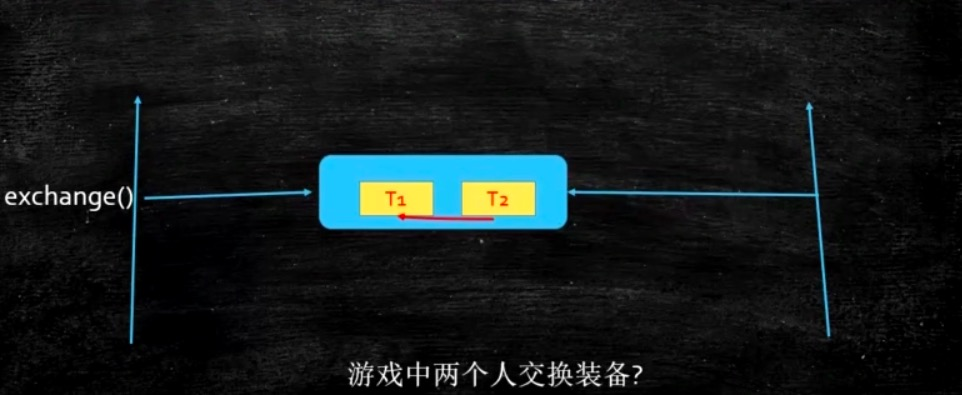

exchange的使用场景，比如在游戏中两个人装备交换。

```java
package com.mashibing.juc.c_020;
import java.util.concurrent.Exchanger;

public class T12_TestExchanger {
    static Exchanger<String> exchanger = new Exchanger<>();

    public static void main(String[] args) {
        new Thread(()->{
            String s = "T1";
            try {
                s = exchanger.exchange(s);
            } catch (InterruptedException e) {
                e.printStackTrace();
            }
            System.out.println(Thread.currentThread().getName() + " " + s);

        }, "t1").start();

        new Thread(()->{
            String s = "T2";
            try {
                s = exchanger.exchange(s);
            } catch (InterruptedException e) {
                e.printStackTrace();
            }
            System.out.println(Thread.currentThread().getName() + " " + s);
        }, "t2").start();

    }
}
```

**内容回顾**

- 我们首先讲了ReentrantLock和synchronized一个区别，ReentrantLock更灵活，更方便；

- 讲了CountDownLatch的用法，就是倒计时，什么时候计数完了，门栓打开，程序继续往下执行；

- CycliBarrier一个栅栏，循环使用，什么时候人满了，栅栏放倒大家冲过去；
- Phaser分阶段的栅栏；
- ReadWriteLock读写锁，重点掌握；
- Semaphore限流用的；
- Exchanger两个线程之间互相交换数据；


# 第四节：LockSupport、淘宝面试题与源码阅读方法论

首先我们简单回顾一下前面三节课讲的内容，分别有线程的基本概念、synchronized、volatile、AtomicXXX、各种JUC同步框架(ReentrantLock、CountDownLatch、CyclicBarrier、Phaser、ReadWriteLock-StampedLock、Semaphore、Exchanger、LockSupport)，其中synchornized重点讲了一下，包括有synchornized的底层实现原理、锁升级的概念(四种状态：无锁、偏向锁、轻量级锁、重量级锁)，volatile我们讲了可见性和禁止指令重排序如何实现。

synchronized和ReentrantLock的不同？

​		synchronized：系统自带、系统自动加锁，自动解锁、不可以出现多个不同的等待队列、默认进行四种锁状态的升级

​		ReentrantLock：需要手动枷锁，手动解锁、可以出现多个不同的等待队列、CIS的实现

本章我们补一个小漏洞，它叫LockSupport，然后我们分析两道面试题，紧接着我会教大家阅读源码的技巧，源码层出不穷，生生不息，掌握了源码的阅读技巧，大家培养出了阅读源码兴趣的时候，之后好多代码，你需要自己去抠，抠出来才是你自己的，最后我们会分析AQS源码，以上是我们本章主讲的内容概述。 

**LockSupport**

我们会以几个小程序为案例，展开对LockSupport的讲解，在以前我们要阻塞和唤醒某一个具体的线程有很多限制比如：

​	1、因为wait()方法需要释放锁，所以必须在synchronized中使用，否则会抛出异常IllegalMonitorStateException

​	2、notify()方法也必须在synchronized中使用，并且应该指定对象

​	3、synchronized()、wait()、notify()对象必须一致，一个synchronized()代码块中只能有一个线程调用wait()或notify()

以上诸多限制，体现出了很多的不足，所以LockSupport的好处就体现出来了。

在JDK1.6中的java.util.concurrent的子包locks中引了LockSupport这个API，LockSupport是一个比较底层的工具类，用来创建锁和其他同步工具类的基本线程阻塞原语。java锁和同步器框架的核心 AQS: AbstractQueuedSynchronizer，就是通过调用 LockSupport .park()和 LockSupport .unpark()的方法，来实现线程的阻塞和唤醒的。我们先来看一个小程序：

```java
public class T13_TestLockSupport {
    public static void main(String[] args) {
        //使用lombda表达式创建一个线程t
        Thread t = new Thread(()->{
            for (int i = 0; i < 10; i++) {
                System.out.println(i);
                if(i == 5) {
                    //使用LockSupport的park()方法阻塞当前线程t
                    LockSupport.park();
                }
                try {
                    //使当前线程t休眠1秒
                    TimeUnit.SECONDS.sleep(1);
                } catch (InterruptedException e) {
                    e.printStackTrace();
                }
            }
        });
        //启动当前线程t
        t.start();
    }
}

```

从以上的小程序中，我们不难看出LockSupport使用起来的是比较灵灵活的，没有了所谓的限制。我们来分析一下代码的执行过程，首先我们使用lombda表达式创建了线程对象 " t " ，然后通过 " t " 对象调用线程的启动方法start()，然后我们再看线程的内容，在for循环中，当 i 的值等于5的时候，我们调用了LockSupport的.park()方法使当前线程阻塞，注意看方法并没有加锁，就默认使当前线程阻塞了，由此可以看出LockSupprt.park()方法并没有加锁的限制。

我们再来看一个小程序：

```java
public class T13_TestLockSupport {
    public static void main(String[] args) {
        //使用lombda表达式创建一个线程t
        Thread t = new Thread(()->{
            for (int i = 0; i < 10; i++) {
                System.out.println(i);
                if(i == 5) {
                    //使用LockSupport的park()方法阻塞当前线程t
                    LockSupport.park();
                }
                try {
                    //使当前线程t休眠1秒
                    TimeUnit.SECONDS.sleep(1);
                } catch (InterruptedException e) {
                    e.printStackTrace();
                }
            }
        });
        //启动当前线程t
        t.start();
        //唤醒线程t
        LockSupport.unpark(t);
    }
}
```

我们来分析一下以上小程序，我们只需要在第一个小程序的主线程中，调用LockSupport的unpark()方法，就可以唤醒某个具体的线程，这里我们指定了线程 " t " ，代码运行以后结果显而易见，线程并没有被阻塞，我们成功唤醒了线程 " t " ，在这里还有一点，需要我们来分析一下，在主线程中线程 " t " 调用了start()方法以后，因为紧接着执行了LockSupport的unpark()方法，所以也就是说，在线程 " t "还没有执行还没有被阻塞的时候，已经调用了LockSupport的unpark()方法来唤醒线程 " t " ，之后线程 " t "才启动调用了LockSupport的park()来使线程 " t " 阻塞，但是线程 " t " 并没有被阻塞，由此可以看出，LockSupport的unpark()方法可以先于LockSupport的park()方法执行。

我们再来看最后一个小程序：

```java
public class T13_TestLockSupport {
    public static void main(String[] args) {
        //使用lombda表达式创建一个线程t
        Thread t = new Thread(()->{
            for (int i = 0; i < 10; i++) {
                System.out.println(i);
                if(i == 5) {
                    //调用LockSupport的park()方法阻塞当前线程t
                    LockSupport.park();
                }
                if(i == 8){
			   	   //调用LockSupport的park()方法阻塞当前线程t
                    LockSupport.park();
                }
                
                try {
                    //使当前线程t休眠1秒
                    TimeUnit.SECONDS.sleep(1);
                } catch (InterruptedException e) {
                    e.printStackTrace();
                }
            }
        });
        //启动当前线程t
        t.start();
        //唤醒线程t
        LockSupport.unpark(t);
    }
}
```

我们来分析一下以上小程序，在第二个小程序的基础上又添加了一个if判断，在i等于8的时候再次调用LockSupport的park()方法来使线程 " t " 阻塞， 我们可以看到线程被阻塞了，原因是LockSupport的unpark()方法就像是获得了一个“令牌”，而LockSupport的park()方法就像是在识别“令牌”，当主线程调用了LockSupport.unpark(t)方法也就说明线程 " t "  已经获得了”令牌”，当线程 " t " 再调用LockSupport的park()方法时，线程 " t " 已经有令牌了，这样他就会马上再继续运行，也就不会被阻塞了，但是当i等于8的时候线程 " t " 再次调用了LockSupport的park()方法使线程再次进入阻塞状态，这个时候“令牌”已经被使用作废掉了，也就无法阻塞线程 " t " 了，而且如果主线程处于等待“令牌”状态时，线程 " t " 再次调用了LockSupport的park()方法，那么线程 " t "就会永远阻塞下去，即使调用unpark()方法也无法唤醒了。

由以上三个小程序我们可以总结得出以下几点：

​	1、LockSupport不需要synchornized加锁就可以实现线程的阻塞和唤醒

​	2、LockSupport.unpartk()可以先于LockSupport.park()执行，并且线程不会阻塞

​	3、如果一个线程处于等待状态，连续调用了两次park()方法，就会使该线程永远无法被唤醒

**LockSupport中park()和unpark()方法的实现原理**

park()和unpark()方法的实现是由Unsefa类提供的，而Unsefa类是由C和C++语言完成的，其实原理也是比较好理解的，它主要通过一个变量作为一个标识，变量值在0，1之间来回切换，当这个变量大于0的时候线程就获得了“令牌”，从这一点我们不难知道，其实park()和unpark()方法就是在改变这个变量的值，来达到线程的阻塞和唤醒的，具体实现不做赘述了。

**淘宝面试题**

**面试题1**

实现一个容器，提供两个方法add、size，写两个线程：

线程1，添加10个元素到容器中

线程2，实时监控元素个数，当个数到5个时，线程2给出提示并结束

我们根据小程序来刨析这个面试题，小程序1：

小程序1的执行流程：

通过内部的list来new一个ArrayList，在自定义的add方法直接调用list的add方法，在自定义的size方法直接调用list的size方法，想法很简单，首先小程序化了这个容器，接下来启动了t1线程，t1线程中做了一个循环，每次循环就添加一个对象，加一个就打印显示一下到第几个了，然后给了1秒的间隔，在t2线程中写了了一个while循环，实时监控着集合中对象数量的变化，如果数量达到5就结束t2线程。

小程序1的执行结果：

方法并没有按预期的执行，我们注意看t2线程中c.size()这个方法，当对象添加以后，ArraylList的size()方肯定是要更新的，我们分析一下，当t1线程中的size()放法要更新的时候，还没有更新t2线程就读了，这个时候t2线程读到的值就与实际当中加入的值不一致了，所以得出两结论，第一这个方案没有加同步，第二while(true)中的c.size()方法永远没有检测到，没有检测到的原因是线程与线程之间是不可见的

```java
public class T01_WithoutVolatile {
	List lists = new ArrayList();
	public void add(Object o) {
		lists.add(o);
	}
	public int size() {
		return lists.size();
	}
	public static void main(String[] args) {
		T01_WithoutVolatile c = new T01_WithoutVolatile();
		new Thread(() -> {
			for(int i=0; i<10; i++) {
				c.add(new Object());
				System.out.println("add " + i);
				try {
					TimeUnit.SECONDS.sleep(1);
				} catch (InterruptedException e) {
					e.printStackTrace();
				}
			}
		}, "t1").start();
		new Thread(() -> {
			while(true) {
				if(c.size() == 5) {java
					break;
				}
			}
			System.out.println("t2 结束");
		}, "t2").start();
	}
}
```


小程序2：

```java
public class T02_WithVolatile {
	volatile List lists = new LinkedList();
	public void add(Object o) {
		lists.add(o);
	}
	public int size() {
		return lists.size();
	}
	public static void main(String[] args) {
		T02_WithVolatile c = new T02_WithVolatile();
		new Thread(() -> {
			for(int i=0; i<10; i++) {
				c.add(new Object());
				System.out.println("add " + i);
				/*try {
					TimeUnit.SECONDS.sleep(1);
				} catch (InterruptedException e) {
					e.printStackTrace();
				}*/
			}
		}, "t1").start();
		new Thread(() -> {
			while(true) {
				if(c.size() == 5) {
					break;
				}
			}
			System.out.println("t2 结束");
		}, "t2").start();
	}
}
```

小程序2是在小程序1的基础上做了一些改动，用volatile修饰了一下List集合，实现线程间信息的传递，但是还是有不足之处，程序还是无法运行成功，而且我们还得出，volatile一定要尽量去修饰普通的值，不要去修饰引用值，因为volatile修饰引用类型，这个引用对象指向的是另外一个new出来的对象对象，如果这个对象里边的成员变量的值改变了，是无法观察到的，所以小程序2也是不理想的。

小程序3：

```java
public class T03_NotifyHoldingLock { //wait notify
	//添加volatile，使t2能够得到通知
	volatile List lists = new ArrayList();
	public void add(Object o) {
		lists.add(o);
	}
	public int size() {
		return lists.size();
	}
	public static void main(String[] args) {
		T03_NotifyHoldingLock c = new T03_NotifyHoldingLock();
		final Object lock = new Object();
        //需要注意先启动t2再启动t1
		new Thread(() -> {
			synchronized(lock) {
				System.out.println("t2 启动");
				if(c.size() != 5) {
					try {
						lock.wait();
					} catch (InterruptedException e) {
						e.printStackTrace();
					}
				}
				System.out.println("t2 结束");
			}
		}, "t2").start();
		try {
			TimeUnit.SECONDS.sleep(1);
		} catch (InterruptedException e1) {
			e1.printStackTrace();
		}
		new Thread(() -> {
			System.out.println("t1 启动");
			synchronized(lock) {
				for(int i=0; i<10; i++) {
					c.add(new Object());
					System.out.println("add " + i);
					
					if(c.size() == 5) {
						lock.notify();
					}
					try {
						TimeUnit.SECONDS.sleep(1);
					} catch (InterruptedException e) {
						e.printStackTrace();
					}
				}
			}
		}, "t1").start();
	}
}
```

小程序3的执行流程：

小程序3用了锁的方式(利用wait()和notify())，通过给object对象枷锁然后调用wait()和notify()实现这道面试题，我们从头到尾分析一下，首先List集合实现的add和size方法不多做解释，我们把重点放在mian方法上，main方法里我们创建了object对象，让后写了两个线程t1和t2，t1用来增加对象，t2用来监控list集合添加的对象个数，在t2线程我们给object对象加锁，然后判断list集合对象的个数为5的时候，就调用wait()方法阻塞t2线程，并给出相应提示，t1线程里我们给object对象加锁，通过for循环来给list集合添加对象，当对象添加到5个的时候，唤醒t2线程来完成对象个数的监控，这里我们需要保证先启动的是第二个线程，让它直接进入监控状态，以完成实时监控。

小程序3的执行结果：

当试过了小程序3，我们会发现，这种写法也是行不通的，原因是notify()方法不释放锁，当t1线程调用了notify()方法后，并没有释放当前的锁，所以t1还是会执行下去，待到t1执行完毕，t2线程才会被唤醒接着执行，这个时候对象已经不只有5个了，所以这个方案也是行不通的。

小程序4：

```java
public class T03_NotifyHoldingLock { //wait notify
	//添加volatile，使t2能够得到通知
	volatile List lists = new ArrayList();
	public void add(Object o) {
		lists.add(o);
	}
	public int size() {
		return lists.size();
	}
	public static void main(String[] args) {
		T03_NotifyHoldingLock c = new T03_NotifyHoldingLock();
		final Object lock = new Object();
        //需要注意先启动t2再启动t1
		new Thread(() -> {
			synchronized(lock) {
				System.out.println("t2 启动");
				if(c.size() != 5) {
					try {
						lock.wait();
					} catch (InterruptedException e) {
						e.printStackTrace();
					}
				}
				System.out.println("t2 结束");
			}
            //通知t1继续执行
            lock.notify()。
		}, "t2").start();
		try {
			TimeUnit.SECONDS.sleep(1);
		} catch (InterruptedException e1) {
			e1.printStackTrace();
		}
		new Thread(() -> {
			System.out.println("t1 启动");
			synchronized(lock) {
				for(int i=0; i<10; i++) {
					c.add(new Object());
					System.out.println("add " + i);
					if(c.size() == 5) {
						lock.notify();
                        //释放锁，让t2得以执行
                        try{
                           lock.wait();
                        }catch(InterruptedException e){
					  	 e.printStackTrace();
                        }
					}
					try {
						TimeUnit.SECONDS.sleep(1);
					} catch (InterruptedException e) {
						e.printStackTrace();
					}
				}
			}
		}, "t1").start();
	}
}
```

小程序4是在小程序3的基础上做了一些小改动，我们来分析一下执行流程，首先t2线程执行，判断到list集合里的对象数量没有5个，t2线程被阻塞了，接下来t1线程开始执行，当循环添加了5个对象后，唤醒了t2线程，重点在于小程序3我们说过notify()方法是不会是释放锁的，所以在notify()以后，又紧接着调用了wait()方法阻塞了t1线程，实现了t2线程的实时监控，t2线程执行结束，打印出相应提示，最后调用notify()方法唤醒t1线程，让t1线程完成执行。看过执行结果，发现示例4完成了面试题的功能成功运行。

小程序5：

```java
public class T05_CountDownLatch {
	//添加volatile，使t2能够得到通知
	volatile List lists = new ArrayList();
	public void add(Object o) {
		lists.add(o);
	}
	public int size() {
		return lists.size();
	}
	public static void main(String[] args) {
		T05_CountDownLatch c = new T05_CountDownLatch();
        //需要注意先启动t2再启动t1
		CountDownLatch latch = new CountDownLatch(1);
		new Thread(() -> {
			System.out.println("t2 启动");
			if (c.size() != 5) {
				try {
					latch.await();
				} catch (InterruptedException e) {
					e.printStackTrace();
				}
			}
			System.out.println("t2 结束");

		}, "t2").start();

		try {
			TimeUnit.SECONDS.sleep(1);
		} catch (InterruptedException e1) {
			e1.printStackTrace();
		}
		new Thread(() -> {
			System.out.println("t1 启动");
			for (int i = 0; i < 10; i++) {
				c.add(new Object());
				System.out.println("add " + i);

				if (c.size() == 5) {
					// 暂停t1线程
					latch.countDown();
				}
				/*try {
					TimeUnit.SECONDS.sleep(1);
				} catch (InterruptedException e) {
					e.printStackTrace();
				}*/
			}
		}, "t1").start();
	}
}

```

小程序5我们用CountDownLatch ( 门闩 ) 来完成这一题的需求，我们来分析代码的执行流程，首先我们不难看出和小程序4的写法大同小异，同样是list集合实现add和size方法，两个线程t1和t2，t1线程里是循环添加对象，t2里是实时监控，不同点在于没有了锁，采用了await()方法替换了t2线程和t1线程中的wait()方法，执行流程是创建门闩对象latch，t2线程开始启动，判断到对象不等于5，调用await()方法阻塞t2线程，t1线程开始执行添加对象，当对象增加到5个时，打开门闩让t2继续执行。

执行结果看似没什么大问题，但是当我们把休眠1秒这段带代码，从t1线程里注释掉以后，会发现出错了，原因是在t1线程里，对象增加到5个时，t2线程的门闩确实被打开了，但是t1线程马上又会接着执行，之前是t1会休眠1秒，给t2线程执行时间，但当注释掉休眠1秒这段带代码，t2就没有机会去实时监控了，所以这种方案来使用门闩是不可行的。但是如果我们非得使用门闩，还要求在对象数量为5的时候把t2线程打印出来，如何实现呢？

小程序6：

```java
public class T05_CountDownLatch {
	//添加volatile，使t2能够得到通知
	volatile List lists = new ArrayList();
	public void add(Object o) {
		lists.add(o);
	}
	public int size() {
		return lists.size();
	}
	public static void main(String[] args) {
		T05_CountDownLatch c = new T05_CountDownLatch();
		CountDownLatch latch = new CountDownLatch(1);
        //需要注意先启动t2再启动t1
		new Thread(() -> {
			System.out.println("t2 启动");
			if (c.size() != 5) {
				try {
					latch.await();
				} catch (InterruptedException e) {
					e.printStackTrace();
				}
			}
			System.out.println("t2 结束");

		}, "t2").start();

		try {
			TimeUnit.SECONDS.sleep(1);
		} catch (InterruptedException e1) {
			e1.printStackTrace();
		}
		new Thread(() -> {
			System.out.println("t1 启动");
			for (int i = 0; i < 10; i++) {
				c.add(new Object());
				System.out.println("add " + i);

				if (c.size() == 5) {
					//打开门闩，让t2得以执行
					latch.countDown();
                      //给t1上门闩，让t2有机会执行
					try {
						latch.await();
					} catch (InterruptedException e) {
						e.printStackTrace();
					}
				}
				try {
					TimeUnit.SECONDS.sleep(1);
				} catch (InterruptedException e) {
					e.printStackTrace();
				}
			}
		}, "t1").start();
	}
}
```

小程序6很容易理解，我们只需要在t1线程打开t2线程门闩的时候，让他再给自己加一个门闩就可以了。

小程序7：

```java
public class T06_LockSupport {
	//添加volatile，使t2能够得到通知
	volatile List lists = new ArrayList();
	public void add(Object o) {
		lists.add(o);
	}
	public int size() {
		return lists.size();
	}
	public static void main(String[] args) {
		T06_LockSupport c = new T06_LockSupport();
		CountDownLatch latch = new CountDownLatch(1);
        //需要注意先启动t2再启动t1
		Thread t2 = new Thread(() -> {
			System.out.println("t2 启动");
			if (c.size() != 5) {
				LockSupport.park();
			}
			System.out.println("t2 结束");
            LockSupport.unpark(t1);
		}, "t2");
		t2.start();
		try {
			TimeUnit.SECONDS.sleep(1);
		} catch (InterruptedException e1) {
			e1.printStackTrace();
		}
		new Thread(() -> {
			System.out.println("t1 启动");
			for (int i = 0; i < 10; i++) {
				c.add(new Object());
				System.out.println("add " + i);
				if (c.size() == 5) {
					LockSupport.unpark(t2);
                      LockSupport.park();
				}
				/*try {
					TimeUnit.SECONDS.sleep(1);
				} catch (InterruptedException e) {
					e.printStackTrace();
				}*/
			}
		}, "t1").start();
	}
}
```

小程序7采用了本章所学的LockSupport实现的，与之前的小程序也是大同小异，不同的只是改变了线程阻塞和唤醒所使用的方法，仔细观看小程序7就会明白，但是小程序7中其实也是有不足的，当注释掉t1线程中休眠1秒方法的时候，程序就出错了，原因是在t1线程调用unpark()方法唤醒t2线程的时候，t1线程并没有停止，就会造成t2线程无法及时的打印出提示信息，怎么解决呢？很简单，在t1线程调用unpark()方法唤醒t2线程的时候，紧接着调用park()方法使t1线程阻塞，然后在t2线程打印信息结束后调用unpark()方法唤醒t1线程，至此程序结束，具体实现，我们往下看。

小程序8

```java
public class T07_LockSupport_WithoutSleep {
	// 添加volatile，使t2能够得到通知
	volatile List lists = new ArrayList();
	public void add(Object o) {
		lists.add(o);
	}
	public int size() {
		return lists.size();
	}
	static Thread t1 = null, t2 = null;
	public static void main(String[] args) {
		T06_LockSupport c = new T06_LockSupport();
		CountDownLatch latch = new CountDownLatch(1);
		t2 = new Thread(() -> {
			System.out.println("t2 启动");
			if (c.size() != 5) {
				LockSupport.park();
			}
			System.out.println("t2 结束");
			LockSupport.unpark(t1);
		}, "t2");
		try {
			TimeUnit.SECONDS.sleep(1);
		} catch (InterruptedException e1) {
			e1.printStackTrace();
		}
		t1 =  new Thread(() -> {
			System.out.println("t1 启动");
			for (int i = 0; i < 10; i++) {
				c.add(new Object());
				System.out.println("add " + i);
				if (c.size() == 5) {
					LockSupport.unpark(t2);
					LockSupport.park();
				}
				try {
					TimeUnit.SECONDS.sleep(1);
				} catch (InterruptedException e) {
					e.printStackTrace();
				}
			}
		}, "t1");
        //需要注意先启动t2再启动t1
		t2.start();
		t1.start();
	}
}
```

我们来分析一下小程序8，首先看，我们在类的成员变量里定义了静态的线程对象t1和t2，然后在main方法里创建了t1线程和t2线程，t2线程中判断了list集合中对象的数量，然后t2线程阻塞，t1线程开始执行添加对象，对象达到5个时，打开t2线程阻塞t1线程，至此程序结束，运行成功。

小程序9：

```java
public class T08_Semaphore {
    // 添加volatile，使t2能够得到通知
    volatile List lists = new ArrayList();
    public void add(Object o) {
        lists.add(o);
    }
    public int size() {
        return lists.size();
    }
    static Thread t1 = null, t2 = null;
    public static void main(String[] args) {
        T08_Semaphore c = new T08_Semaphore();
        Semaphore s = new Semaphore(1);
        t1 = new Thread(() -> {
            try {
                s.acquire();
                for (int i = 0; i < 5; i++) {
                    c.add(new Object());
                    System.out.println("add " + i);
                }
                s.release();
            } catch (InterruptedException e) {
                e.printStackTrace();
            }
            try {
                t2.start();
                t2.join();
            } catch (InterruptedException e) {
                e.printStackTrace();
            }
            try {
                s.acquire();
                for (int i = 5; i < 10; i++) {
                    c.add(new Object());
                    System.out.println("add"+i);
                }
                s.release();
            } catch (InterruptedException e) {
                e.printStackTrace();
            }
        }, "t1");
        t2 = new Thread(() -> {
            try {
                s.acquire();
                System.out.println("t2 结束");
                s.release();
            } catch (InterruptedException e) {
                e.printStackTrace();
            }
        }, "t2");
        t1.start();
    }
}
```

小程序9我们通过Semaphore来实现，大体的执行流程大体是这样的，创建一个Semaphore对象，设置只能有1一个线程可以运行，首先线程1开始启动，调用acquire()方法限制其他线程运行，在for循环添加了4个对象以后，调用s.release()表示其他线程可以运行，这个时候t1线程启动t2线程，调用join()把CPU的控制权交给t2线程，t2线程打印出提示信息，并继续输出后来的对象添加信息，当然了这个方案看起来很牵强，但是的确实现了这个效果，思路是好的，可以用做参考。

**面试题1总结**

面试题1中的9个小程序9种方案，5种技术分别是volatile、wait()和notify()、Semaphore、CountDownLatch、LockSupport，其中wait()和notify()这个方案建议牢牢掌握，其它的可以用作巩固技术。

**面试题2**

写一个固定容量同步容器，拥有put和get方法，以及getCount方法，能够支持2个生产者线程以及10个消费者线程的阻塞调用。

小程序1：

```java
public class MyContainer1<T> {
	final private LinkedList<T> lists = new LinkedList<>();
	final private int MAX = 10; //最多10个元素
	private int count = 0;
    //生产者
	public synchronized void put(T t) {
		while(lists.size() == MAX) { //想想为什么用while而不是if？
			try {
				this.wait(); //effective java
			} catch (InterruptedException e) {
				e.printStackTrace();
			}
		}
		lists.add(t);
		++count;
		this.notifyAll(); //֪ͨ通知消费者线程进行消费
	}
    //消费者
	public synchronized T get() {
		T t = null;
		while(lists.size() == 0) {
			try {
				this.wait();
			} catch (InterruptedException e) {
				e.printStackTrace();
			}
		}
		t = lists.removeFirst();
		count --;
		this.notifyAll(); //通知生产者线程进行生产
		return t;
	}
	public static void main(String[] args) {
		MyContainer1<String> c = new MyContainer1<>();
		//启动消费者线程
		for(int i=0; i<10; i++) {
			new Thread(()->{
				for(int j=0; j<5; j++) System.out.println(c.get());
			}, "c" + i).start();
		}
		try {
			TimeUnit.SECONDS.sleep(2);
		} catch (InterruptedException e) {
			e.printStackTrace();
		}
		//启动生产者线程
		for(int i=0; i<2; i++) {
			new Thread(()->{
				for(int j=0; j<25; j++) c.put(Thread.currentThread().getName() + " " + j);
			}, "p" + i).start();
		}
	}
}
```

我们来说一下以上小程序的执行流程，我们创建了一个LinkedList集合用于保存 “馒头”，定义了MAX变量来限制馒头的总数，定义了count变量用来判断生产了几个 “馒头”和消费了几个 “馒头”，在put()方法中，首先判断 LinkedList集合中“馒头”是否是MAX变量的值，如果是启动所有消费者线程，反之开始生产 “馒头”，在get()方法中，首先判断是否还有 “馒头”，也就是MAX的值是否为0，如果为0通知所有生产者线程开始生产 “馒头”，反之不为0 “馒头”数就继续减少，需要注意的点是，我们为什么要加synchronized，因为我们++count我们生产了3个 “馒头”，当还没来得及加的时候，count值为2的时候，另外一个线程读到的值很可能是2，并不是3，所以不加锁就会出问题，我们接着来看main方法中通过for循环分别创建了2个生产者线程生产分别生产25 “馒头”，也就是50个馒头，10个消费者线程每个消费者消费5个 “馒头”，也就是50个 “馒头”，首先启动消费者线程，然后启动生产者线程，至此流程介绍完毕。

我们来分析一下这个小程序

为什么用while而不是用if？ 因为当LinkedList集合中“馒头”数等于最大值的时候，if在判断了集合的大小等于MAX的时候，调用了wait()方法以后，它不会再去判断一次，方法会继续往下运行，假如在你wait()以后，另一个方法又添加了一个“ 馒头”，你没有再次判断，就又添加了一次，造成数据错误，就会出问题，因此必须用while。

注意看我们用的是notifyAll()来唤醒线程的，notifyAll()方法会叫醒等待队列的所有方法，那么我们都知道，用了锁以后就只有一个线程在运行，其他线程都得wait()，不管你有多少个线程，这个时候被叫醒的线程有消费者的线程和生产者的线程，所有的线程都会争抢这把锁，比如说我们是生产者线程，生产满了，满了以后我们叫醒消费者线程，可是很不幸的是，它同样的也会叫醒另外一个生产者线程，假如这个生产者线程难道了这把锁刚才第一个生产者释放的这把锁，拿到了以后，它又wait()一遍，wait()完以后，又叫醒全部的线程，然后又开始争抢这把锁，其实从这个意义上来讲，生产者的线程wait的你是没有必要去叫醒别的生产者的，我们能不能只叫醒消费者线程，就是生产者线程只叫醒消费者线程，消费者线程只负责叫醒生产者线程，如果想达到这样一个程度的话用另外一个小程序。

```java
public class MyContainer2<T> {
	final private LinkedList<T> lists = new LinkedList<>();
	final private int MAX = 10; //最多10个元素
	private int count = 0;
     private Lock lock = new ReentrantLock();
	private Condition producer = lock.newCondition();
	private Condition consumer = lock.newCondition();
	public void put(T t) {
		try {
			lock.lock();
			while(lists.size() == MAX) { //想想为什么用while而不是用if？
				producer.await();
			}
			lists.add(t);
			++count;
			consumer.signalAll(); //通知消费者线程进行消费
		} catch (InterruptedException e) {
			e.printStackTrace();
		} finally {
			lock.unlock();
		}
	}
	public T get() {
		T t = null;
		try {
			lock.lock();
			while(lists.size() == 0) {
				consumer.await();
			}
			t = lists.removeFirst();
			count --;
			producer.signalAll(); //通知生产者进行生产
		} catch (InterruptedException e) {
			e.printStackTrace();
		} finally {
			lock.unlock();
		}
		return t;
	}
	public static void main(String[] args) {
		MyContainer2<String> c = new MyContainer2<>();
		//启动消费者线程
		for(int i=0; i<10; i++) {
			new Thread(()->{
				for(int j=0; j<5; j++) System.out.println(c.get());
			}, "c" + i).start();
		}
		try {
			TimeUnit.SECONDS.sleep(2);
		} catch (InterruptedException e) {
			e.printStackTrace();
		}
		
		//启动生产者线程
		for(int i=0; i<2; i++) {
			new Thread(()->{
				for(int j=0; j<25; j++) c.put(Thread.currentThread().getName() + " " + j);
			}, "p" + i).start();
		}
	}
}
```

上面这个小程序用了ReentrantLock，它与synchronized最大区别其实在这个面试题里已经体现出来了，ReentrantLock它可以有两种Condition条件，在put()方法里是我们的生产者线程，生产者线程lock()最后unlock()不多说，一但MAX达到峰值的时候是producer.await()，最后是consumer.signalAll()，就是说我在producer的情况下阻塞的，我叫醒的时候只叫醒consumer，在get()方法里是我们的消费者线程，一但集合的size空了，我是consumer.await()，然后我只叫醒producer，这就是ReentrantLock的含义，它能够精确的指定哪些线程被叫醒，注意是哪些不是哪个，我们来说一下Lock和Condition的本质是什么，它的本质是在synchronized里调用wait()和notify()的时候，它只有一个等待队列，如果lock.newnewCondition()的时候，就变成了多个等待队列，Condition的本质就是等待队列个数，以前只有一个等待队列，现在我new了两个Condition，一个叫producer一个等待队列出来了，另一个叫consumer第二个的等待队列出来了，当我们使用producer.await();的时候，指的是当前线程进入producer的等待队列，使用producer.signalAll()指的是唤醒producer这个等待队列的线程，consumner也是如此，所以上面的小程序就很容易理解了，我在生产者线程里叫醒consumer等待队列的线程也就是消费者线程，在消费者线程里叫醒producer待队列的线程也就是生产者线程，这个小程序的思路就是这样了。

**源码阅读技巧和AQS源码结构解析**

我们会通过学习ReentrantLock来学习如何阅读源码，在之前的小程序，我们已经了解过ReentrantLock了，就是创建ReentrantLock对象，调用对象的方法lock()和unlock()方法来加锁解锁，那么我们就来了解一下，在源码中是如何实现这些的，首先，要承认一点，读源码很难，因为你必须要理解别的思路，你要了解理解自己思路，或者理解跟你类似的人的思路，这件事是比较容易的，想法都是一样的，都是住在农村，从小在小河边光着屁股长大，我们聊河边那些柳树的问题，聊那些小虫子的问题，他一聊我就能理解，可惜很不幸的是那边是一白富美，人住在天宫，每天都用各种的口红，用一些我们没用过的，他一聊这些色号的时候，我就跟她聊不到一起去了，现在写程序的这些人就像住在天宫的人，而你就是小河边光屁股的小孩，你想理解的她的思路，你得先让你的思维达到她那个高度再说，读源码不管你读什么源码，基本上第一个要有一定的数据结构基础 ，第二个要有设计模式基础，其次是不要吹毛求疵，阅读源码贵在读懂别人的思路就行，没必要边边角角的都要去看，当你达到手中无剑，心中有剑的境界的时候，你会发现这些东西都是互通的，概念是人类发明出来帮助大家理解问题的，如果死抠概念，这样做是不对的，理解就好

**阅读源码的原则**

1、跑不起来的不读

跑不起来的源码不要读，看也看不懂，很难看懂，事倍功半，读起来还费劲，什么时候这个源码必须得跑起来，跑起来有什么好处就是，你可以用debug一条线跟进去，举个例子，比如ReentrantLock的lock()方法，没有跑起来的时候，静态的来读源码你会怎么读，按ctrl鼠标单击lock()方法，进入这个方法，会看到这个方法调用了别的方法，你又会按ctrl鼠标单击进入它调用的这个方法，一层层往下，你会发现没法读了，所以如果这个东西能跑起来就不一样了，你会发现与之前鼠标单击跟进的结果不一样了，原因是因为多态的实现，如果一个方法有很多子类的实现，但是你不知道跟着这条线，它会去实现那个方法，所以你就得全部看一遍。

2、解决问题就好 — 目的性

在实际中解决问题就好，读源码一方面可以解决问题，一方面可以应对面试，什么意思呢，如果你接手了一个别人改过6手的代码，现在你的老板说这个代码有些问题，你往里边加一些功能或者修改一些bug，你解决问题就好，你不要从头到尾去读去改这个代码，你读你能累死你，目的性要强，解决问题就好。

3、一条线索到底

读源码的时候要一条线索到底，不要只读表面，我们知道一个程序跑起来以后，可能这个程序非常大，一个main方法有很多的put、get、size各种各样其他的方法，每一个方法你调进去，这个方法很有可能又去调别的方法，你不要每个方法先看一遍表面，让后再去里边找，要一条线索到底，就读一个方法，由浅到深看一遍。

4、无关细节略过

有那些边界性的东西，在你读第一边的时候，没必要的时候，你可以先把它略过。

读源码的时候我建议大家自己去画图比如：

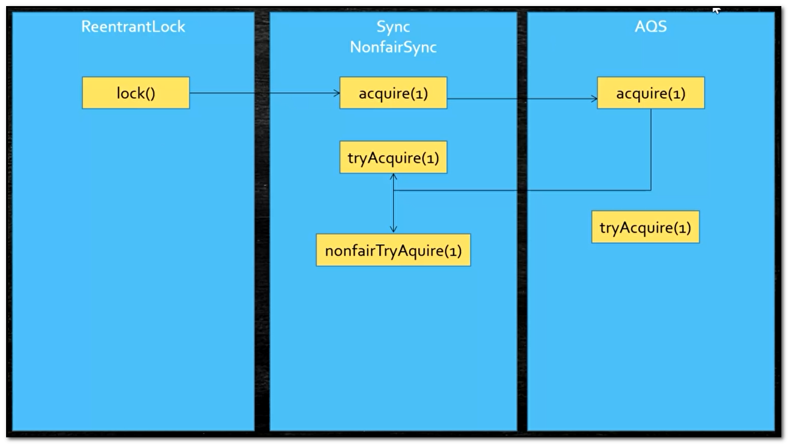

这种图叫甬道图，这是UML图的一种叫甬道，这个图诠释了哪个类里的哪个方法又去调用了哪个类里的的哪个方法，你读源码的时候，你一定要把它画成图给画出来，其次是授人以鱼不如授人以渔，把源码从头到尾带着你那样进步不会太大 ，我把方法教给你，远比带你要好的多。

从上面的甬道图可以看出，ReentrantLock调用它lock()方法的时候，它会调用acquire(1)方法，谁的acquire？是Sync的acquire，这很容易理解，在我们的lock方法里它调用了内部的一个类，这个类叫NonfairSync，NonfairSync它里边有个方法叫acquire(1)，当你读到这里的时候，实际上你要开始分支了，你要知道这个Sync是个什么样的类，大概扫一眼，前面说过要顺着线读进去，然后你再看一下这个acquire(1)方法它内部是怎么调用的，这个Sync是谁呢？它是一个NonfairSync，我们找到这个NonfairSync这个时候你再画一张图

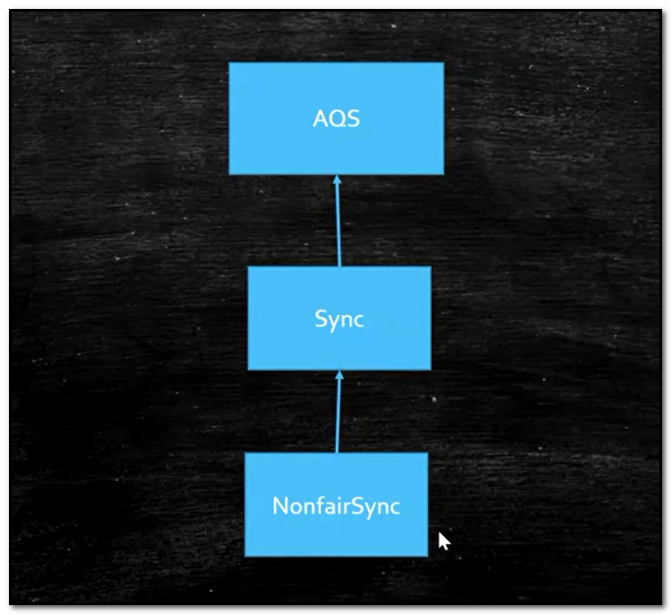

这个图是说这个NonfairSync的父类是Sync，因为你看到NonfairSync子类里方法的时候，它有可能用到父类的方法，所以你要去父类里读才可以，这个图一定要画好，NonfairSync的父类是Sync，好这个时候再回到Sync，这个时候我们看一下，这个Sync的父类又是谁？是AQS(AbstarctQueuedSynchronizer)，这个时候说一下AQS是所有锁的核心，我们继续lock调用了acquire(1)这个方法，是谁的acquire(1)？是NonfairSync的acquire(1)，NonfairSync又是谁？他是Sync的子类，Sync又是谁，Sync是AQS的子类，所以调用了acquire(1)我们再跟进去，这个时候就调用了AQS的acquire(1)了，AQS里面调用的是什么呢？是tryAcquire(1)，再跟进去你会发现这次调用的是NonfairSync里的tryAcquire(1)，刚才我们读的时候已经知道AQS里有一个tryAcquire(1)，但是它里面是抛出了一个异常，所以很容易理解，是NonfairSync里边重写了AQS里的tryAcquire(1)，所以AQS里的acquire(1)调用了NonfairSync里的tryAcquire(1)，我们再来看NonfairSync里的tryAcquire(1)又调用了nonfairTryAcquire(acquires)，我们再跟进这个时候读到这里，我们就必须要了解AQS了，如果不懂，就没办法继续进行下去了，我们看nonfairTryAcquire(acquires)方法实现，开始它得到了当前线程，跟线程有关系了，这个时候出现了一个方法getState()，我们来看一下这个方法，我们跟进你会发现，这个方法又尽到了AQS类里，这个getState()方法返回了一个state，这个state是什么呢？按着ctrl点过去，你会发现这个state就是一个volatile修饰的int类型的数，这个时候就牵扯到AQS的结构了

**AQS源码解析**

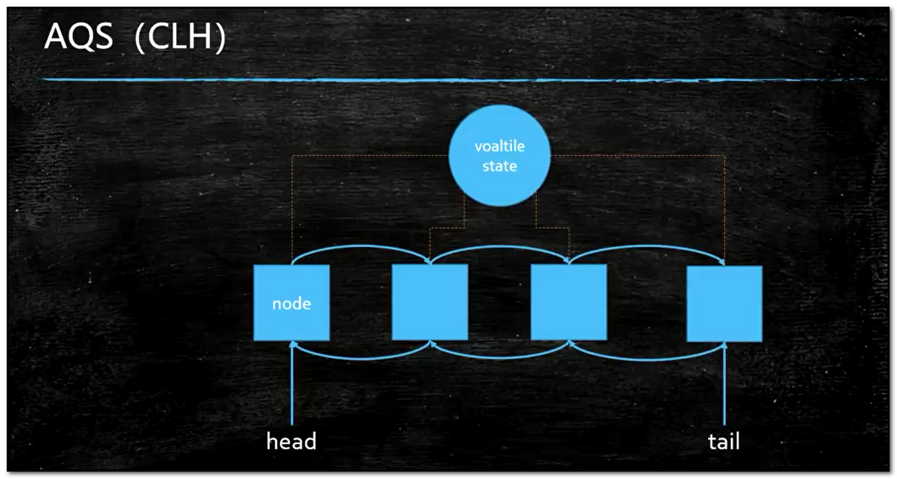

AQS队列又可以称为CLH队列，AQS的核心是什么？就是这个state，这个state所代表的意思随你定，随子类来定，我们现在讲的是ReentrantLock，刚才state的值是0，当你获得了之后它会变成1，就表示当前线程得到了这把锁，什么时候你释放完了，state又会从1变回0，说明当前线程释放了这把锁，所以这个state0和1就代表了加锁和解锁，所以这个state的值是根据你子类不同的实现取不同的意义，这个state的值的基础之上，它的下面跟着一个队列，这个队列是AQS自己内部所维护的队列，这个队列里边每一个所维护的都是node一个节点，它在哪里呢？他在AQS这个类里属于AQS的内部类，在这个node里最重要的一项是他里面保留了一个Thread一个线程，所以这个队列是个线程队列，而且还有两个prev和next分别是前面的节点和后面的节点，所以AQS里边的队列是这样子的，一个一个的node，node里装的是线程Thread，这个node它可以指向前面的这一个，也可以指向后面的这一个，所以叫双向列表，所以AQS的核心是一个state，以及监控这个state的双向列表，每个列表里面有个节点，这个节点里边装的是线程，那么那个线程得到了state这把锁，那个线程要等待，都要进入这个队列里边，当我们其中一个node得到了state这把锁，就说明这个node里得线程持有这把锁，所以当我们acquire(1)上来以后看到这个state的值是0，那我就直接拿到state这个把锁，现在是非公平上来就抢，抢不着就进队列里acquireQueued()，怎么是抢到呢？先得到当前线程，然后获取state的值，如果state的值等于0，用compareAndSetState(0,acquire)方法尝试把state的值改为1，假如改成了setExclusiveOwnerThread()把当前线程设置为独占statie这个把锁的状态，说明我已经得到这个把锁，而且这个把锁是互斥的，我得到以后，别人是得不到的，因为别人再来的时候这个state的值已经变成1了，如果说当前线程已经是独占state这把锁了，就往后加个1就表示可重入了。

什么叫模板方法？

模板方法是我在父类里有一个方法，就是这个tryAcquire(1)，它调用了我子类的一些方法，这些子类的方法没有实现，我调用自己的方法事先写好，但是由于这些方法就是给子类用来去重写实现的，所以我就像一个模板一样，我要打造一辆汽车，我要造地盘，造发动机，造车身，最后组装，造地盘这件事子类去实现，哪个车厂去实现是哪个车厂的事，奥迪是奥迪的事，奥托是奥托的事，车身也是发动机也是，最后反正这个流程是一样的，就像一个模板一样，我的模板是固定的，里边的方法是由具体的子类去实现的，当我们开始造车的时候，就会调用具体子类去实现的函数，所以叫为钩子函数，我勾着谁呢？勾着子类的实现，这个就叫模板方法。

什么叫非公平的去获得(nonfairTryAcquire)?

什么叫公平什么叫非公平，当我们获得一把锁的时候，有一些等待队列，如果说新来了一个线程要获得这个锁的时候，先去检查等待队列有没有人，如果有后面排队，这个叫公平，上来二话不说，我才不管你的队列有没有人在等着，我上来就抢，抢着就算我的，插队非公平。

最后我们来总结一下阅读源码的原则，跑不起来的不读、解决问题就好、一条线索到底、无关细节略过，在你阅读的过程中，我希望你话两种图，第一种方法之间的调用图，哪个方法调用了哪个方法，第二种类之间的类图，读源码重点在于你自己去读，所以强烈建议，边读边画图，这样会更深刻


# 第五节：AQS源码阅读与强软弱虚4种引用以及ThreadLocal原理与源码

今天咱们继续讲AQS的源码，在上节课我教大家怎么阅读AQS源码，跑不起来的不读、解决问题就好 — 目的性、一条线索到底、无关细节略过，读源码的时候应该先读骨架，比如拿AQS来说，你需要了解AQS是这么一个数据 结构，你读源码的时候读起来就会好很多，在这里需要插一句，从第一章到本章，章章的内容都是环环相扣的，没学习前边，建议先去补习一下前面的章节。


**通过ReentrantLock来解读AQS源码**

 AQS大家还记得吗？最核心的是它的一个共享的int类型值叫做state，这个state用来干什么，其实主要是看他的子类是怎么实现的，比如ReentrantLock这个state是用来干什么的？拿这个state来记录这个线程到底重入了多少次，比如说有一个线程拿到state这个把锁了，state的值就从0变成了1，这个线程又重入了一次，state就变成2了，又重入一次就变成3等等，什么时候释放了呢？从3变成2变成1变成0就释放了，这个就是AQS核心的东西，一个数，这个数代表了什么要看子类怎么去实现它，那么在这个state核心上还会有一堆的线程节点，当然这个节点是node，每个node里面包含一个线程，我们称为线程节点，这么多的线程节点去争用这个state，谁拿到了state，就表示谁得到了这把锁，AQS得核心就是一个共享的数据，一堆互相抢夺竞争的线程，这个就是AQS。

我们接着上节课来讲，首先给lock()方法处打断点，然后debug运行程序，

```java
//JDK源码
public class TestReentrantLock {
    private static volatile int i = 0;
    public static void main(String[] args) {
        ReentrantLock lock = new ReentrantLock();
        lock.lock();
        //synchronized (TestReentrantLock.class) {
            i++;
        //}
        lock.unlock();
        //synchronized 程序员的丽春院 JUC
    }
}
```

在lock()方法里里面，我们可以读到它调用了sync.acquire(1)，

```java
//JDK源码
public class ReentrantLock implements Lock, java.io.Serializable {
	public void lock(){
        sync.acquire(1);
    }
}
```

再跟进到acquire(1)里，可以看到acquire(1)里又调用了我们自己定义自己写的那个tryAcquire(arg)

```java
//JDK源码
public abstract class AbstractQueuedSynchronizer
    extends AbstractOwnableSynchronizer
    implements java.io.Serializable {
	public final void acquire(int arg){
		if(!tryAcquire(arg) 
           && acquireQueued(addWaiter(Node.EXCLUSIVE),arg))
       	 selfInterrupt();
	}
}
```

跟进到tryAcquire(arg)里又调用了nonfairTrytAcquire(acquires)

```java
//JDK源码
public class ReentrantLock implements Lock, java.io.Serializable {
    
	public void lock(){
        sync.acquire(1);
    }
    
    static final NonfairSync extends Sync{
        protected final boolean tryAcquire(int acquire){
            return nonfairTrytAcquire(acquires);
	   }
    }
}
```


nonfairTrytAcquire(acquires)我们读进去会发现它的里面就调用到了state这个值，到这里我们就接上了上一章讲的，nonfairTrytAcquire(acquires)里是这样的，首先拿到当前线程，拿到state的值，然后进行if判断，如果state的值为0，说明没人上锁，没人上锁怎么办呢？就给自己上锁，当前线程就拿到这把锁，拿到这个把锁的操作用到了CAS(compareAndSetState)的操作，从0让他变成1，state的值设置为1以后，设置当前线程是独一无二的拥有这把锁的线程，否则如果当前线程已经占有这把锁了，怎么办？很简单我们在原来的基础上加1就可以了，这样就能拿到这把锁了，就重入，前者是加锁后者是重入

```java
//JDK源码
public class ReentrantLock implements Lock, java.io.Serializable {
    
	public void lock(){
        sync.acquire(1);
    }
    
    static final NonfairSync extends Sync{
        protected final boolean tryAcquire(int acquire){
            return nonfairTrytAcquire(acquires);
	   }
    }
    
    final boolean nonfairTrytAcquire(int acquire){
         //获取当前线程
		final Thread current = Thread.currentThread();
        //拿到AQS核心数值state
         int c getState();
        //如果数值为0说明没人上锁
         if(c == 0){
             //给当线程上锁
			if(compareAndSetState(0,acquires)){
                //设置当前线程为独一无二拥有这把锁的线程
			    setExclusiveOwnerThread(current);
                 return true
            }
         }
        //判断当前线程是否拥有这个把锁
        else if(current == getExclusiveOwnerThread){
            //设置重入
			int nextc = c + acquires;
             if(nextc < 0)
                 throw new Error("Maximum lock count wxceeded");
             setState(nextc);
             return true;
         }
        return false;
    }
}
```

我们跟进到tryAcquire(arg)是拿到了这把锁以后的操作，如果拿不到呢？如果拿不到它实际上是调用了acquireQueued()方法，acquireQueued()方法里又调用了addWaiter(Node.EXCLUSIVE)然后后面写一个arg(数值1)，方法结构是这样的acquireQueued(addWaiter(Node.EXCLUSIVE),arg)通过acquireQueued这个方法名字你猜一下这是干什么的，你想如果是我得到这把锁了，想一下后面的acquireQueued是不用运行的，如果没有得到这把锁，后面的acquireQueued()才需要运行，那么想一下没有得到这把锁的时候它会运行什么呢？他会运行acquireQueued，Queued队列，acquire获得，跑到队列里去获得，那意思是什么？排队去，那排队的时候需要传递两个参数，第一个参数是某个方法的返回值addWaiter(Node.EXCLUSIVE)，来看这个方法的名字addWaiter，Waiter等待者，addWaiter添加一个等待者，用什么样的方式呢？Node.EXCLUSIVE排他形式，意思就是把当线程作为排他形式扔到队列里边。

```java
//JDK源码
public abstract class AbstractQueuedSynchronizer
    extends AbstractOwnableSynchronizer
    implements java.io.Serializable {
	public final void acquire(int arg){
        //判断是否得到锁
		if(!tryAcquire(arg) 
           && acquireQueued(addWaiter(Node.EXCLUSIVE),arg))
       	 selfInterrupt();
	}
}
```

我们来说一下这个addWaiter()方法，这个方法意思是说你添加等待者的时候，使用的是什么类型，如果这个线程是Node.EXCLUSIVE那么就是排他锁，Node.SHARED就是共享锁，首先是获得当前要加进等待者队列的线程的节点，然后是一个死循环，这意思就是说我不干成这件事我誓不罢休，那它干了一件什么事呢？

```java
//JDK源码
public abstract class AbstractQueuedSynchronizer
    extends AbstractOwnableSynchronizer
    implements java.io.Serializable {
	public final void acquire(int arg){
        //判断是否得到锁
		if(!tryAcquire(arg) 
           && acquireQueued(addWaiter(Node.EXCLUSIVE),arg))
       	 selfInterrupt();
	}
    
    private Node addWaiter(Node mode){
        //获取当前要加进来的线程的node(节点)
		Node node = new Node(mode);
        for(;;){
            //回想一下AQS数据结构图
		   Node oldTail = tail;
            if(oldTail != null){
                //把我们这个新节点的前置节点设置在等待队列的末端
				node.setPrevRelaved(oldTail);
                //CAS操作，把我们这个新节点设置为tail末端
                 if(compareAndAetTail(oldTail,node)){
					oldTail.next = node;
                      return node;
                 }
            }else{
                initializeSuncQueue();
            }
        }
    }
}
```

你想想想看，我们回想一下AQS数据结构图，就是他有一个int类型的数叫state，然后在state下面排了一个队列，这个队列是个双向的链表有一个head和一个tail，现在你要往这个队列中加一个节点上来，要排队嘛，我们仔细想一下加节点的话，应该得加到这个队列的末端是不是？它是怎么做到的呢？首先把tail记录在oldTail里，oldTail指向这个tail了，如果oldTail不等于空，它会把我们这个新节点的前置节点设置在这个队列的末端，接下来再次用到CAS操作，把我们这个新的节点设置为tail，整段代码看似繁琐，其实很简单，就是要把当前要加进等待者队列的线程的节点加到等待队列的末端，这里提一点，加到末端为什么要用CAS操作呢？因为CAS效率高，这个问题关系到AQS的核心操作，理解了这一点，你就理解了AQS为什么效率高，我们接着讲源码，这个增加线程节点操作，如果没有成功，那么就会不断的试，一直试到我们的这个node节点被加到线程队列末端为止，意思就是说，其它的节点也加到线程队列末端了，我无非就是等着你其它的线程都加到末端了，我加最后一个，不管怎么样我都要加到线程末端去为止。

源码读这里我们可以总结得出，AQS(AbstractQueuedSynchronizer)的核心就是用CAS(compareAndSet)去操作head和tail，就是说用CAS操作代替了锁整条双向链表的操作

**通过AQS是如何设置链表尾巴的来理解AQS为什么效率这么高**

我们的思路是什么呢？假如你要往一个链表上添加尾巴，尤其是好多线程都要往链表上添加尾巴，我们仔细想想看用普通的方法怎么做？第一点要加锁这一点是肯定的，因为多线程，你要保证线程安全，一般的情况下，我们会锁定整个链表(Sync)，我们的新线程来了以后，要加到尾巴上，这样很正常，但是我们锁定整个链表的话，锁的太多太大了，现在呢它用的并不是锁定整个链表的方法，而是只观测tail这一个节点就可以了，怎么做到的呢？compareAndAetTail(oldTail,node)，中oldTail是它的预期值，假如说我们想把当前线程设置为整个链表尾巴的过程中，另外一个线程来了，它插入了一个节点，那么仔细想一下Node oldTail = tail;的整个oldTail还等于整个新的Tail吗？不等于了吧，那么既然不等于了，说明中间有线程被其它线程打断了，那如果说却是还是等于原来的oldTail，这个时候就说明没有线程被打断，那我们就接着设置尾巴，只要设置成功了OK，compareAndAetTail(oldTail,node)方法中的参数node就做为新的Tail了，所以用了CAS操作就不需要把原来的整个链表上锁，这也是AQS在效率上比较高的核心。

**为什么是双向链表？**

其实你要添加一个线程节点的时候，需要看一下前面这个节点的状态，如果前面的节点是持有线程的过程中，这个时候你就得在后面等着，如果说前面这个节点已经取消掉了，那你就应该越过这个节点，不去考虑它的状态，所以你需要看前面节点状态的时候，就必须是双向的。

接下来我们来解读acquireQueued()这个方法，这个方法的意思是，在队列里尝试去获得锁，在队列里排队获得锁，那么它是怎么做到的呢？我们先大致走一遍这个方法，首先在for循环里获得了Node节点的前置节点，然后判断如果前置节点是头节点，并且调用tryAcquire(arg)方法尝试一下去得到这把锁，获得了头节点以后，你设置的节点就是第二个，你这个节点要去和前置节点争这把锁，这个时候前置节点释放了，如果你设置的节点拿到了这把锁，拿到以后你设置的节点也就是当前节点就被设置为前置节点，如果没有拿到这把锁，当前节点就会阻塞等着，等着什么？等着前置节点叫醒你，所以它上来之后是竞争，怎么竞争呢？如果你是最后节点，你就下别说了，你就老老实实等着，如果你的前面已经是头节点了，说明什么？说明快轮到我了，那我就跑一下，试试看能不能拿到这把锁，说不定前置节点这会儿已经释放这把锁了，如果拿不着阻塞，阻塞以后干什么？等着前置节点释放这把锁以后，叫醒队列里的线程，我想执行过程已经很明了了，打个比方，有一个人，他后面又有几个人在后面排队，这时候第一个人是获得了这把锁，永远都是第一个人获得锁，那么后边来的人干什么呢？站在队伍后面排队，然后他会探头看他前面这个人是不是往前走了一步，如果走了，他也走一步，当后来的这个人排到了队伍的第二个位置的时候，发现前面就是第一个人了，等这第一个人走了就轮到他了，他会看第一个人是不是完事了，完事了他就变成头节点了，就是这么个意思。


```java
//JDK源码
public abstract class AbstractQueuedSynchronizer
    extends AbstractOwnableSynchronizer
    implements java.io.Serializable {
	public final void acquire(int arg){
        //判断是否得到锁
		if(!tryAcquire(arg) 
           && acquireQueued(addWaiter(Node.EXCLUSIVE),arg))
       	 selfInterrupt();
	}
    
    final boolean acquireQueud(final Node node,int arg){
        boolean interrupted = false;
        try{
            for(;;){
                final Node p = node.predecessor();
                if(p == head && tryAcquire(arg)){
					setHead(node);
                      p.next = null;
                      return interrupted; 
                }
                if(shouldParkAfterFailedAcquire(p,node))
                    interrupted |= parkAndCheckInterrupt();
            }catch (Throwable t){
				cancelAcquire(node);
                 if(interrupted)
                     selfInterrupt();
                throw t;
            }
        }
    }
}
```

到这里AQS还有其它的一些细节我建议大家读一下，比如AQS是怎么释放锁的，释放完以后是怎么通知后置节点的，这个就比较简单了，本章不再一一赘述了，那么在你掌握了读源码的技巧，以及在前面教你了AQS大体的结构，还教了你怎么去记住这个队列，那么怎么去unlock这件事，就由大家自己去探索了。

**VarHandle**

我们再来讲一个细节，我们看addWaiter()这个方法里边有一个node.setPrevRelaved(oldTail)，这个方法的意思是把当前节点的前置节点写成tail，进入这个方法你会看到PREV.set(this,p)，那这个PREV是什么东西呢？当你真正去读这个代码，读的特别细的时候你会发现，PREV有这么一个东西叫VarHandle，这个VarHandle是什么呢？这个东西实在JDK1.9之后才有的，我们说一下这个VarHandle，Var叫变量(variable)，Handle叫句柄，打个比方，比如我们写了一句话叫Object o= new Object()，我们new了一个Object，这个时候内存里有一个小的引用“O”，指向一段大的内存这个内存里是new的那个Object对象，那么这个VarHandle指什么呢？指的是这个“引用”，我们思考一下，如果VarHandle代表“引用”，那么VarHandle所代表的这个值PREV是不是也这个“引用”呢？当然是了。这个时候我们会生出一个疑问，本来已经有一个“O”指向这个Object对象了，为什么还要用另外一个引用也指向这个对象，这是为什么？

```java
//JDK源码
public abstract class AbstractQueuedSynchronizer
    extends AbstractOwnableSynchronizer
    implements java.io.Serializable {
	public final void acquire(int arg){
        //判断是否得到锁
		if(!tryAcquire(arg) 
           && acquireQueued(addWaiter(Node.EXCLUSIVE),arg))
       	 selfInterrupt();
	}
    
    private Node addWaiter(Node mode){
        //获取当前要加进来的线程的node(节点)
		Node node = new Node(mode);
        for(;;){
            //回想一下AQS数据结构图
		   Node oldTail = tail;
            if(oldTail != null){
                //把我们这个新节点的前置节点设置在等待队列的末端
				node.setPrevRelaved(oldTail);
                //CAS操作，把我们这个新节点设置为tail末端
                 if(compareAndAetTail(oldTail,node)){
					oldTail.next = node;
                      return node;
                 }
            }else{
                initializeSuncQueue();
            }
        }
    }
    
    final void setPrevRelaved(Node p){
        PREV.set(this,p);
    }
    
    private static final VarHandle PREV;
    static {
        try{
			MethodHandles.Lookup l = MethodHandles.lookup():
             PREV = l.findVarHandle(Node.class,"prev",Node.class);
        }catch(ReflectiveOperationException e){
            throw new ExceptionInInitializerError(e);
        }
    }
}
```

我们来看一个小程序，用这个小程序来理解这个VarHandle是什么意思，在这个类，我们定义了一个int类型的变量x，然后定义了一个VarHandle类型的变量handle，在静态代码块里设置了handle指向T01_HelloVarHandle类里的x变量的引用，换句话说就是通过这个handle也能找到这个x，这么说比较精确，通过这个x能找到这个x，里面装了个8，通过handle也能找到这个x，这样我们就可以通过这个handle来操作这个x的值，我们看main方法里，我们创建了T01_HelloVarHandle对象叫t，这个t对象里有一个x，里面还有个handle，这个handle也指向这个x，既然handle指向x，我当然可以(int)handle.get(t)拿到这个x的值不就是8吗？我还可以通过handle.set(t,9)来设置这个t对象的x值为9，读写操作很容易理解，因为handle指向了这个变量，但是最关键的是通过这个handle可以做什么事呢？handle.compareAndSet(t,9,10)，做原子性的修改值，我通过handle.compareAndSet(t,9,10)把9改成10改成100，这是原子性的操作，你通过x=100 ，它会是原子性的吗？当然int类型是原子性的，但是long类型呢？就是说long类型连x=100都不是原子性的，所以通过这个handle可以做一些compareAndSet操作(原子操作)，还可以handle.getAndAdd()操作这也是原子操作，比如说你原来写x=x+10，这肯定不是原子操作，因为当你写这句话的时候，你是需要加锁的，要做到线程安全的话是需要加锁的，但是如果通过handle是不需要的，所以这就是为什么会有VarHandle，VarHandle除了可以完成普通属性的原子操作，还可以完成原子性的线程安全的操作，这也是VarHandle的含义。

在JDK1.9之前要操作类里边的成员变量的属性，只能通过反射完成，用反射和用VarHandle的区别在于，VarHandle的效率要高的多，反射每次用之前要检查，VarHandle不需要，VarHandle可以理解为直接操纵二进制码，所以VarHandle反射高的多

```java
//小程序
public class T01_HelloVarHandle {
    int x = 8;
    private static VarHandle handle;
    static {
        try {
            handle = MethodHandles.lookup().findVarHandle(T01_HelloVarHandle.class, "x", int.class);
        } catch (NoSuchFieldException e) {
            e.printStackTrace();
        } catch (IllegalAccessException e) {
            e.printStackTrace();
        }
    }
    public static void main(String[] args) {
        T01_HelloVarHandle t = new T01_HelloVarHandle();
        //plain read / write
        System.out.println((int)handle.get(t));
        handle.set(t,9);
        System.out.println(t.x);
        handle.compareAndSet(t, 9, 10);
        System.out.println(t.x);
        handle.getAndAdd(t, 10);
        System.out.println(t.x);

    }
}
```

**ThreadLocal**

首先我们来说一下ThreadLocal的含义，Thread线程，Local本地，线程本地到底是什么意思呢？我们来看下面这个小程序，我们可以看到这个小程序里定义了一个类，这个类叫Person，类里面定义了一个String类型的变量name，name的值为“zhangsan”，在ThreadLocal1这个类里，我们实例化了这个Person类，然后在main方法里我们创建了两个线程，第一个线程打印了p.name，第二个线程把p.name的值改为了“lisi”，两个线程访问了同一个对象

```java
public class ThreadLocal1 {
	volatile static Person p = new Person();
	public static void main(String[] args) {		
		new Thread(()->{
			try {
				TimeUnit.SECONDS.sleep(2);
			} catch (InterruptedException e) {
				e.printStackTrace();
			}
			System.out.println(p.name);
		}).start();
		new Thread(()->{
			try {
				TimeUnit.SECONDS.sleep(1);
			} catch (InterruptedException e) {
				e.printStackTrace();
			}
			p.name = "lisi";
		}).start();
	}
}
class Person {
	String name = "zhangsan";
}
```

这个小程序想想也知道，最后的结果肯定是打印出了“lisi”而不是“zhangsan”，因为原来的值虽然是“zhangsan”，但是有一个线程1秒终之后把它变成“lisi”了，另一个线程两秒钟之后才打印出来，那它一定是变成“lisi”了，所以这件事很正常，但是有的时候我们想让这个对象每个线程里都做到自己独有的一份，我在访问这个对象的时候，我一个线程要修改内容的时候要联想另外一个线程，怎么做呢？我们来看这个小程序，这个小程序中，我们用到了ThreadLocal，我们看main方法中第二个线程，这个线程在1秒终之后往tl对象中设置了一个Person对象，虽然我们访问的仍然是这个tl对象，第一个线程在两秒钟之后回去get获取tl对象里面的值，第二个线程是1秒钟之后往tl对象里set了一个值，从多线程普通的角度来讲，既然我一个线程往里边set了一个值，另外一个线程去get这个值的时候应该是能get到才对，但是很不幸的是，来看代码，我们1秒终的时候set了一个值，两秒钟的时候去拿这个值是拿不到的，这个小程序证明了这一点，这是为什么呢？原因是如果我们用ThreadLocal的时候，里边设置的这个值是线程独有的，线程独有的是什么意思呢？就是说这个线程里用到这个ThreadLocal的时候，只有自己去往里设置，设置的是只有自己线程里才能访问到的Person，而另外一个线程要访问的时候，设置也是自己线程才能访问到的Person，这就是ThreadLocal的含义

```java
public class ThreadLocal2 {
	//volatile static Person p = new Person();
	static ThreadLocal<Person> tl = new ThreadLocal<>();
	public static void main(String[] args) {		
		new Thread(()->{
			try {
				TimeUnit.SECONDS.sleep(2);
			} catch (InterruptedException e) {
				e.printStackTrace();
			}
			System.out.println(tl.get());
		}).start();
		new Thread(()->{
			try {
				TimeUnit.SECONDS.sleep(1);
			} catch (InterruptedException e) {
				e.printStackTrace();
			}
			tl.set(new Person());
		}).start();
	}
	static class Person {
		String name = "zhangsan";
	}
```

讲到这里，有没有想过我就是往tl对象里设置了一个Person，但是设置好了以后，另一个线程为什么就是读取不到呢？这到底是怎么做到的呢？要想理解怎么做到的，得去读一下ThreadLocal的源码，我们尝试一下读ThreadLocal的源码

**ThreadLocal源码**

我们先来看一个ThreadLocal源码的set方法，ThreadLocal往里边设置值的时候是怎么设置的呢？首先拿到当前线程，这是你会发现，这个set方法里多了一个容器ThreadLocalMap，这个容器是一个map，是一个key/value对，然后再往下读你会发现，其实这个值是设置到了map里面，而且这个map是什么样的，key设置的是this，value设置的是我们想要的那个值，这个this就是当前对象ThreadLocal，value就是Person类，这么理解就行了，如果map不等于空的情况下就设置进去就行了，如果等于空呢？就创建一个map

```java
//ThraedLocal源码
public class ThreadLocal<T> {
    public void set(T value) {
        Thread t = Thread.currentThread();
        ThreadLocalMap map = getMap(t);
        if (map != null)
            map.set(this, value);
        else
            createMap(t, value);
    }
}
```

我们回过头来看这个map，ThreadLocalMap map=getMap(t)，我们来看看这个map到底在哪里，我们点击到了getMap这个方法看到，它的返回值是t.threadLocals

```java
//ThreadLocal源码
public class ThreadLocal<T> {
    public void set(T value) {
        Thread t = Thread.currentThread();
        ThreadLocalMap map = getMap(t);
        if (map != null)
            map.set(this, value);
        else
            createMap(t, value);
    }
    ThreadLocalMap getMap(Thread t){
        return t.threadLocals;
    }
}
```

我们进入这个t.threadLocals，你会发现ThreadLocalMap这个东西在哪里呢？居然是在Thread这个类里，所以说这个map是在Thred类里的

```java
public class Thread implements Runnable{
	ThreadLocal.ThreadLocalMap threadLocals = null;
}
```

这个时候我们应该明白，map的set方法其实就是设置当前线程里面的map：

```tex
·set
	- Thread.currentThread.map(ThreadLocal,person)
```

所以这个时候你会发现，原来Person类被set到了，当前线程里的某一个map里面去了，这个时候，我们是不是就能想明白了，我set了一个值以后，为什么其他线程访问不到？我们注重“当前线程”这个段话，所以个t1线程set了一个Person对象到自己的map里，t2线程去访问的也是自己的属于t2线程的map，所以是读不到值的，因此你使用ThreadLocal的时候，你用set和get就完全的把他隔离开了，就是我自己线程里面所特有的，其它的线程是没有的，以前我们的理解是都在一个map，然而并不是，所以你得读源码，读源码你就明白了

**为什么要用ThreadLocal？**

我们根据Spirng的声明式事务来解析，为什么要用ThreadLocal，声明式事务一般来讲我们是要通过数据库的，但是我们知道Spring结合Mybatis，我们是可以把整个事务写在配置文件中的，而这个配置文件里的事务，它实际上是管理了一系列的方法，方法1、方法2、方法3....，而这些方法里面可能写了，比方说第1个方法写了去配置文件里拿到数据库连接Connection，第2个、第3个都是一样去拿数据库连接，然后声明式事务可以把这几个方法合在一起，视为一个完整的事务，如果说在这些方法里，每一个方法拿的连接，它拿的不是同一个对象，你觉的这个东西能形成一个完整的事务吗？Connection会放到一个连接池里边，如果第1个方法拿的是第1个Connection，第2个拿的是第2个，第3个拿的是第3个，这东西能形成一个完整的事务吗？百分之一万的不可能，没听说过不同的Connection还能形成一个完整的事务的，那么怎么保证这么多Connection之间保证是同一个Connection呢？把这个Connection放到这个线程的本地对象里ThreadLocal里面，以后再拿的时候，实际上我是从ThreadLocal里拿的，第1个方法拿的时候就把Connection放到ThreadLocal里面，后面的方法要拿的时候，从ThreadLocal里直接拿，不从线程池拿。

**java的四种引用：强软弱虚**

其实java有4种引用，4种可分为强、软、弱、虚

gc：java的垃圾回收机制

首先明白什么是一个引用？

Object o = new Object()这就是一个引用了，一个变量指向new出来的对象，这就叫以个引用，引用这个东西，在java里面分4种，普通的引用比如Object o = new Object()，这个就叫强引用，强引用有什么特点呢？我们来看下面的小程序。

**强引用**

首先看到我们有一个类叫M，在这个类里我重写了一个方法叫finalize()，我们可以看到这个方法是已经被废弃的方法，为什么要重写他呢？主要想说明一下在垃圾回收的过程中，各种引用它不同的表现，垃圾回收的时候，它是会调用finalize()这个方法的，什么意思？当我们new出来一个象，在java语言里是不需要手动回收的，C和C++是需要的，在这种情况下，java的垃圾回收机制会自动的帮你回收这个对象，但是它回收对象的时候它会调用finalize()这个方法，我们重写这个方法之后我们能观察出来，它什么时候被垃圾回收了，什么时候被调用了，我在这里重写这个方法的含义是为了以后面试的时候方便你们造火箭，让你们观察结果用的，并不说以后在什么情况下需要重写这个方法，这个方法永远都不需要重写，而且也不应该被重写。

```java
public class M {
    @Override
    protected void finalize() throws Throwable {
        System.out.println("finalize");
    }
}

```

我们来解释一下普通的引用NormalReference，普通的引用也就是默认的引用，默认的引用就是说，只要有一个应用指向这个对象，那么垃圾回收器一定不会回收它，这就是普通的引用，也就是强引用，为什么不会回收？因为有引用指向，所以不会回收，只有没有引用指向的时候才会回收，指向谁？指向你创建的那个对象。

我们来看下面这个小程序，我new了一个m出来，然后调用了System.gc()，显式的来调用一下垃圾回收，让垃圾回收尝试一下，看能不能回收这个m，需要注意的是，要在最后阻塞住当前线程，为什么？因为System.gc()是跑在别的线程里边的，如果main线程直接退出了，那整个程序就退出了，那gc不gc就没有什么意义了，所以你要阻塞当前线程，在这里调用了System.in.read()阻塞方法，它没有什么含义，只是阻塞当前线程的意思。

阻塞当前线程就是让当前整个程序不会停止，程序运行起来你会发现，程序永远不会输出，为什么呢？我们想一下，这个M是有一个小引用m指向它的，那有引用指向它，它肯定不是垃圾，不是垃圾的话一定不会被回收。

```java
public class T01_NormalReference {
    public static void main(String[] args) throws IOException {
        M m = new M();
        System.gc(); //DisableExplicitGC
        System.in.read();
    }
}

```

那你想让它显示回收，怎么做呢？我们让m=null，m=nul的意思就是不会再有引用指向这个M对象了，也就是说把m和new M()之间的引用给打断了，不再有关联了，这个时候再运行程序，你会发现，输出了：finalize，说明什么？说明M对象被回收了，综上所述这个就是强引用

```java
public class T01_NormalReference {
    public static void main(String[] args) throws IOException {
        M m = new M();
        m = null;
        System.gc(); //DisableExplicitGC
        System.in.read();
    }
}

```

我们来看一下什么是软引用，要声明一个软引用，要在内存里面体现一个软引用，怎么做呢？我们来看下面这个小程序SoftReference叫软引用，Soft是软的意思。

我们来分析SoftReference<byte[]> m = new SoftReference<>(new byte[1024*1024*10])，首先栈内存里有一个m，指向堆内存里的SoftReference软引用对象，注意这个软引用对象里边又有一个对象，可以想象一下软引用里边一个引用指向了一个10MB大小的字节数组，然后通过m.get()拿到这个字节数组然后输出，它会输出HashCode值，然后调用System.gc()，让垃圾回收去运行，那么如果说，这个时候如果gc运行完以后，字节数组被回收了，你再次打印m.get()的时候，它应该是个null值了，然后在后面又分配了一个15MB大小的数组，最后再打印m.get()，注意还是第一个m的get，如果这个时候被回收了它应该打印null值，没有被回收的话，应该打印一个HashCode值

**软引用**

我们来说一下软引用的含义，当有一个对象(字节数组)被一个软引用所指向的时候，只有系统内存不够用的时候，才会回收它(字节数组)

我们来跑一下这个程序，在程序运行的时候，我们来设置一下堆内存最大为20MB，就是说我堆内存直接给你分配20MB，你要设置一下堆内存，如果不设置它永远不会回收的，这个时候我们运行程序你会发现，第三次调用m.get()输出的时候，输出的值为null，我们来分析一下，第一次我们的堆内存这个时候最多只能放20MB，第一次创建字节数组的时候分配了10MB，这个时候堆内存是能分配下的，这个时候我调用了gc来做回收是无法回收的，因为堆内存够用，第二次创建字节数组的时候分配了15MB，这个时候对内存的内存还够15MB吗？肯定是不够的，不够了怎么办？清理，清理的时候既然内存不够用，就会把你这个软引用给干掉，然后15MB内存分配进去，所以这个时候你再去get第一个字节数组的时候它是一个null值，这是就是软引用的含义，用大腿想一想这个软引用的使用场景：做缓存用，这个东西主要做缓存用

```java
//软引用非常适合缓存使用
public class T02_SoftReference {
    public static void main(String[] args) {
        SoftReference<byte[]> m = new SoftReference<>(new byte[1024*1024*10]);
        //m = null;
        System.out.println(m.get());
        System.gc();
        try {
            Thread.sleep(500);
        } catch (InterruptedException e) {
            e.printStackTrace();
        }
        System.out.println(m.get());
        //再分配一个数组，heap将装不下，这时候系统会垃圾回收，先回收一次，如果不够，会		 //把软引用干掉
        byte[] b = new byte[1024*1024*15];
        System.out.println(m.get());
    }
}

```

举个例子你从内存里边读一个大图片，特别的图片出来，然你用完了之后就没什么用了，你可以放在内存里边缓存在那里，要用的时候直接从内存里边拿，但是由于这个大图片占的空间比较大，如果不用的话，那别人也要用这块空间，那就把它干掉，这个时候就用到了软引用

再举个例子，从数据库里读一大堆的数据出来，这个数据有可能比如说你按一下back，我还可以访问到这些数据，如果内存里边有的话，我就不用从数据库里拿了，这个时候我也可以用软应用，需要新的空间你可以把我干掉，没问题我下次去数据库取就行了，但是新空间还够用的时候，我下次就不用从数据库取，直接从内存里拿就行了

**弱引用**

接下来我们来说一下弱引用，弱引用的意思是，只要遭遇到gc就会回收，刚才我们说到软引用的概念是，垃圾回收不一定回收它，只有空间不够了才会回收它，所以软引用的生存周期还是比较长的，我们接着说弱应用，弱引用就是说，只要垃圾回收看到这个引用是一个特别弱的引用指向的时候，就直接把它给干掉

我们来看这个小程序，WeakReference<M> m = new WeakReference<>(new M())，这里我们new了一个对象这是第一点，这m指向的是一个弱引用，这个弱引用里边有一个引用，是弱弱的指向了new出来的另外一个M对象，然后通过m.get()来打印这个M对象，接下来gc调用垃圾回收，如果他它没有被回收，你接下来get还能拿到，反之则不能

```java
public class T03_WeakReference {
    public static void main(String[] args) {
        WeakReference<M> m = new WeakReference<>(new M());
        System.out.println(m.get());
        System.gc();
        System.out.println(m.get());
        ThreadLocal<M> tl = new ThreadLocal<>();
        tl.set(new M());
        tl.remove();
    }
}

```

运行程序以后我们看到，第一次打印出来了，第二次打印之前调用了gc，所以第二次打印出了null值，那我们想这东西本来指向一个弱引用对象，小m指向这个弱引用对象，这个弱引用对象里边有一个弱弱的引用指向了另外一个大M对象，但这个大M对象垃圾回收一来就把它干掉了，那么把它创建出来有什么用呢？这个东西作用就在于，如果有另外一个强引用指向了这个弱引用之后，只要这个强引用消失掉，这个弱引用就应该去被回收，我就不用管了，只要这个强引用消失掉，我就不用管这个弱引用了，这个弱引用也一定是被回收了，这个东西用在什么地方呢？一般用在容器里

我来讲一个弱引用最典型的一个应用ThreadLocal，我们来看下面的代码，注意看我们创建了一个对象叫tl，这个tl对象的引用指向ThreadLocal对象，ThreadLocal对象里又指向了一个M对象，这是我们最直观的想法

```java
public class T03_WeakReference {
    public static void main(String[] args) {
        WeakReference<M> m = new WeakReference<>(new M());
        System.out.println(m.get());
        System.gc();
        System.out.println(m.get());
        
        ThreadLocal<M> tl = new ThreadLocal<>();
        tl.set(new M());
        tl.remove();
    }
}

```

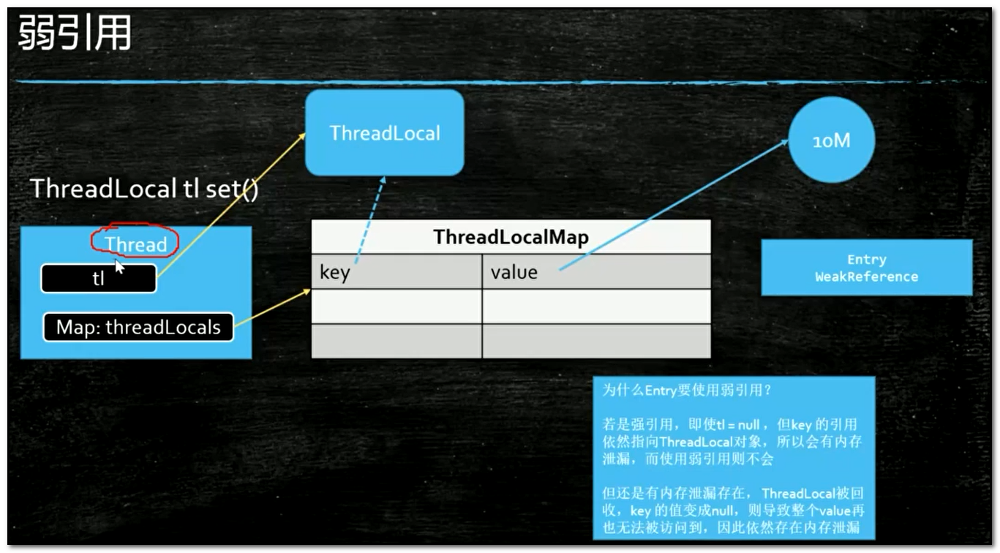

我们的想法是这么个想法，但是它里面到底执行了一个什么样的操作呢？我们来看上面的图，从左往右看，首先我们来说当前肯定是有一个线程的，任何一个方法肯定是要运行在某个线程里的，这个线程是我的主线程，在这个线程里有一个线程的局部变量叫tl，tl它new出来了一个ThreadLoal对象，这是一个强引用没问题，然后我又往ThreadLocal里放了一个对象，可是你们是不是还记得，往ThreadLocal里放对象的话，实际上是放到了当前线程的一个threadLocals变量里面，这个threadLocals变量指向的是一个Map，也就是我们把这个M对象给放到了这Map里面，它的key是我们的ThreadLocal对象，value是我们的M对象，我们来回想一下，往ThreadLocal里面set的时候，先拿到当前线程，然后拿到当前线程里面的那个Map，然后通过这个Map把ThreadLocal对象给set进去，这个map.set(this, value)方法中的this是谁？是ThreadLocal对象，set进去的时候往里面放了这么一个东西叫Entry，这个Entry又是什么呢？注意看代码，这个Entry是从弱引用WeakReference继承出来的

现在也就是说有一个Entry，它的父类是一个WeakReference，这个WeakReference里面装的是什么？是ThreadLocal对象，也就是说这个Entry一个key一个value，而这个Entry的key的类型是ThreadLocal，这个value当然就是我们的那个M的值或者其它什么值这个不重要，这个key是ThreadLocal，而由于这个Entry是从ThreadLocal继承的，在Entry构造的时候调用了super(k),这个k指的就是ThreadLocal对象，我们想一下WeakReference不就相当于new WeakReference key吗？

```java
//ThreadLocal源码
public class ThreadLocal<T> {
    public void set(T value) {
        //获取当前线程
        Thread t = Thread.currentThread();
        //获取当前线程的Map
        ThreadLocalMap map = getMap(t);
        if (map != null)
            map.set(this, value);
        else
            createMap(t, value);
    }
    ThreadLocalMap getMap(Thread t){
        return t.threadLocals;
    }
    private void set(ThreadLocal<?> key, Object value) {
       Entry[] tab = table;
       int len = tab.length;
       int i = key.threadLocalHashCode & (len-1);
       for (Entry e = tab[i];
            e != null;
            e = tab[i = nextIndex(i, len)]) {
           ThreadLocal<?> k = e.ge
           if (k == key) {
               e.value = value;
               return;
        
           if (k == null) {
               replaceStaleEntry(key, value, i);
               return;
           }
       tab[i] = new Entry(key, value);
       int sz = ++size;
       if (!cleanSomeSlots(i, sz) && sz >= threshold)
           rehash();
   }
   static class Entry extends WeakReference<ThreadLocal<?>> {
       /** The value associated with this ThreadLocal. */
        Object value;
        Entry(ThreadLocal<?> k, Object v) {
            super(k);
            value = v;
        }
   }
}

```

我们来看下面图中从左开始看，这时候我们应该明白了，这里tl是一个强引用指向这个ThreadLocal对象，而Map里的key是通过一个弱引用指向了一个ThreadLocal对象，我们假设这是个强引用，当tl指向这个ThreadLocal对象消失的时候，tl这个东西是个局部变量，方法已结束它就消失了，当tl消失了，如果这个ThreadLocal对象还被一个强引用的key指向的时候，这个ThreadLocal对象能被回收吗？肯定不行，而且由于这个线程有很多线程是长期存在的，比如这个是一个服务器线程，7*24小时一年365天不间断运行，那么不间断运行的时候，这个tl会长期存在，这个Map会长期存在，这个Map的key也会长期存在，这个key长期存在的话，这个ThreadLocal对象永远不会被消失，所以这里是不是就会有内存泄漏，但是如果这个key是弱引用的话还会存在这个问题吗？当这个强引用消失的时候这个弱引用是不是自动就会回收了，这也是为什么用WeakReference的原因


关于ThreadLocal还有一个问题，当我们tl这个强引用消失了，key的指向也被回收了，可是很不幸的是这个key指向了一个null值，但是这个threadLocals的Map是永远存在的，相当于说key/value对，你这个key是null的，你这个value指向的东西，你的这个10MB的字节码，你还能访问到吗？访问不到了，如果这个Map越积攒越多，越来越多，它还是会内存泄漏，怎么办呢？所以必须记住这一点，使用ThreadLocal里面的对象不用了，务必要remove掉，不然还会有内存泄漏

```java
ThradLocalM> tl = new ThreadLocal<>();
tl.set(new M());
tl.remove();

```

**虚引用**

对于虚引用它就干一件事，它就是管理堆外内存的，首先第一点，这个虚引用的构造方法至少都是两个参数的，第二个参数还必须是一个队列，这个虚引用基本没用，就是说不是给你用的，那么它是给谁用的呢？是给写JVM(虚拟机)的人用的

我们来看下面的小程序，在小程序里创建了一个List集合用于模拟内存溢出，还创建了一个ReferenceQueue(引用队列)，在main方法里创建一个虚引用对象PhantomReference，这个虚引用对象指向的这个内存里是什么样子的呢？有一个phantomReference对象指向了一个new出来的PhantomReference对象，这个对像里面可以访问两个内容，第一个内容是它又通过一个特别虚的引用指向了我们new出来的一个M对象，第二个内容它关联了一个Queue(队列)，这个时候一但虚引用被回收，这个虚引用会装到这个队列里，也就是说这个队列是干什么的呢？就是垃圾回收的时候，一但把这个虚引用给回收的时候，会装到这个队列里，让你接收到一个通知，什么时候你检测到这个队列里面如果有一个引用存在了，那说明什么呢？说明这个虚引用被回收了，这个虚引用叫特别虚的引用，指向的任何一个对象，垃圾回收二话不说，上来就把这个M对象给干掉这是肯定的，只要有垃圾回收， 而且虚引用最关键的是当M对象被干掉的时候，你会收到一个通知，通知你的方式是什么呢？通知你的方式就是往这个Queue(队列)里放进一个值

那么我们这个小程序是什么意思呢？在小程序启动前先设置好了堆内存的最大值，然后看第一个线程启动以后，它会不停的往List集合里分配对象，什么时候内存占满了，触发垃圾回收的时候，另外一个线程就不断的监测这个队列里边的变动，如果有就说明这个虚引用被放进去了，就说明被回收了

在第一个线程启动后我们会看到，无论我们怎么get这个phantomReference里面的值，它输出的都是空值，虚引用和弱引用的区别就在于，弱引用里边有值你get的时候还是get的到的，但是虚引用你get里边的值你是get不到的

```java
public class T04_PhantomReference {
    private static final List<Object> LIST = new LinkedList<>();
    private static final ReferenceQueue<M> QUEUE = new ReferenceQueue<>();
    public static void main(String[] args) {
        PhantomReference<M> phantomReference = new PhantomReference<>(new M(), QUEUE);
        new Thread(() -> {
            while (true) {
                LIST.add(new byte[1024 * 1024]);
                try {
                    Thread.sleep(1000);
                } catch (InterruptedException e) {
                    e.printStackTrace();
                    Thread.currentThread().interrupt();
                }
                System.out.println(phantomReference.get());
            }
        }).start();

        new Thread(() -> {
            while (true) {
                Reference<? extends M> poll = QUEUE.poll();
                if (poll != null) {
                    System.out.println("--- 虚引用对象被jvm回收了 ---- " + poll);
                }
            }
        }).start();

        try {
            Thread.sleep(500);
        } catch (InterruptedException e) {
            e.printSackTrace();
        }
    }
}

```

那么我们想一下你拿不到这里边的值我用它来干什么呢？这里再强调一遍，只是为了给你一个通知，通知的时候放到队列里，这虚引用干什么用？就是写JVM的人拿来用，写JVM的人用的时候怎么用呢？他会当Queue这个值，检测到队列里边有虚引用指向这个东西被回收的时候做出相应的处理，什么时候出现相应的处理呢？

经常会有一种情况，NIO里边有一个比较新的新的Buffer叫DirectByteBuffer(直接内存)，直接内存是不被JVM(虚拟机)直接管理的内存，被谁管理？被操作系统管理，又叫做堆外内存，这个DirectByteBuffer是可以指向堆外内存的，那我们想一下，如果这个DirectByteBuffer设为null，垃圾回收器能回收DirectByteBuffer吗？它指向内存都没在堆里，你怎么回收它，所以没有办法回收，那么写虚拟机的人怎么回收DirectByteBuffer呢？如果有一天你也用到堆外内存的时候，当这个DirectByteBuffer被设为null的时候，你怎么回收堆外这个内存呢？你可以用虚引用，当我们检测到这个虚引用被垃圾回收器回收的时候，你做出相应处理去回收堆外内存

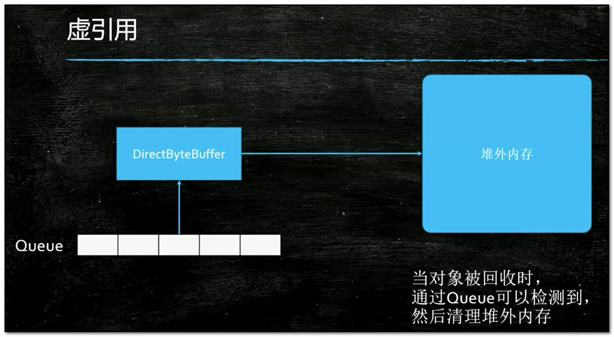

说不定将来的某一天，你写了一个Netty，然后你再Netty里边分配内存的时候，用的是堆外内存，那么堆外内存你又想做到自动的垃圾回收，你不能让人家用你API的人，让人家自己去回收对不对？所以你这个时候怎么做到自动回收呢？你可以检测虚引用里的Queue，什么时候Queue检测到DirectByteBuffer(直接内存)被回收了，这个时候你就去清理堆外内存，堆外内存怎么回收呢？ 你如果是C和C++语言写的虚拟机的话，当然是del和free这个两个函数，它们也是C和C++提供的，java里面现在也提供了，堆外内存回收，这个回收的类叫Unsafe，这个类在JDK1.8的时候可以用java的反射机制来用它，但是JDK1.9以后它被加到包里了，普通人是用不了的，但JUC的一些底层有很多都用到了这个类，这个Unsafe类里面有两个方法，allocateMemory方法直接分配内存也就是分配堆外内存，freeMemory方法回收内存也就是手动回收内存，这和C/C++里边一样你直接分配内存，必须得手动回收


# 第六节：并发容器


今天是第六天了，这节课本来想上一个大而全的课，后来发现这个实在目标太大了，大而全的概念就是上节课讲到的那张容器图中的每一个都讲的非常的细致，然后去谈他们的源码。但是如果这么讲的话我们高并发的课就讲不完了，所以也别着急，后面单独开一门课来讲集合，集合的发展历程，现在为什么讲这个并发容器呢，主要是为了线程池做准备，线程池里有一个参数就是用并发容器来做你工作任务的容器。


容器这章是面试特别爱问，这个面试属于是高频中的高频，为什么他特别爱问，因为他牵扯的东西太多了，拿大腿想一下也知道容器肯定是往里面装东西的肯定牵扯到数据结构，数据结构肯定要牵扯到算法，还有一点就是容器本身的一个组织结构也是大家比较爱考的，再一点他又牵扯到高并发，这就是面试的一个重灾区。容器这章得用好多个维度来讲他才能理解的比较透彻，今天，主要还是从线程池使用的角度，为了和后面的线程池做准备。这个容器通过接口来说分为两大类，我们先从大体的结构上来认识他。

第一大类Collection叫集合。集合的意思是不管你这个容器是什么结构你可以把一个元素一个元素的往里面扔；Map是一对一对的往里扔。其实Map来说可以看出是Collection一个特殊的变种，你可以把一对对象看成一个entry对象，所以这也是一个整个对象。容器就是装一个一个对象的，这么一些个集合。严格来讲数组也属于容器。从数据结构角度来讲在物理上的这种存储的数据结构其实只有两种，一种是连续存储的数组Array，另一种就是非连续存储的一个指向另外一个的链表。在逻辑结构那就非常非常多了。

ok，容器上来讲JAVA接口区分的比较明确，两大接口：Map是一对一对的。Collection是一个一个的，在它里面又分三大类。在大概十年前我讲的一段老的视频，在那个时候讲的Collection之分两大类List和Set，Queue是后来加入的接口，而这个接口专门就是为高并发准备的，所以这个接口对高并发来说才是最重要的。你要和别人聊面试题的时候，说你聊聊这个容器类吧，好，你就可以从大面开始聊，容器分两大类Collection、Map，Collection又分三大类List、Set、Queue队列，队列就是一对一队的，往这个队列里取数据的时候它和这个List、Set都不一样。大家知道List取的时候如果是Array的话还可以取到其中一个的。Set主要和其他的区别就是中间是唯一的，不会有重复元素，这个它最主要的区别。Queue实现了一个什么逻辑呢，实际上就是一个队列，队列什么概念，有进有出，那么在这个基础之上它实现了很多的多线程的访问方法（比如说put阻塞式的放、take阻塞式的取），这个是在其他的List、Set里面都是没有的。队列最主要的原因是为了实现任务的装载的这种取和装**这里面最重要的就是是叫做阻塞队列，它的实现的初衷就是为了线程池、高并发做准备的**。原来的这些是容器是普通的为了装东西做准备的。所以你要和别人聊Queue的区别的时候主要就说高并发和普通的这种容器这上面的一个区别，这里面有三个Collection的子接口，在子接口Queue里面又分了各种各样的队列，稍后我们讲到在聊。Queue里面还有一个子接口叫Deque叫双端队列，一般的队列只是从一端往里扔从另一端往外取。Deque就是说你可以从反方向装从另外一个方向取。


**Hashtable - CHM**

最开始java1.0容器里只有两个，第一个叫Vector可以单独的往里扔，还有一个是Hashtable是可以一对一对往里扔的。Vector相对于实现了List接口，Hashtable实现了Map接口。但是这个两个容器在1.0设计的时候稍微有点问题，这两个容器设计成了所有方法默认都是加synchronized的，这是它最早设计不太合理的地方。多数的时候我们多数的程序只有一个线程在工作，所以在这种情况下你完全是没有必要加synchronized，因此最开始的时候设计的性能比较差，所以后来它意识到了这一点，在Hashtable之后又添加了HashMap，HashMap就是完全的没有加锁，一个是二话没说就加锁，一个是完全没有加锁。那这两个除了这个加锁区别之外 还有其他的一些源码上的区别，所以Sun在那个时候就在这个HashMap的基础之上又添加了一个，说你用的这个新的HashMap比原来Hashtable好用，但是HashMap没有那些锁的东西，那么怎么才可以让这个HashMap既可以用于这些不需要锁的环境，有可以用于需要锁的环境呢？ 所以它又添加了一个方法叫做Collections相当于这个容器的工具类，这个工具类里有一个方法叫synchronizedMap，这个方法会把它变成加锁的版本。所以，HashMap有两个版本。

Vector 和 Hashtable 自带锁，基本不用，大家记住这个结论。

- Hashtable

看第一个小程序Hashtable里面装的是什么东西呢，装的都是Key,Value对，一对一对的。这个Key是UUID，Value也是UUID等于new一个Hashtable出来，这里面的UUID到底有多少个呢，我定义了两个常量，这两个常量在一个单独的类里，这个类叫Constants：100万个UUID对内容要装到容器里，会有100个线程，将来我们访问的时候会有100个线程来模拟。

```java
package com.mashibing.juc.c_023_02_FromHashtableToCHM;

public class Constants {
    public static final int COUNT = 1000000;
    public static final int THREAD_COUNT = 100;
}
```

这两个值的变化会引起效率上的变化，永远要记住这一点，那个效率高那个效率低不要想当然，务必要写程序来测试，高并发课的后面还会给大家讲一个JMH测试框架。看程序，我先new出100万个Key和100万个Value来，然后把这些东西装到数组里面去，for循环(int i = 0; i < count; i++)。为什么先把这些UUID对准备好而不是我们装的时候现场生成？原因是我们写这个测试用例的时候前后用的是一样的，你往Hashtable里头装的时候也得是这100万对，同样的内容，但你要是每次都生成是不一样的内容，在这种情况下你测试就会有一些干扰因素，所以我们先准备好在往里扔。后面，写了一个线程类，叫MyThread，从Thread继承，start，gap是每个线程负责往里面装多少。线程开始往里面扔。在看后面主程序代码，记录起始时间，new出来一个线程数组，这个线程数据总共有100个线程，给它做初始化。由于你需要指定这个start值，所以这个MyThread启动的时候i乘以count(总而言之就是这个起始的值不一样，第一个线程是从0开始，第二个是从100000个开始)没用到也没关系，用到了就把他记录下来是一个好的习惯。然后让每一个线程启动，等待每一个线程结束，最后计算这个线程时间。

我在重新解释一下，现在我有一个Hashtable，里面装的是一对一对的内容，现在我们起了100个线程，这个100个线程去Key，Value取数据，一个线程取1万个数据，一共100万个数据，100个线程，每个线程取1万个数据往里插，整个程序模拟的是这么一个情形

```java
package com.mashibing.juc.c_023_02_FromHashtableToCHM;

import java.util.Hashtable;
import java.util.UUID;

public class T01_TestHashtable {

    static Hashtable<UUID, UUID> m = new Hashtable<>();

    static int count = Constants.COUNT;
    static UUID[] keys = new UUID[count];
    static UUID[] values = new UUID[count];
    static final int THREAD_COUNT = Constants.THREAD_COUNT;

    static {
        for (int i = 0; i < count; i++) {
            keys[i] = UUID.randomUUID();
            values[i] = UUID.randomUUID();
        }
    }

    static class MyThread extends Thread {
        int start;
        int gap = count/THREAD_COUNT;

        public MyThread(int start) {
            this.start = start;
        }

        @Override
        public void run() {
            for(int i=start; i<start+gap; i++) {
                m.put(keys[i], values[i]);
            }
        }
    }

    public static void main(String[] args) {

        long start = System.currentTimeMillis();

        Thread[] threads = new Thread[THREAD_COUNT];

        for(int i=0; i<threads.length; i++) {
            threads[i] =
            new MyThread(i * (count/THREAD_COUNT));
        }

        for(Thread t : threads) {
            t.start();
        }

        for(Thread t : threads) {
            try {
                t.join();
            } catch (InterruptedException e) {
                e.printStackTrace();
            }
        }

        long end = System.currentTimeMillis();
        System.out.println(end - start);

        System.out.println(m.size());

        //-----------------------------------

        start = System.currentTimeMillis();
        for (int i = 0; i < threads.length; i++) {
            threads[i] = new Thread(()->{
                for (int j = 0; j < 10000000; j++) {
                    m.get(keys[10]);
                }
            });
        }

        for(Thread t : threads) {
            t.start();
        }

        for(Thread t : threads) {
            try {
                t.join();
            } catch (InterruptedException e) {
                e.printStackTrace();
            }
        }

        end = System.currentTimeMillis();
        System.out.println(end - start);
    }
}
```

**HashMap**

我们来看这HashMap，同学们想一下这个HashMap往里头插会不会有问题。因为HashMap没有锁啊，线程不安全，这个就没有意义了，这只是为了程序的完整性留在这，他虽然速度比较快，但是数据会出问题，还各种各样的报异常。主要是因为它内部会把这个变成TreeNode，我们先不去细究它，总而言之HashMap这个东西你往里扔的时候，由于它内部没有锁，所以你多线程访问的时候会出问题，这个你往里插的时候就没有实际意义了。

```java
package com.mashibing.juc.c_023_02_FromHashtableToCHM;

import java.util.HashMap;
import java.util.UUID;

public class T02_TestHashMap {

    static HashMap<UUID, UUID> m = new HashMap<>();

    static int count = Constants.COUNT;
    static UUID[] keys = new UUID[count];
    static UUID[] values = new UUID[count];
    static final int THREAD_COUNT = Constants.THREAD_COUNT;

    static {
        for (int i = 0; i < count; i++) {
            keys[i] = UUID.randomUUID();
            values[i] = UUID.randomUUID();
        }
    }

    static class MyThread extends Thread {
        int start;
        int gap = count/THREAD_COUNT;

        public MyThread(int start) {
            this.start = start;
        }

        @Override
        public void run() {
            for(int i=start; i<start+gap; i++) {
                m.put(keys[i], values[i]);
            }
        }
    }

    public static void main(String[] args) {

        long start = System.currentTimeMillis();

        Thread[] threads = new Thread[THREAD_COUNT];

        for(int i=0; i<threads.length; i++) {
            threads[i] =
            new MyThread(i * (count/THREAD_COUNT));
        }

        for(Thread t : threads) {
            t.start();
        }

        for(Thread t : threads) {
            try {
                t.join();
            } catch (InterruptedException e) {
                e.printStackTrace();
            }
        }

        long end = System.currentTimeMillis();
        System.out.println(end - start);

        System.out.println(m.size());
    }
}
```

**SynchronizedHashMap**

我们在看第三个，用的是SynchronizedMap这个方法，给HashMap我们手动加锁，它的源码自己做了一个Object，然后每次都是SynchronizedObject，严格来讲他和那个Hashtable效率上区别不大。

```java
package com.mashibing.juc.c_023_02_FromHashtableToCHM;

import java.util.Collections;
import java.util.HashMap;
import java.util.Map;
import java.util.UUID;

public class T03_TestSynchronizedHashMap {

    static Map<UUID, UUID> m = Collections.synchronizedMap(new HashMap<UUID, UUID>());

    static int count = Constants.COUNT;
    static UUID[] keys = new UUID[count];
    static UUID[] values = new UUID[count];
    static final int THREAD_COUNT = Constants.THREAD_COUNT;

    static {
        for (int i = 0; i < count; i++) {
            keys[i] = UUID.randomUUID();
            values[i] = UUID.randomUUID();
        }
    }

    static class MyThread extends Thread {
        int start;
        int gap = count/THREAD_COUNT;

        public MyThread(int start) {
            this.start = start;
        }

        @Override
        public void run() {
            for(int i=start; i<start+gap; i++) {
                m.put(keys[i], values[i]);
            }
        }
    }

    public static void main(String[] args) {

        long start = System.currentTimeMillis();

        Thread[] threads = new Thread[THREAD_COUNT];

        for(int i=0; i<threads.length; i++) {
            threads[i] =
            new MyThread(i * (count/THREAD_COUNT));
        }

        for(Thread t : threads) {
            t.start();
        }

        for(Thread t : threads) {
            try {
                t.join();
            } catch (InterruptedException e) {
                e.printStackTrace();
            }
        }

        long end = System.currentTimeMillis();
        System.out.println(end - start);

        System.out.println(m.size());

        //-----------------------------------

        start = System.currentTimeMillis();
        for (int i = 0; i < threads.length; i++) {
            threads[i] = new Thread(()->{
                for (int j = 0; j < 10000000; j++) {
                    m.get(keys[10]);
                }
            });
        }

        for(Thread t : threads) {
            t.start();
        }

        for(Thread t : threads) {
            try {
                t.join();
            } catch (InterruptedException e) {
                e.printStackTrace();
            }
        }

        end = System.currentTimeMillis();
        System.out.println(end - start);
    }
}
```

**ConcurrentHashMap**

这个第四个ConcurrentHashMap是多线程里面真正用的，以后我们多线程用的基本就是它，用Map的时候。并发的。这个ConcurrentHashMap提高效率主要提高在读上面，由于它往里插的时候内部又做了各种各样的判断，本来是链表的，到8之后又变成了红黑树，然后里面又做了各种各样的cas的判断，所以他往里插的数据是要更低一些的。HashMap和Hashtable虽然说读的效率会稍微低一些，但是它往里插的时候检查的东西特别的少，就加个锁然后往里一插。所以，关于效率，还是看你实际当中的需求。用几个简单的小程序来给大家列举了这几个不同的区别。

```java
package com.mashibing.juc.c_023_02_FromHashtableToCHM;

import java.util.Map;
import java.util.UUID;
import java.util.concurrent.ConcurrentHashMap;

public class T04_TestConcurrentHashMap {

    static Map<UUID, UUID> m = new ConcurrentHashMap<>();

    static int count = Constants.COUNT;
    static UUID[] keys = new UUID[count];
    static UUID[] values = new UUID[count];
    static final int THREAD_COUNT = Constants.THREAD_COUNT;

    static {
        for (int i = 0; i < count; i++) {
            keys[i] = UUID.randomUUID();
            values[i] = UUID.randomUUID();
        }
    }

    static class MyThread extends Thread {
        int start;
        int gap = count/THREAD_COUNT;

        public MyThread(int start) {
            this.start = start;
        }

        @Override
        public void run() {
            for(int i=start; i<start+gap; i++) {
                m.put(keys[i], values[i]);
            }
        }
    }

    public static void main(String[] args) {

        long start = System.currentTimeMillis();

        Thread[] threads = new Thread[THREAD_COUNT];

        for(int i=0; i<threads.length; i++) {
            threads[i] =
            new MyThread(i * (count/THREAD_COUNT));
        }

        for(Thread t : threads) {
            t.start();
        }

        for(Thread t : threads) {
            try {
                t.join();
            } catch (InterruptedException e) {
                e.printStackTrace();
            }
        }

        long end = System.currentTimeMillis();
        System.out.println(end - start);

        System.out.println(m.size());

        //-----------------------------------

        start = System.currentTimeMillis();
        for (int i = 0; i < threads.length; i++) {
            threads[i] = new Thread(()->{
                for (int j = 0; j < 10000000; j++) {
                    m.get(keys[10]);
                }
            });
        }

        for(Thread t : threads) {
            t.start();
        }

        for(Thread t : threads) {
            try {
                t.join();
            } catch (InterruptedException e) {
                e.printStackTrace();
            }
        }

        end = System.currentTimeMillis();
        System.out.println(end - start);
    }
}
```


**From Vector To Queue**

**ArrayList**

我们在认识一下Vector到Queue的发展历程，下面有这样一个小程序叫TicketSeller给票做销售的这么一个小程序，写法比较简单，我们先来用一个List把这些票全装进去，往里面装一万张票，然后10个线程也就是10个窗口对外销售，只要size大于零，只要还有剩余的票时我就往外卖，取一张往外卖remove。大家想象一下到最后一张票的时候，好几个线程执行到这里所以线程都发现了size大于零，所有线程都往外买了一张票，那么会发生什么情形，只有一个线程拿到了这张票，其他的拿到的都是空值，就是超卖的现象。没有加锁，线程不安全。

```java
/**
 * 有N张火车票，每张票都有一个编号
 * 同时有10个窗口对外售票
 * 请写一个模拟程序
 * 
 * 分析下面的程序可能会产生哪些问题？
 * 重复销售？超量销售？
 * 
 * 
 * @author 
 */
package com.mashibing.juc.c_024_FromVectorToQueue;

import java.util.ArrayList;
import java.util.List;

public class TicketSeller1 {
   static List<String> tickets = new ArrayList<>();
   
   static {
      for(int i=0; i<10000; i++) tickets.add("票编号" + i);
   }
   
   
   
   public static void main(String[] args) {
      for(int i=0; i<10; i++) {
         new Thread(()->{
            while(tickets.size() > 0) {
               System.out.println("销售了--" + tickets.remove(0));
            }
         }).start();
      }
   }
}
```

**Vector**

 我们来看最早的这个容器Vector，内部是自带锁的，你去读它的时候就会看到很多方法synchronized二话不说先加上锁在说，所以你用Vector的时候请放心它一定是线程安全的。100张票，10个窗口，读这个程序还是有问题的，还是不对。锁为了线程的安全，就是当我们调用size方法的时候他加锁了，调用remove的时候它也加锁了，可是很不幸的是在你这两个中间它没有加锁，那么，好多个线程还会判断依然这个size还是大于0的，大家伙又超卖了。

```java
/**
 * 有N张火车票，每张票都有一个编号
 * 同时有10个窗口对外售票
 * 请写一个模拟程序
 * 
 * 分析下面的程序可能会产生哪些问题？
 * 重复销售？超量销售？
 * 
 * 
 * @author 
 */
package com.mashibing.juc.c_024_FromVectorToQueue;

import java.util.Vector;
import java.util.concurrent.TimeUnit;

public class TicketSeller2 {
   static Vector<String> tickets = new Vector<>();
   
   
   static {
      for(int i=0; i<1000; i++) tickets.add("票编号" + i);
   }
   
   public static void main(String[] args) {
      
      for(int i=0; i<10; i++) {
         new Thread(()->{
            while(tickets.size() > 0) {
               
               try {
                  TimeUnit.MILLISECONDS.sleep(10);
               } catch (InterruptedException e) {
                  e.printStackTrace();
               }
               
               
               System.out.println("销售了--" + tickets.remove(0));
            }
         }).start();
      }
   }
}
```

**LinkedList**

虽然你用了这个加锁的容器了，由于在你调用这个并发容器的时候，你是调用了其中的两个原子方法，所以你在外层还得在加一把锁synchronized(tickets)，继续判断size，售出去不断的remove，这个就没有问题了，它会踏踏实实的往外销售，但不是效率最高的方案

```java
package com.mashibing.juc.c_024_FromVectorToQueue;

import java.util.LinkedList;
import java.util.List;
import java.util.concurrent.TimeUnit;

public class TicketSeller3 {
   static List<String> tickets = new LinkedList<>();
   
   
   static {
      for(int i=0; i<1000; i++) tickets.add("票编号" + i);
   }
   
   public static void main(String[] args) {
      
      for(int i=0; i<10; i++) {
         new Thread(()->{
            while(true) {
               synchronized(tickets) {
                  if(tickets.size() <= 0) break;
                  
                  try {
                     TimeUnit.MILLISECONDS.sleep(10);
                  } catch (InterruptedException e) {
                     e.printStackTrace();
                  }
                  
                  System.out.println("销售了--" + tickets.remove(0));
               }
            }
         }).start();
      }
   }
}
```

 **Queue**

效率最高的就是这个Queue，这是最新的一个接口，他的主要目标就是为了高并发用的，就是为了多线程用的。所以，以后考虑多线程这种单个元素的时候多考虑Queue。看程序前面初始化不说了，这个使用的是ConcurrentLinkedQueue，然后里面并没有说加锁，我就直接调用了一个方法叫poll，poll的意思就是我从tickets去取值，这个值什么时候取空了就说明里面的值已经没了，所以这个while(true)不断的往外销售，一直到他突然发现伸手去取票的时候这里面没了，那我这个窗口就可以关了不用买票了。poll的意思它加了很多对于多线程访问的时候比较友好的一些方法，它的源码，取一下去得到我们这个queue上的头部，脑袋上这个元素，得到并且去除掉这里面这个值，如果这个已经是空我就返回null值。

```java
package com.mashibing.juc.c_024_FromVectorToQueue;

import java.util.Queue;
import java.util.concurrent.ConcurrentLinkedQueue;

public class TicketSeller4 {
   static Queue<String> tickets = new ConcurrentLinkedQueue<>();
   
   
   static {
      for(int i=0; i<1000; i++) tickets.add("票编号" + i);
   }
   
   public static void main(String[] args) {
      
      for(int i=0; i<10; i++) {
         new Thread(()->{
            while(true) {
               String s = tickets.poll();
               if(s == null) break;
               else System.out.println("销售了--" + s);
            }
         }).start();
      }
   }
}
```

这个四个小程序就给大家演示了怎么从Vector一步一步演化到Queue的，所以刚才讲的这八个小程序，主要是为了给大家说明整体的这个演化的过程是一个什么样子的，从Map这个角度来讲最早是从Hashtable，二话不说先加锁到HashMap去除掉锁，再到synchronizedHashMap加一个带锁的版本，到ConcurrentHashMap多线程时候专用。注意，不是替代关系，这个归根结底还是会归到，到底cas操作就一定会比synchronized效率要高吗，不一定，要看你并发量的高低，要看你锁定之后代码执行的时间，任何时候在你实际情况下都需要通过测试，压测来决定用哪种容器。

讲到这里，在给大家扩展一下，设计上方法有一种叫面向接口编程，为什么要面向接口编程，如果说你在工作之中设计一个程序，这个程序你应该设计一个接口，这个接口里面只包括业务逻辑，取出学生列表，放好，但是这里列表具体的实现是放到Hashtable里面还是放到HashMap里面还是放到ConcurrentHashMap里面，你可以写好几个不同的实现，在不同的并发情况下采用不同的实现你的程序会更灵活，在这里你们能不能理解就是这种面向接口的编程和面向接口的设计它的微妙之所在。


**ConcurrentMap**

我们来看这个经常在多线程的情况下使用的这些个容器 ，从Map开始讲，Map经常用的有这么几个

- ConcurrentHashMap用hash表实现的这样一个高并发容器；

  既然有了ConcurrentHashMap正常情况下就应该有ConcurrentTreeMap，你可以去查查，它没有，就等于缺了一块，为什么没有呢，原因就是ConcurrentHashMap里面用的是cas操作，这个cas操作它用在tree的时候，用在树这个节点上的时候实现起来太复杂了，所以就没有这个ConcurrentTreeMap，但是有时间也需要这样一个排好序的Map，那就有了ConcurrentSkipListMap跳表结构就出现了。

- ConcurrentSkipListMap通过跳表来实现的高并发容器并且这个Map是有排序的；

  

  跳表是什么样的结构呢？底层本身存储的元素一个链表，它是排好顺序的，大家知道当一个链表排好顺序的时候往里插入是特别困难的，查找的时候也特别麻烦，因为你得从头去遍历查找这个元素到底在哪里，所以就出现了这个跳表的结构，底层是一个链表，链表查找的时候比较困难怎么办，那么我们在这些链表的基础上在拿出一些关键元素来，在上面做一层，那这个关键元素的这一层也是一个链表，那这个数量特别大的话在这个基础之上在拿一层出来再做一个链表，每层链表的数据越来越少，而且它是分层，在我们查找的时候从顶层往下开始查找，所以呢，查找容易了很多，同时它无锁的实现难度比TreeMap又容易很多，因此在JUC里面提供了ConcurrentSkipListMap这个类。

  

他们两个的区别一个是有序的一个是无序的，同时都支持并发的操作。下面这个小程序是一个效率的测试其实也没多大意义，大家可以去写一下跑跑。

```java
package com.mashibing.juc.c_025;

import java.util.*;
import java.util.concurrent.ConcurrentHashMap;
import java.util.concurrent.ConcurrentSkipListMap;
import java.util.concurrent.CountDownLatch;

public class T01_ConcurrentMap {
   public static void main(String[] args) {
      Map<String, String> map = new ConcurrentHashMap<>();
      //Map<String, String> map = new ConcurrentSkipListMap<>(); //高并发并且排序
      
      //Map<String, String> map = new Hashtable<>();
      //Map<String, String> map = new HashMap<>(); //Collections.synchronizedXXX
      //TreeMap
      Random r = new Random();
      Thread[] ths = new Thread[100];
      CountDownLatch latch = new CountDownLatch(ths.length);
      long start = System.currentTimeMillis();
      for(int i=0; i<ths.length; i++) {
         ths[i] = new Thread(()->{
            for(int j=0; j<10000; j++) map.put("a" + r.nextInt(100000), "a" + r.nextInt(100000));
            latch.countDown();
         });
      }
      
      Arrays.asList(ths).forEach(t->t.start());
      try {
         latch.await();
      } catch (InterruptedException e) {
         e.printStackTrace();
      }
      
      long end = System.currentTimeMillis();
      System.out.println(end - start);
      System.out.println(map.size());

   }
}
```

**CopyOnWrite**

再来说一个在并发的时候经常使用的一个类，这个类叫CopyOnWrite。CopyOnWriteList、CopyOnWriteSet有两个。CopyOnWrite的意思叫写时复制。

我们看这个小程序，用了一个容器，这个容器是List，一个一个元素往里装，往里装的时候，装的一堆的数组，一堆的字符串，没100个线程往里面装1000个，各种各样的实现，可以用ArrayList、Vector，但是ArrayList会出并发问题，因为多线程访问没有锁，可以用CopyOnWriteArrayList。这个CopyOnWrite解释一下，你通过这个名字进行分析一下，当Write的时候我们要进行复制，写时复制，写的时候进行复制。这个原理非常简单，当我们需要往里面加元素的时候你把里面的元素得复制出来。在很多情况下，写的时候特别少，读的时候很多。在这个时候就可以考虑CopyOnWrite这种方式来提高效率，CopyOnWrite为什么会提高效率呢，是因为我写的时候不加锁，大家知道我Vector写的时候加锁，读的时候也加锁。那么用CopyOnWriteList的时候我读的时候不加锁，写的时候会在原来的基础上拷贝一个，拷贝的时候扩展出一个新元素来，然后把你新添加的这个扔到这个元素扔到最后这个位置上，于此同时把指向老的容器的一个引用指向新的，这个写法就是写时复制。我这里只是写了一个写线程，没有模拟读线程，这个写时复制，写的效率比较低，因为每次写都要复制。在读比较多写比较少的情况下使用CopyOnWrite。

```java
package com.mashibing.juc.c_025;

import java.util.ArrayList;
import java.util.Arrays;
import java.util.List;
import java.util.Random;
import java.util.Vector;
import java.util.concurrent.CopyOnWriteArrayList;

public class T02_CopyOnWriteList {
   public static void main(String[] args) {
      List<String> lists = 
            //new ArrayList<>(); //这个会出并发问题！
            //new Vector();
            new CopyOnWriteArrayList<>();
      Random r = new Random();
      Thread[] ths = new Thread[100];
      
      for(int i=0; i<ths.length; i++) {
         Runnable task = new Runnable() {
   
            @Override
            public void run() {
               for(int i=0; i<1000; i++) lists.add("a" + r.nextInt(10000));
            }
            
         };
         ths[i] = new Thread(task);
      }
      
      runAndComputeTime(ths);		
      System.out.println(lists.size());
   }
   
   static void runAndComputeTime(Thread[] ths) {
      long s1 = System.currentTimeMillis();
      Arrays.asList(ths).forEach(t->t.start());
      Arrays.asList(ths).forEach(t->{
         try {
            t.join();
         } catch (InterruptedException e) {
            e.printStackTrace();
         }
      });
      long s2 = System.currentTimeMillis();
      System.out.println(s2 - s1);
      
   }
}
```

CopyOnWrite对比的是synchronizedList，这方面的一个对比。

```java
package com.mashibing.juc.c_025;
import java.util.ArrayList;
import java.util.Collections;
import java.util.List;

public class T03_SynchronizedList {
   public static void main(String[] args) {
      List<String> strs = new ArrayList<>();
      List<String> strsSync = Collections.synchronizedList(strs);
   }
}
```


**BlockingQueue**

BlockingQueue，是我们后面讲线程池需要用到的这方面的内容，是给线程池来做准备的。BlockingQueue的概念重点是在Blocking上，Blocking阻塞，Queue队列，是阻塞队列。他提供了一系列的方法，我们可以在这些方法的基础之上做到让线程实现自动的阻塞。

我们现在聊的就是这个Queue里面所提供的一些可以给多线程比较友好的接口。他提供了一些什么接口呢，第一个就是offer对应的是原来的那个add，提供了poll取数据，然后提供了peek拿出来这个数据。那么这个是什么意思呢，我们读一下这个offer的概念，offer是往里头添加，加进去没加进去它会给你一个布尔类型的返回值，和原来的add是什么区别呢，add如果加不进去了是会抛异常的。所以一般的情况下我们用的最多的Queue里面都用offer，它会给你一个返回值，peek的概念是去取并不是让你remove掉，poll是取并且remove掉，而且这几个对于BlockingQueue来说也确实是线程安全的一个操作。对于Queue经常用的接口就这么几个，大家了解就可以。

```java
package com.mashibing.juc.c_025;

import java.util.Queue;
import java.util.concurrent.ConcurrentLinkedQueue;

public class T04_ConcurrentQueue {
   public static void main(String[] args) {
      Queue<String> strs = new ConcurrentLinkedQueue<>();
      
      for(int i=0; i<10; i++) {
         strs.offer("a" + i);  //add
      }
      
      System.out.println(strs);
      
      System.out.println(strs.size());
      
      System.out.println(strs.poll());
      System.out.println(strs.size());
      
      System.out.println(strs.peek());
      System.out.println(strs.size());
      
      //双端队列Deque
   }
}
```

**LinkedBlockingQueue**

LinkedBlockingQueue，体现Concurrent的这个点在哪里呢，我们来看这个LinkedBlockingQueue，用链表实现的BlockingQueue，是一个无界队列。就是它可以一直装到你内存满了为止，一直添加。

来看一下这个小程序，这么一些线程，第一个线程是我往里头加内容，加put。BlockingQueue在Queue的基础上又添加了两个方法，这两个方法一个叫put，一个叫take。这两个方法是真真正正的实现了阻塞。put往里装如果满了的话我这个线程会阻塞住，take往外取如果空了的话线程会阻塞住。所以这个BlockingQueue就实现了生产者消费者里面的那个容器。这个小程序是往里面装了100个字符串，a开头i结尾，每装一个的时候睡1秒钟。然后，后面又启动了5个线程不断的从里面take，空了我就等着，什么时候新加了我就马上给它取出来。这是BlockingQueue和Queue的一个基本的概念。

```java
package com.mashibing.juc.c_025;

import java.util.Random;
import java.util.concurrent.BlockingQueue;
import java.util.concurrent.LinkedBlockingQueue;
import java.util.concurrent.TimeUnit;

public class T05_LinkedBlockingQueue {

   static BlockingQueue<String> strs = new LinkedBlockingQueue<>();

   static Random r = new Random();

   public static void main(String[] args) {
      new Thread(() -> {
         for (int i = 0; i < 100; i++) {
            try {
               strs.put("a" + i); //如果满了，就会等待
               TimeUnit.MILLISECONDS.sleep(r.nextInt(1000));
            } catch (InterruptedException e) {
               e.printStackTrace();
            }
         }
      }, "p1").start();

      for (int i = 0; i < 5; i++) {
         new Thread(() -> {
            for (;;) {
               try {
                  System.out.println(Thread.currentThread().getName() + " take -" + strs.take()); //如果空了，就会等待
               } catch (InterruptedException e) {
                  e.printStackTrace();
               }
            }
         }, "c" + i).start();

      }
   }
}
```


**ArrayBlockingQueue**

ArrayBlockingQueue是有界的，你可以指定它一个固定的值10，它容器就是10，那么当你往里面扔容器的时候，一旦他满了这个put方法就会阻塞住。然后你可以看看用add方法满了之后他会报异常。offer用返回值来判断到底加没加成功，offer还有另外一个写法你可以指定一个时间尝试着往里面加1秒钟，1秒钟之后如果加不进去它就返回了。

回到那个面试经常被问到的问题，Queue和List的区别到底在哪里，主要就在这里，添加了offer、peek、poll、put、take这些个对线程友好的或者阻塞，或者等待方法。

```java
package com.mashibing.juc.c_025;

import java.util.Random;
import java.util.concurrent.ArrayBlockingQueue;
import java.util.concurrent.BlockingQueue;
import java.util.concurrent.TimeUnit;

public class T06_ArrayBlockingQueue {

   static BlockingQueue<String> strs = new ArrayBlockingQueue<>(10);

   static Random r = new Random();

   public static void main(String[] args) throws InterruptedException {
      for (int i = 0; i < 10; i++) {
         strs.put("a" + i);
      }
      
      //strs.put("aaa"); //满了就会等待，程序阻塞
      //strs.add("aaa");
      //strs.offer("aaa");
      strs.offer("aaa", 1, TimeUnit.SECONDS);
      
      System.out.println(strs);
   }
}
```


继续，我们来看几个比较特殊的Queue，这几个Queue是BlockingQueue，全是阻塞的，记住这点。这几种Queue都有特殊的用途，往下看。

**DelayQueue**

DelayQueue可以实现在时间上的排序，这个DelayQueue能实现按照在里面等待的时间来进行排序。这里我们new了一个DelayQueue，他是BlockingQueue的一种也是用于阻塞的队列，这个阻塞队列装任务的时候要求你必须实现Delayed接口，Delayed往后拖延推迟，Delayed需要做一个比较compareTo，最后这个队列的实现，这个时间等待越短的就会有优先的得到运行，所以你需要做一个比较 ，这里面他就有一个排序了，这个排序是按时间来排的，所以去做好，哪个时间返回什么样的值，不同的内容比较的时候可以按照时间来排序。如果你对compareTo和Comparable不理解的话可以去翻找以前老师讲的策略模式。总而言之，你要实现Comparable接口重写 compareTo方法来确定你这个任务之间是怎么排序的。getDelay去拿到你Delay多长时间了。往里头装任务的时候首先拿到当前时间，在当前时间的基础之上指定在多长时间之后这个任务要运行，添加顺序参看代码，但是当我们去拿的时候，一般的队列是先加那个先往外拿那个，先进先出。这个队列是不一样的，按时间进行排序（按紧迫程度进行排序）。DelayQueue就是按照时间进行任务调度。

```java
package com.mashibing.juc.c_025;

import java.util.Calendar;
import java.util.Random;
import java.util.concurrent.BlockingQueue;
import java.util.concurrent.DelayQueue;
import java.util.concurrent.Delayed;
import java.util.concurrent.TimeUnit;

public class T07_DelayQueue {

   static BlockingQueue<MyTask> tasks = new DelayQueue<>();

   static Random r = new Random();
   
   static class MyTask implements Delayed {
      String name;
      long runningTime;
      
      MyTask(String name, long rt) {
         this.name = name;
         this.runningTime = rt;
      }

      @Override
      public int compareTo(Delayed o) {
         if(this.getDelay(TimeUnit.MILLISECONDS) < o.getDelay(TimeUnit.MILLISECONDS))
            return -1;
         else if(this.getDelay(TimeUnit.MILLISECONDS) > o.getDelay(TimeUnit.MILLISECONDS)) 
            return 1;
         else 
            return 0;
      }

      @Override
      public long getDelay(TimeUnit unit) {
         
         return unit.convert(runningTime - System.currentTimeMillis(), TimeUnit.MILLISECONDS);
      }
      
      
      @Override
      public String toString() {
         return name + " " + runningTime;
      }
   }

   public static void main(String[] args) throws InterruptedException {
      long now = System.currentTimeMillis();
      MyTask t1 = new MyTask("t1", now + 1000);
      MyTask t2 = new MyTask("t2", now + 2000);
      MyTask t3 = new MyTask("t3", now + 1500);
      MyTask t4 = new MyTask("t4", now + 2500);
      MyTask t5 = new MyTask("t5", now + 500);
      
      tasks.put(t1);
      tasks.put(t2);
      tasks.put(t3);
      tasks.put(t4);
      tasks.put(t5);
      
      System.out.println(tasks);
      
      for(int i=0; i<5; i++) {
         System.out.println(tasks.take());
      }
   }
}
```

DelayQueue本质上用的是一个PriorityQueue，PriorityQueue是从AbstractQueue继承的。PriorityQueue特点是它内部你往里装的时候并不是按顺序往里装的，而是内部进行了一个排序。按照优先级，最小的优先。它内部实现的结构是一个二叉树，这个二叉树可以认为是堆排序里面的那个最小堆值排在最上面。

```java
package com.mashibing.juc.c_025;
import java.util.PriorityQueue;

public class T07_01_PriorityQueque {
    public static void main(String[] args) {
        PriorityQueue<String> q = new PriorityQueue<>();

        q.add("c");
        q.add("e");
        q.add("a");
        q.add("d");
        q.add("z");

        for (int i = 0; i < 5; i++) {
            System.out.println(q.poll());
        }

    }
}

```

**SynchronousQueue**

SynchronousQueue容量为0，就是这个东西它不是用来装内容的，SynchronousQueue是专门用来两个线程之间传内容的，给线程下达任务的，老师讲过一个容器叫Exchanger还有印象吗，本质上这个容器的概念是一样的。看下面代码，有一个线程起来等着take，里面没有值一定是take不到的，然后就等着。然后当put的时候能取出来，take到了之后能打印出来，最后打印这个容器的size一定是0，打印出aaa来这个没问题。那当把线程注释掉，在运行一下程序就会在这阻塞，永远等着。如果add方法直接就报错，原因是满了，这个容器为0，你不可以往里面扔东西。这个Queue和其他的很重要的区别就是你不能往里头装东西，只能用来阻塞式的put调用，要求是前面得有人等着拿这个东西的时候你才可以往里装，但容量为0，其实说白了就是我要递到另外一个的手里才可以。这个SynchronousQueue看似没有用，其实不然，SynchronousQueue在线程池里用处特别大，很多的线程取任务，互相之间进行任务的一个调度的时候用的都是它。

```java
package com.mashibing.juc.c_025;

import java.util.concurrent.BlockingQueue;
import java.util.concurrent.SynchronousQueue;

public class T08_SynchronusQueue { //容量为0
   public static void main(String[] args) throws InterruptedException {
      BlockingQueue<String> strs = new SynchronousQueue<>();
      
      new Thread(()->{
         try {
            System.out.println(strs.take());
         } catch (InterruptedException e) {
            e.printStackTrace();
         }
      }).start();

      strs.put("aaa"); //阻塞等待消费者消费
      //strs.put("bbb");
      //strs.add("aaa");
      System.out.println(strs.size());
   }
}

```

**TransferQueue**

TransferQueue传递，实际上是前面这各种各样Queue的一个组合，它可以给线程来传递任务，以此同时不像是SynchronousQueue只能传递一个，TransferQueue做成列表可以传好多个。比较牛X的是它添加了一个方法叫transfer，如果我们用put就相当于一个线程来了往里一装它就走了。transfer就是装完在这等着，阻塞等有人把它取走我这个线程才回去干我自己的事情。一般使用场景：是我做了一件事情，我这个事情要求有一个结果，有了这个结果之后我可以继续进行我下面的这个事情的时候，比方说我付了钱，这个订单我付账完成了，但是我一直要等这个付账的结果完成才可以给客户反馈。

```java
package com.mashibing.juc.c_025;
import java.util.concurrent.LinkedTransferQueue;

public class T09_TransferQueue {
   public static void main(String[] args) throws InterruptedException {
      LinkedTransferQueue<String> strs = new LinkedTransferQueue<>();
      
      new Thread(() -> {
         try {
            System.out.println(strs.take());
         } catch (InterruptedException e) {
            e.printStackTrace();
         }
      }).start();
      
      strs.transfer("aaa");
      
      //strs.put("aaa");

      /*new Thread(() -> {
         try {
            System.out.println(strs.take());
         } catch (InterruptedException e) {
            e.printStackTrace();
         }
      }).start();*/
   }
}

```


容器这章主要还是为了后面的线程池，由于这章呢它不单单牵扯到高并发，还会牵扯到算法和数据结构，所以很多时候对与容器的理解你要分多方面去解读它。

讲的内容总结一下，讲了什么内容呢	 

- 从Hashtable一直到这个ConcurrentHashMap，这些不是一个替代的关系，它们各自有各自的用途

- Vector到Queue的这样的一个过程，这里面经常问的面试题就是Queue到List的区别到底在哪里需要大家记住

  区别主要就是Queue添加了许多对线程友好的API offer、peek、poll，他的一个子类型叫BlockingQueue对线程友好的API又添加了put和take，这两个实现了阻塞操作。

- DelayQueue  SynchronousQ  TransferQ


# 第七节：线程池


今天这节课呢，我们通过一道面试把前面讲的哪些基础复习一下，然后再开始线程池这部分的内容，我们一点一点来看。

这道面试题呢实际上是华为的一道面试题，其实它里面是一道填空题，后来就很多的开始考这道题，这个面试题是两个线程，第一个线程是从1到26，第二个线程是从A到一直到Z，然后要让这两个线程做到同时运行，交替输出，顺序打印。那么这道题目的解法有非常多。

```java
package com.mashibing.juc.c_026_00_interview.A1B2C3;
public class T01_00_Question {
    public static void main(String[] args) {
        //要求用线程顺序打印A1B2C3....Z26
    }
}
```

用LockSupport其实是最简单的。你让一个线程输出完了之后停止，然后让另外一个线程继续运行就完了。我们定义了两个数组，两个线程，第一个线程拿出数组里面的每一个数字来，然后打印，打印完叫醒t2，然后让自己阻塞。另外一个线程上来之后自己先park，打印完叫醒线程t1。两个线程就这么交替来交替去，就搞定了。

```java
package com.mashibing.juc.c_026_00_interview.A1B2C3;
import java.util.concurrent.locks.LockSupport;
//Locksupport park 当前线程阻塞（停止）
//unpark(Thread t)

public class T02_00_LockSupport {
    static Thread t1 = null, t2 = null;
    public static void main(String[] args) throws Exception {
        char[] aI = "1234567".toCharArray();
        char[] aC = "ABCDEFG".toCharArray();

        t1 = new Thread(() -> {
                for(char c : aI) {
                    System.out.print(c);
                    LockSupport.unpark(t2); //叫醒T2
                    LockSupport.park(); //T1阻塞
                }
        }, "t1");

        t2 = new Thread(() -> {

            for(char c : aC) {
                LockSupport.park(); //t2阻塞
                System.out.print(c);
                LockSupport.unpark(t1); //叫醒t1
            }
        }, "t2");
        t1.start();
        t2.start();
    }
}
```

当时出这道题的时候是想考察wait、notify和notifyAll，主要是synchronized、wait、notify。

来解释一下，首先第一个我先调用wait、notify的时候，wait线程阻塞，notify叫醒其他线程，调用这个两个方法的时候必须要进行synchronized锁定的，如果没有synchronized这个线程你是锁定不了的，他是离开不锁的，因此我们定义一个锁的对象new Object()，两个数组，第一线程上来先锁定Object对象 o，锁定完对象之后，我们开始输出，输出第一个数字，输出完之后叫醒第二个，然后自己wait。还是这个思路，其实这个就和LookSupport的park、unpark是非常类似的，这里面最容易出错的一个地方就是把整个数组都打印完了要记得notify，为什么要notify啊，因为这两个线程里面终归有一个线程wait的，是阻塞在这停止不动的。 

```java
package com.mashibing.juc.c_026_00_interview.A1B2C3;


public class T06_00_sync_wait_notify {
    public static void main(String[] args) {
        final Object o = new Object();

        char[] aI = "1234567".toCharArray();
        char[] aC = "ABCDEFG".toCharArray();

        new Thread(()->{
            synchronized (o) {
                for(char c : aI) {
                    System.out.print(c);
                    try {
                        o.notify();
                        o.wait(); //让出锁
                    } catch (InterruptedException e) {
                        e.printStackTrace();
                    }
                }

                o.notify(); //必须，否则无法停止程序
            }

        }, "t1").start();

        new Thread(()->{
            synchronized (o) {
                for(char c : aC) {
                    System.out.print(c);
                    try {
                        o.notify();
                        o.wait();
                    } catch (InterruptedException e) {
                        e.printStackTrace();
                    }
                }

                o.notify();
            }
        }, "t2").start();
    }
}

//如果我想保证t2在t1之前打印，也就是说保证首先输出的是A而不是1，这个时候该如何做？
```


保证第一个线程先运行，办法也是非常的多的，看下面，使用自旋的方式，设置一个boolean类型的变量，t2刚开始不是static。如果说t2没有static的话，我这个t1线程就wait，要求t2必须先static才能执行我的业务逻辑。还有一种写法就是t2上来二话不说先wait，然后t1呢上来二话不说先输出，输出完了之后notify；还有一种写法用CountDownLatch也可以；

```java
package com.mashibing.juc.c_026_00_interview.A1B2C3;
public class T07_00_sync_wait_notify {
    private static volatile boolean t2Started = false;
    //private static CountDownLatch latch = new C(1);
    public static void main(String[] args) {
        final Object o = new Object();
        char[] aI = "1234567".toCharArray();
        char[] aC = "ABCDEFG".toCharArray();
        new Thread(()->{
            //latch.await();
            synchronized (o) {

                while(!t2Started) {
                    try {
                        o.wait();
                    } catch (InterruptedException e) {
                        e.printStackTrace();
                    }
                }
                //
                for(char c : aI) {
                    System.out.print(c);
                    try {
                        o.notify();
                        o.wait();
                    } catch (InterruptedException e) {
                        e.printStackTrace();
                    }
                }

                o.notify();
            }
        }, "t1").start();

        new Thread(()->{
            synchronized (o) {
                for(char c : aC) {
                    System.out.print(c);
                    //latch.countDown()
                    t2Started = true;
                    try {
                        o.notify();
                        o.wait();
                    } catch (InterruptedException e) {
                        e.printStackTrace();
                    }
                }
                o.notify();
            }
        }, "t2").start();
    }
}
```


这两种最重要的方法，一个是LockSupport，一个是synchronized、wait、notify。这两种面试的时候你要是能写出来问题就不大，但是，你如果能用新的lock的接口，就不再用synchronized，用这种自旋的，也可以。严格来讲这个lock和synchronized本质是一样的。不过他也有好用的地方，下面我们来看看写法。

严格来讲这个lock和synchronized本质是一样的，不过还是有它好用的地方，我们来看看它的第一种写法我用一个ReentrantLock，然后调用newCondition，上来之后先lock相当于synchronized了，打印，打印完之后signal叫醒另一个当前的等待，最后condition.signal()相当于notify()，然后之后另外一个也类似就完了，这种写法相当于synchronized的一个变种。

```java
package com.mashibing.juc.c_026_00_interview.A1B2C3;
import java.util.concurrent.locks.Condition;
import java.util.concurrent.locks.Lock;
import java.util.concurrent.locks.ReentrantLock;

public class T08_00_lock_condition {
    public static void main(String[] args) {

        char[] aI = "1234567".toCharArray();
        char[] aC = "ABCDEFG".toCharArray();

        Lock lock = new ReentrantLock();
        Condition condition = lock.newCondition();

        new Thread(()->{
            try {
                lock.lock();
                for(char c : aI) {
                    System.out.print(c);
                    condition.signal();
                    condition.await();
                }
                condition.signal();

            } catch (Exception e) {
                e.printStackTrace();
            } finally {
                lock.unlock();
            }
        }, "t1").start();

        new Thread(()->{
            try {
                lock.lock();
                for(char c : aC) {
                    System.out.print(c);
                    condition.signal();
                    condition.await();
                }
                condition.signal();

            } catch (Exception e) {
                e.printStackTrace();
            } finally {
                lock.unlock();
            }
        }, "t2").start();
    }
}
```


但是如果你能写出两个Condition的情况就会好很多。大家知道，在一个一把锁，这个锁的等待队列里有好多线程，假如我要notify的话他实际上要找出一个让它运行，如果说我要调用的是一个notifyAll的话，是让所有线程都醒过来去争用这把锁看谁能抢的到，谁抢到了就让这个线程运行。那好，在这里面呢，我不能去要求那一类或者那一个线程去醒过来，这个回想原来讲过的生产者消费者的问题，既然我们有两个线程，那完全可以模仿生产者和消费者我干脆来两种的Condition，同学们也回顾一下，给大家讲Condition的时候说过这个问题，Condition它本质上是一个等待队列 ，就是两个等待队列，其中一个线程在这个等待队列上，另一个线程在另外一个等待队列上。

所以呢，如果说我用两个Condition的话就可以精确的指定那个等待队列里的线程醒过来去执行任务。所以这个写法就是这样来写的，第一线程呢conditionT2.signal()，叫醒第二个那个里面的线程，然后我第一个线程让它等待，第二个就是我叫醒第一个线程，第二个让它等待放到这个等待队列里，相当于我放了两个等待队列，t1在这个等待队列里，t2在另一个等待队列里，在t1完成了之后呢叫醒t2是指定你这个队列的线程醒过来，所以永远都是t2。其实对于两个线程来讲区别不大，因为你叫醒的时候当前线程肯定是醒着的，叫醒的也就只有是你这个线程 ，不过对于写代码来说，写到这个样子面试官肯定是会高看你一眼。

```java
/*
Condition本质是锁资源上不同的等待队列
 */
package com.mashibing.juc.c_026_00_interview.A1B2C3;
import java.util.concurrent.locks.Condition;
import java.util.concurrent.locks.Lock;
import java.util.concurrent.locks.ReentrantLock;
public class T09_00_lock_condition {

    public static void main(String[] args) {

        char[] aI = "1234567".toCharArray();
        char[] aC = "ABCDEFG".toCharArray();

        Lock lock = new ReentrantLock();
        Condition conditionT1 = lock.newCondition();
        Condition conditionT2 = lock.newCondition();

        new Thread(()->{
            try {
                lock.lock();

                for(char c : aI) {
                    System.out.print(c);
                    conditionT2.signal();
                    conditionT1.await();
                }

                conditionT2.signal();

            } catch (Exception e) {
                e.printStackTrace();
            } finally {
                lock.unlock();
            }

        }, "t1").start();

        new Thread(()->{
            try {
                lock.lock();
                for(char c : aC) {
                    System.out.print(c);
                    conditionT1.signal();
                    conditionT2.await();
                }

                conditionT1.signal();

            } catch (Exception e) {
                e.printStackTrace();
            } finally {
                lock.unlock();
            }

        }, "t2").start();
    }
}
```


在这里，用一个自旋式的写法，就是我们没有锁，相当于自己写了一个自旋锁。cas的写法，这个写法用了enum，到底哪个线程要运行他只能取两个值，T1和T2，然后定义了一个ReadyToRun的变量，刚开始的时候是T1，这个意思呢就相当于是我有一个信号灯，这个信号灯要么就是T1要么就是T2，只能取这个两个值，不能取别的，当一开始的时候我在这个信号灯上显示的是T1，T1你可以走一步。看程序，第一上来判断是不是T1啊，如果不是就占用cpu在这循环等待，如果一看是T1就打印，然后把r值变成T2进行下一次循环，下一次循环上来之后这个r是不是T1，不是T1就有在这转圈玩儿，而第二个线程发现它变成T2了，变成T2了下面的线程就会打印A，打印完了之后有把这个r变成了T1，就这么交替交替，就是这个一种玩法，写volatile是保证线程的可见性。为什么要用enum类型，就是防止它取别的值，用一个int类型或者布尔也都可以。

```java
package com.mashibing.juc.c_026_00_interview.A1B2C3;
public class T03_00_cas {

    enum ReadyToRun {T1, T2}

    static volatile ReadyToRun r = ReadyToRun.T1; //思考为什么必须volatile

    public static void main(String[] args) {

        char[] aI = "1234567".toCharArray();
        char[] aC = "ABCDEFG".toCharArray();

        new Thread(() -> {

            for (char c : aI) {
                while (r != ReadyToRun.T1) {}
                System.out.print(c);
                r = ReadyToRun.T2;
            }

        }, "t1").start();

        new Thread(() -> {

            for (char c : aC) {
                while (r != ReadyToRun.T2) {}
                System.out.print(c);
                r = ReadyToRun.T1;
            }
        }, "t2").start();
    }
}
```


在来看一个**BlockingQueue**的玩法，上节课呢讲了BlockingQueue了，它有一个特点，BlockingQueue可以支持多线程的阻塞操作，他有两个操作一个是put，一个take。put的时候满了他就会阻塞住，take的时候如果没有，他就会阻塞住在这儿等着，我们利用这个特点来了两个BlockingQueue，这两个BlockingQueue都是ArrayBlockingQueue数组实现的，但是数组的长度是1，相当于我用了两个容器，这两个容器里头放两个值，这两个值比如说我第一个线程打印出1来了我就在这边放一个，我这边OK了，该你了，而另外一个线程盯着这个事，他take，这个take里面没有值的时候他是要在这里阻塞等待的，take不到的时候他就等着，等什么时候这边打印完了，take到了他就打印这个A，打印完了A之后他就往第二个里面放一个OK，第一个线程也去take第二个容器里面的OK，什么时候take到了他就接着往下打印，大概是这么一种玩儿法。

```java
package com.mashibing.juc.c_026_00_interview.A1B2C3;
import java.util.concurrent.ArrayBlockingQueue;
import java.util.concurrent.BlockingQueue;
import java.util.concurrent.locks.LockSupport;

public class T04_00_BlockingQueue {
    static BlockingQueue<String> q1 = new ArrayBlockingQueue(1);
    static BlockingQueue<String> q2 = new ArrayBlockingQueue(1);

    public static void main(String[] args) throws Exception {
        char[] aI = "1234567".toCharArray();
        char[] aC = "ABCDEFG".toCharArray();

        new Thread(() -> {

            for(char c : aI) {
                System.out.print(c);
                try {
                    q1.put("ok");
                    q2.take();
                } catch (InterruptedException e) {
                    e.printStackTrace();
                }
            }
        }, "t1").start();

        new Thread(() -> {

            for(char c : aC) {
                try {
                    q1.take();
                } catch (InterruptedException e) {
                    e.printStackTrace();
                }
                System.out.print(c);
                try {
                    q2.put("ok");
                } catch (InterruptedException e) {
                    e.printStackTrace();
                }
            }
        }, "t2").start();
    }
}
```


这个效率非常低，它里面有各种的同步，我们了解一下就可以了，基本上面试也问不到这个。这里要把两个线程连接起来要求的步骤比较多，要求建立一个PipedInputStream和一个PipedOutputStream。就相当于两个线程通信，第一个这边就得有一个OutputStream，对应第二个线程这边就得有一个InputStream，同样的第二个要往第一个写的话，第一个也得有一个InputStream，第二个也还得有一个OutputStream。最后要求你的第一个线程的input1和你第二个线程的output2连接connect起来，互相之间的扔消息玩儿，这边搞定了告诉另一边儿，另一边儿搞定了告诉这边，回合制。

```java
package com.mashibing.juc.c_026_00_interview.A1B2C3;
import java.io.IOException;
import java.io.PipedInputStream;
import java.io.PipedOutputStream;

public class T10_00_PipedStream {
    public static void main(String[] args) throws Exception {
        char[] aI = "1234567".toCharArray();
        char[] aC = "ABCDEFG".toCharArray();

        PipedInputStream input1 = new PipedInputStream();
        PipedInputStream input2 = new PipedInputStream();
        PipedOutputStream output1 = new PipedOutputStream();
        PipedOutputStream output2 = new PipedOutputStream();

        input1.connect(output2);
        input2.connect(output1);

        String msg = "Your Turn";

        new Thread(() -> {

            byte[] buffer = new byte[9];

            try {
                for(char c : aI) {
                    input1.read(buffer);

                    if(new String(buffer).equals(msg)) {
                        System.out.print(c);
                    }
                    output1.write(msg.getBytes());
                }

            } catch (IOException e) {
                e.printStackTrace();
            }

        }, "t1").start();

        new Thread(() -> {
            byte[] buffer = new byte[9];
            try {
                for(char c : aC) {
                    System.out.print(c);
                    output2.write(msg.getBytes());
                    input2.read(buffer);
                    if(new String(buffer).equals(msg)) {
                        continue;
                    }
                }
            } catch (IOException e) {
                e.printStackTrace();
            }
        }, "t2").start();
    }
}
```

试了一下，使用**Semaphore**与**Exchanger**是解决不了这个问题的。(思考为什么？)

那么TransferQueue是一种什么样的队列呢，就是我一个线程往里头生产，生产者线程往里头生产的时候，我生产了之后扔在这的时候我这个线程是阻塞的不动的，什么时候有另外一个线程把这个拿走了，拿走了之后这个线程才返回继续运行。

我这个写法是这样的，我用了一个TransferQueue，我第一个线程上来二话不说先take，相当于第一个线程做了一个消费者，就在这个Queue等着，看看有没有人往里扔。第二个线程二话不说上来经过transfer，就把这个字母扔进去了，扔进去了一个A，第一个线程发现很好，来了一个，我就把这个拿出来打印，打印完之后我又进行transfer，进去了一个1。然后，第二个线程它去里面take，把这个1 take出来打印。这个写法很好玩儿，相当于我们自己每个人都把自己的一个数字或者是字母交到一个队列里让对方去打印。

```java
package com.mashibing.juc.c_026_00_interview.A1B2C3;

import java.util.concurrent.LinkedTransferQueue;
import java.util.concurrent.TransferQueue;

public class T13_TransferQueue {
    public static void main(String[] args) {
        char[] aI = "1234567".toCharArray();
        char[] aC = "ABCDEFG".toCharArray();

        TransferQueue<Character> queue = new LinkedTransferQueue<Character>();
        new Thread(()->{
            try {
                for (char c : aI) {
                    System.out.print(queue.take());
                    queue.transfer(c);
                }

            } catch (InterruptedException e) {
                e.printStackTrace();
            }
        }, "t1").start();

        new Thread(()->{
            try {
                for (char c : aC) {
                    queue.transfer(c);
                    System.out.print(queue.take());
                }

            } catch (InterruptedException e) {
                e.printStackTrace();
            }
        }, "t2").start();
    }
}
```


我们接下来讲高并发这个部分的理论知识的一部分，线程池。

线程池首先有几个接口先了解第一个是Executor，第二个是ExecutorService，在后面才是线程池的一个使用ThreadPoolExecutor。

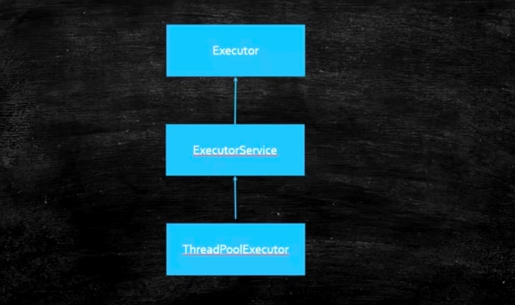

- Executor看它的名字也能理解，执行者，所以他有一个方法叫执行，那么执行的东西是Runnable，所以这个Executor有了之后呢由于它是一个借口，他可以有好多实现，因此我们说，有了Executor之后呢，我们现场就是一个任务的定义，比如Runnable起了一个命令的意思，他的定义和运行就可以分开了，不像我们以前定义一个Thread，new一个Thread然后去重写它的Run方法.start才可以运行，或者以前就是你写了一个Runnable你也必须得new一个Thread出来，以前的这种定义和运行是固定的，是写死的就是你new一个Thread让他出来运行。有的同学他还是new一个Thread但是他有了各种各样新的玩法，不用你亲自去指定每一个Thread，他的运行的方式你可以自己去定义了，所以至于是怎么去定义的就看你怎么实现Executor的接口了，这里是定义和运行分开这么一个含义，所以这个接口体现的是这个意思，所以这个接口就比较简单，至于你是直接调用run还是new一个Thread那是你自己的事儿。

```java
 * The {@code Executor} implementations provided in this package
 * implement {@link ExecutorService}, which is a more extensive
 * interface.  The {@link ThreadPoolExecutor} class provides an
 * extensible thread pool implementation. The {@link Executors} class
 * provides convenient factory methods for these Executors.
 *
 * <p>Memory consistency effects: Actions in a thread prior to
 * submitting a {@code Runnable} object to an {@code Executor}
 * <a href="package-summary.html#MemoryVisibility"><i>happen-before</i></a>
 * its execution begins, perhaps in another thread.
 *
 * @since 1.5
 * @author Doug Lea
 */
public interface Executor {

    /**
     * Executes the given command at some time in the future.  The command
     * may execute in a new thread, in a pooled thread, or in the calling
     * thread, at the discretion of the {@code Executor} implementation.
     *
     * @param command the runnable task
     * @throws RejectedExecutionException if this task cannot be
     * accepted for execution
     * @throws NullPointerException if command is null
     */
    void execute(Runnable command);
}
```

- ExecutorService又是什么意思呢，他是从Executor继承，另外，他除了去实现Executor可以去执行一个任务之外，他还完善了整个任务执行器的一个生命周期，就拿线程池来举例子，一个线程池里面一堆的线程就是一堆的工人，执行完一个任务之后我这个线程怎么结束啊，线程池定义了这样一些个方法:

- ```java
  void shutdown();//结束
  List<Runnable> shutdownNow();//马上结束
  boolean isShutdown();//是否结束了
  boolean isTerminated();//是不是整体都执行完了
  boolean awaitTermination(long timeout, TimeUnit unit)
          throws InterruptedException;//等着结束，等多长时间，时间到了还不结束的话他就返回false
  ```

  等等，所以这里面呢，他是实现了一些个线程的线程池的生命周期的东西，扩展了Executor的接口，真正的线程池的现实是在ExecutorService的这个基础上来实现的。当我们看到这个ExecutorService的时候你会发现他除了Executor执行任务之外还有submit提交任务，执行任务是直接拿过来马上运行，而submit是扔给这个线程池，什么时候运行由这个线程池来决定，相当于是异步的，我只要往里面一扔就不管了。那好，如果不管的话什么时候他有结果啊，这里面就涉及了比较新的类：比如说Future、RunnableFuture、FutureTask所以在这个里面我要给大家拓展一些线程的基础的概念，大家以前学线程的时候定义一个线程的任务只能去实现Runnable接口，那在1.5之后他就增加了Callable这个接口。

- 下面代码我们看一下Callable这个文档，他说这个接口和java.lang.Runnable类似，所以这两个类设计出来都是想潜在的另外一个线程去运行他，所以通过这点你会知道Callable和Runnable一样他也可以是一个线程来运行他，那好，为什么有了Runnable还要有Callable，很简单看代码Callable有一个返回值，call这个方法相当与Runnable里面的run方法，而Runnable里的方法返回值是空值，而这里是可以有一个返回值的，给你一个计算的任务，最后你得给我一个结果啊，这个叫做Callable，那么由于他可以返回一个结果，我就可以把这个结果给存储起来，等什么时候您老人家计算完了通知我就可以了，我就不需要像原来线程池里面我调用他的run在这等着了。

  所以有了这个Callable之后就有了很多种新鲜的玩法，Callable是什么，他类似于Runnable，不过Callable可以有返回值。

  ```java
  package java.util.concurrent;
  /**
   * A task that returns a result and may throw an exception.
   * Implementors define a single method with no arguments called
   * {@code call}.
   *
   * <p>The {@code Callable} interface is similar to {@link
   * java.lang.Runnable}, in that both are designed for classes whose
   * instances are potentially executed by another thread.  A
   * {@code Runnable}, however, does not return a result and cannot
   * throw a checked exception.
   *
   * <p>The {@link Executors} class contains utility methods to
   * convert from other common forms to {@code Callable} classes.
   *
   * @see Executor
   * @since 1.5
   * @author Doug Lea
   * @param <V> the result type of method {@code call}
   */
  @FunctionalInterface
  public interface Callable<V> {
      /**
       * Computes a result, or throws an exception if unable to do so.
       *
       * @return computed result
       * @throws Exception if unable to compute a result
       */
      V call() throws Exception;
  }
  ```

  

- 有了这个Callable之后呢，我们在来看一个接口：Future，这个Future代表的是什么呢，这个Future代表的是那个Callable被执行完了之后我怎么才能拿到那个结果啊，它会封装到一个Future里面。Future将来，未来。未来你执行完之后可以把这个结果放到这个未来有可能执行完的结果里头，所以Future代表的是未来执行完的一个结果。

  由于Callable基本上就是为了线程池而设计的，所以你要是不用线程池的接口想去写Callable的一些个小程序还是比较麻烦，所以这里面是要用到一些线程池的直接的用法，比较简单，我们先用，用完后再给大家解释什么意思。我们来看Future是怎么用的，在我们读这个ExecutorService的时候你会发现他里面有submit方法，这个submit是异步的提交任务，提交完了任务之后原线程该怎么运行怎么运行，运行完了之后他会出一个结果，这个结果出在哪儿 ，他的返回值是一个Future，所以你只能去提交一个Callable，必须有返回值，把Callable的任务扔给线程池，线程池执行完了，异步的，就是把任务交给线程池之后我主线程该干嘛干嘛，调用get方法直到有结果之后get会返回。Callable一般是配合线程池和Future来用的。

  其实更灵活的一个用法是FutureTask，即是一个Future同时又是一个Task，原来这Callable只能一个Task只能是一个任务但是他不能作为一个Future来用。这个FutureTask相当于是我自己可以作为一个任务来用，同时这个任务完成之后的结果也存在于这个对象里，为什么他能做到这一点，因为FutureTask他实现了RunnableFuture，而RunnableFuture即实现了Runnable又实现了Future，所以他即是一个任务又是一个Future。所以这个FutureTask是更好用的一个类。大家记住这个类，后面还会有WorkStealingPool、ForkJoinPool这些个基本上是会用到FutureTask类的。

  ```java
  package com.mashibing.juc.c_026_01_ThreadPool;
  import java.util.concurrent.*;
  
  public class T06_00_Future {
  	public static void main(String[] args) throws InterruptedException, ExecutionException {
  		
  		FutureTask<Integer> task = new FutureTask<>(()->{
  			TimeUnit.MILLISECONDS.sleep(500);
  			return 1000;
  		}); //new Callable () { Integer call();}
  		
  		new Thread(task).start();
  		
  		System.out.println(task.get()); //阻塞
  	}
  }
  ```

  

我们拓展了几个类，大家把这几个小类理解一下

- Callable 类似与 Runnable，但是有返回值。
- 了解了Future，是用来存储执行的将来才会产生的结果。
- FutureTask，他是Future加上Runnable，既可以执行又可以存结果。
- CompletableFuture，管理多个Future的结果。


那么有了这些之后那，我们可以介绍一个CompletableFuture。他底层特别复杂，但是用法特别灵活，如果你们感兴趣可以去拓展的了解一下，用一下。CompletableFuture他的底层用的是ForkJoinPool。

我们先来看他的用法，这里有一个小例子，有这样一个情景可以用到这个CompletableFuture，这个CompletableFuture非常的灵活，它内部有好多关于各种结果的一个组合，这个CompletableFuture是可以组合各种各样的不同的任务，然后等这个任务执行完产生一个结果进行一个组合。我们直接看代码，假如你自己写了一个网站，这个网站都卖格力空调，同一个类型，然后很多人买东西都会进行一个价格比较，而你提供的这个服务就是我到淘宝上去查到这个格力空调买多少钱，然后我另启动一个线程去京东上找格力空调卖多少钱，在启动一个线程去拼多多上找，最后，我给你汇总一下这三个地方各售卖多少钱，然后你自己再来选去哪里买。下面代码，模拟了一个去别的地方取价格的一个方法，首先你去别的地方访问会花好长时间，因此我写了一个delay() 让他去随机的睡一段时间，表示我们要联网，我们要爬虫爬结果执行这个时间，然后打印了一下睡了多少时间之后才拿到结果的，如拿到天猫上的结果是1块钱，淘宝上结果是2块钱，京东上结果是3块钱，总而言之是经过网络爬虫爬过来的数据分析出来的多少钱。然后我们需要模拟一下怎么拿到怎么汇总，第一种写法就是我注释的这种写法，就是挨着牌的写，假设跑天猫跑了10秒，跑淘宝拍了10秒，跑京东跑了5秒，一共历时25秒才总出来。但是如果我用不同的线程呢，一个一个的线程他们是并行的执行他们计算的结果是只有10秒。

但是用线程你写起来会有各种各样的麻烦事儿，比如说在去淘宝的过程中网络报错了该怎么办，你去京东的过程中正好赶上那天他活动，并发访问特别慢你又该怎么办，你必须得等所有的线程都拿到之后才能产生一个结果，如果想要做这件事儿的话与其是要你每一个都要写一个自己的线程，需要考虑到各种各样的延迟的问题，各种各样的异常的问题这个时候有一个简单的写法，用一个CompletableFuture，首先第一点CompletableFuture他是一个Future，所以他会存一个将来有可能产生的结果值，结果值是一个Double，它会运行一个任务，然后这个任务最后产生一个结果，这个结果会存在CompletableFuture里面，结果的类型是Double。

在这里我就定义了三个Future，分别代表了淘宝、京东、天猫，用了CompletableFuture的一个方法叫supplyAsync产生了一个异步的任务，这个异步的任务去天猫那边去给我拉数据去。你可以想象在一个线程池里面扔给他一个任务让他去执行，什么时候执行完了之后他的结果会返回到这个futureTM里面。但是总体的要求就是这些个所有的future都得结束才可以，才能展示我最后的结果。

往下走还有这么一直写法，就是我把这三个future都可以扔给一个CompletableFuture让他去管理，他管理的时候可以调用allOf方法相当于这里面的所有的任务全部完成之后，最后join，你才能够继续往下运行。所以CompletableFuture除了提供了比较好用的对任务的管理之外，还提供了对于任务堆的管理，用于对一堆任务的管理。CompletableFuture还提供了很多的写法，比如下面Lambda表达式的写法。

CompletableFuture是什么东西呢？他是各种任务的一种管理类，总而言之呢CompletableFuture是一个更高级的类，它能够在很高的一个层面上来帮助你管理一些个你想要的各种各样的任务，比如说你可以对任务进行各种各样的组合 ，所有任务完成之后你要执行一个什么样的结果，以及任何一个任务完成之后你要执行一个什么样的结果，还有他可以提供一个链式的处理方式Lambda的一些写法，拿到任务之后结果进行一个怎样的处理。

```java
/**
 * 假设你能够提供一个服务
 * 这个服务查询各大电商网站同一类产品的价格并汇总展示
 * @author  http://mashibing.com
 */
package com.mashibing.juc.c_026_01_ThreadPool;
import java.io.IOException;
import java.util.Random;
import java.util.concurrent.CompletableFuture;
import java.util.concurrent.ExecutionException;
import java.util.concurrent.TimeUnit;

public class T06_01_CompletableFuture {
    public static void main(String[] args) throws ExecutionException, InterruptedException {
        long start, end;

        /*start = System.currentTimeMillis();
        priceOfTM();
        priceOfTB();
        priceOfJD();

        end = System.currentTimeMillis();
        System.out.println("use serial method call! " + (end - start));*/

        start = System.currentTimeMillis();

        CompletableFuture<Double> futureTM = CompletableFuture.supplyAsync(()->priceOfTM());
        CompletableFuture<Double> futureTB = CompletableFuture.supplyAsync(()->priceOfTB());
        CompletableFuture<Double> futureJD = CompletableFuture.supplyAsync(()->priceOfJD());

        CompletableFuture.allOf(futureTM, futureTB, futureJD).join();

        CompletableFuture.supplyAsync(()->priceOfTM())
                .thenApply(String::valueOf)
                .thenApply(str-> "price " + str)
                .thenAccept(System.out::println);

        end = System.currentTimeMillis();
        System.out.println("use completable future! " + (end - start));
        try {
            System.in.read();
        } catch (IOException e) {
            e.printStackTrace();
        }
    }

    private static double priceOfTM() {
        delay();
        return 1.00;
    }

    private static double priceOfTB() {
        delay();
        return 2.00;
    }

    private static double priceOfJD() {
        delay();
        return 3.00;
    }

    /*private static double priceOfAmazon() {
        delay();
        throw new RuntimeException("product not exist!");
    }*/

    private static void delay() {
        int time = new Random().nextInt(500);
        try {
            TimeUnit.MILLISECONDS.sleep(time);
        } catch (InterruptedException e) {
            e.printStackTrace();
        }
        System.out.printf("After %s sleep!\n", time);
    }
}
```


我们在来了解一下线程池，线程池呢从目前JDK提供的有两种类型，第一种就是普通的线程池**ThreadPoolExecutor**，第二种是**ForkJoinPool**，这两种是不同类型的线程池，能干的事儿不太一样，大家先把结论记住。Fork分叉，分叉完再分叉，最后的结果汇总这叫join。给大家讲一个故事，在我上大学的时候NASA美国航天局他们有很多的数据，计算机的计算力不行，就想了办法，他把哪些要计算的气象或者宇宙中产生各种各样的数据进行一个分片，一大块儿数据分成一小片一小片的，然后自己的计算机确实算不过来，太多了，他就向全球发出请求，你们愿不愿意在计算机空余的时间来帮我做一些这样的饿计算，他是干过这样的一个事情的，我在上大学的时候是收到过NASA这样一个申请的。所以这个就是ForkJoinPool的一个概念。这是两种不同类型的线程池，我们说线程池的时候一般是说的第一种线程池，严格来讲这两种是不一样的，今天我先来对ThreadPoolExecutor进行一个入门，后面我们再来讲ForkJoinPool。

ThreadPoolExecutor他的父类是从AbstractExecutorService，而AbstractExecutorService的父类是ExecutorService，再ExecutorService的父类是Executo，所以ThreadPoolExecutor就相当于线程池的执行器，就是大家伙儿可以向这个池子里面扔任务，让这个线程池去运行。另外在阿里巴巴的手册里面要求线程池是要自定义的，还有不少同学会被问这个线程池是怎么自定义。

我们来看怎么样手动定义一个线程池，手动定义线程池他有很多构造方法，我们找这个最常见的理解了就行了。大家看下面这里代码，我定义了一个任务Task，这个任务是实现Runnable接口，就是一个普通的任务了，每一个任务里有一个编号i，然后打印这个编号，主要干这个事儿，打印完后阻塞System.in.read()，每个任务都是阻塞的，toString方法就不说了，定义一个线程池最长的有七个参数，首先我们来理解什么叫线程池，线程池他维护这两个集合，第一个是线程的集合，里面是一个一个的线程。第二个是任务的集合，里面是一个一个的任务这叫一个完整的线程池。

我怎么定义这一个线程池，这里面的七个参数，

- 第一个参数**corePoolSoze核心线程数**，最开始的时候是有这个线程池里面是有一定的核心线程数的；

- 第二个叫**maximumPoolSize最大线程数**，线程数不够了，能扩展到最大线程是多少；

- 第三个**keepAliveTime生存时间**，意思是这个线程有很长时间没干活了请你把它归还给操作系统；

- 第四个**TimeUnit.SECONDS生存时间的单位**到底是毫秒纳秒还是秒自己去定义；

- 第五个是**任务队列**，就是我们上节课讲的BlockingQueue，各种各样的BlockingQueue你都可以往里面扔，我们这用的是ArrayBlockingQueue，参数最多可以装四个任务；

- 第六个是**线程工厂**defaultThreadFactory，他返回的是一个enw DefaultThreadFactory,它要去你去实现ThreadFactory的接口，这个接口只有一个方法叫newThread，所以就是产生线程的，可以通过这种方式产生自定义的线程，默认产生的是defaultThreadFactory，而defaultThreadFactory产生线程的时候有几个特点：new出来的时候指定了group制定了线程名字，然后指定的这个线程绝对不是守护线程，设定好你线程的优先级。自己可以定义产生的到底是什么样的线程，指定线程名叫什么（为什么要指定线程名称，有什么意义，就是可以方便出错是回溯）；

- 第七个叫**拒绝策略**，指的是线程池忙，而且任务队列满这种情况下我们就要执行各种各样的拒绝策略，jdk默认提供了四种拒绝策略，也是可以自定义的。

  1：Abort：抛异常

  2：Discard：扔掉，不抛异常

  3：DiscardOldest：扔掉排队时间最久的

  4：CallerRuns：调用者处理服务

  一般情况这四种我们会自定义策略，去实现这个拒绝策略的接口，处理的方式是一般我们的消息需要保存下来，要是订单的话那就更需要保存了，保存到kafka，保存到redis或者是存到数据库随便你然后做好日志。

```java
package com.mashibing.juc.c_026_01_ThreadPool;
import java.io.IOException;
import java.util.concurrent.*;
public class T05_00_HelloThreadPool {
    static class Task implements Runnable {
        private int i;

        public Task(int i) {
            this.i = i;
        }

        @Override
        public void run() {
            System.out.println(Thread.currentThread().getName() + " Task " + i);
            try {
                System.in.read();
            } catch (IOException e) {
                e.printStackTrace();
            }
        }

        @Override
        public String toString() {
            return "Task{" +
                    "i=" + i +
                    '}';
        }
    }

    public static void main(String[] args) {
        ThreadPoolExecutor tpe = new ThreadPoolExecutor(2, 4,
                60, TimeUnit.SECONDS,
                new ArrayBlockingQueue<Runnable>(4),
                Executors.defaultThreadFactory(),
                new ThreadPoolExecutor.CallerRunsPolicy());

        for (int i = 0; i < 8; i++) {
            tpe.execute(new Task(i));
        }
        System.out.println(tpe.getQueue());
        tpe.execute(new Task(100));
        System.out.println(tpe.getQueue());
        tpe.shutdown();
    }
}
```

今天讲的东西很多，复习的时候你就把一个一个小程序从头到尾看完，看懂意思之后自己去敲，前面呢我们通过一道面试题来复习了之前学的一些方法，重点是LockSupport以及synchronized_wait_notify。然后我们讲了ThreadPool的一个入门，讲ThreadPool的时候我们给大家扩展了Callable和Runnable的不同，Future用来存储执行的将来才会产生的结果、FutureTask，他是Future加上Runnable，既可以执行又可以存结果、CompletableFuture，管理各种各样的Future的结果。


# 第八节：线程池与源码阅读


我们回顾一下上节课的内容

第一个我们讲了一个Executor这个接口，大家回顾一下这个接口是干什么使的，把线程的定义和执行分开，主要来做线程的执行接口。在这他下面有一个整个的这个线程池的生命周期，它里面的方法都给他定义全的接口ExecutorService，他下面还有AbstractExecutor这个没有和大家说，这个无所谓了，是为了哪些个子类做准备的。

然后才是各种各样的ThreadPoolExecutor，把线程池作为一个执行的单元，给他单独出来的这么一个类，然后他的七个参数是需要大家背过的

1：corePoolSoze核心线程数；

2：maximumPS最大线程数；

3：keepAliveTime生存时间；

4：TimeUnit 生存时间的单位；

5：BlockingQueue 任务队列；

6：ThreadFactory 线程工厂；

7：RejectStrategy 拒绝策略 ->常见的四个（Abort抛异常、Discard扔掉，不抛异常、DiscardOldest扔掉排队时间最久的、CallerRuns调用者处理服务）；


今天我们来看看JDK给我们提供了一些默认的线程池的实现，默认的常用的有哪些，看完之后在来带大家读一下ThreadPoolExecutor的源码。我们先来看JDK提供给我们一些默认的实现。

我们分析过所有的线程池都是从ExecutorService这个类来继承的，所以呢这个Executors是对线程执行的工具类，他可以看作是线程池的工厂。他是用来产生各种各样的线程池的。

**SingleThreadPool**

看下面代码，第一个叫SingleThreadPool，看名字就知道这个线程池里面只有一个线程，这个一个线程的线程池可以保证我们扔进去的任务是顺序执行的。

肯定会有人问这样一个问题，为什么会有单线程的线程池？第一个线程池是有任务队列的；生命周期管理线程池是能帮你提供的；

```java
package com.mashibing.juc.c_026_01_ThreadPool;
import java.util.concurrent.ExecutorService;
import java.util.concurrent.Executors;

public class T07_SingleThreadPool {
	public static void main(String[] args) {
		ExecutorService service = Executors.newSingleThreadExecutor();
		for(int i=0; i<5; i++) {
			final int j = i;
			service.execute(()->{
				System.out.println(j + " " + Thread.currentThread().getName());
			});
		}
	}
}
```

**CachedPool**

我们来看第二种CachedPool，看他的源码实际上是new了一个ThreadPoolExecutor，他没有核心线程，最大线程可以有好多好多线程，然后60秒钟没有人理他，就回收了，他的任务队列用的是SynchronousQueue，没有指定他的线程工厂他是用的默认线程工厂的，也没有指定拒绝策略，他是默认拒绝策略的。

我们能够看出CachedThreadPool的特点，就是你来一个任务我给你启动一个线程，当然前提是我的线程池里面有线程存在而且他还没有到达60秒钟的回收时间的时候，来一个任务，如果有线程存在我就用现有的线程池，但是在有新的任务来的时候，如果其他线程忙我就启动一个新的，哪有同学说我不是来任务就扔到任务队列里面吗，可是大家分析一下我们这个CachedThreadPool他用的任务队列是synchronousQueue，它是一个手递手容量为空的Queue，就是你来一个东西必须得有一个线程把他拿走，不然我提交任务的线程从这阻塞住了。synchronousQueue还可以扩展为多个线程的手递手，多个生产者多个消费者都需要手递手叫TransferQueue。这个CachedThreadPool就是这样一个线程池，来一个新的任务就必须马上执行，没有线程空着我就new一个线程。那么阿里是不会推荐使用这中线程池的，原因是线程会启动的特别多，基本接近于没有上限的。

来看这个小程序，首先将这个service打印出来，最后在把service打印出来，我们的任务是睡500个毫秒，然后打印线程池，打印他的名字。运行一下，通过打印线程池的toString的输出能看到线程池的一些状态。

```java
//源码
public static ExecutorService newCachedThreadPool() {
        return new ThreadPoolExecutor(0, Integer.MAX_VALUE,
                                      60L, TimeUnit.SECONDS,
                                      new SynchronousQueue<Runnable>());
}

package com.mashibing.juc.c_026_01_ThreadPool;
import java.util.concurrent.ExecutorService;
import java.util.concurrent.Executors;
import java.util.concurrent.TimeUnit;

public class T08_CachedPool {
	public static void main(String[] args) throws InterruptedException {
		ExecutorService service = Executors.newCachedThreadPool();
		System.out.println(service);
		for (int i = 0; i < 2; i++) {
			service.execute(() -> {
				try {
					TimeUnit.MILLISECONDS.sleep(500);
				} catch (InterruptedException e) {
					e.printStackTrace();
				}
				System.out.println(Thread.currentThread().getName());
			});
		}
		System.out.println(service);
		TimeUnit.SECONDS.sleep(80);
		System.out.println(service);
	}
}
```


**FixedThreadPool**

你看他的名称，fixed是固定的含义，就是固定的一个线程数，FixedThreadPool指定一个参数，到底有多少个线程，你看他的核心线程和最大线程都是固定的，因为他的最大线程和核心线程都是固定的就没有回收之说所以把他指定成0，这里用的是LinkedBlockingQueue（如果在阿里工作看到LinkedBlockingQueue一定要小心，他是不建议用的）

我们来看一下这个FixedThreadPool的小例子，用一个固定的线程池有一个好处是什么呢，就是你可以进行并行的计算，那么说到这儿**并行和并发有什么区别concurrent vs parallel**:并发是指任务提交，并行指任务执行；并行是并发的子集。并行是多个cpu可以同时进行处理，并发是多个任务同时过来。要理解这个概念。FixedThreadPool是确实可以让你的任务来并行处理的，那么并行处理的时候就可以真真正正的提高效率。看这个方法isPrime判断一个数是不是质数，然后写了另外一个getPrime方法，指定一个其实的位置，一个结束的位置将中间的质数拿出来一部分，主要是为了把任务给切分开。计算从1一直到200000这么一些数里面有多少个数是质数getPrime，计算了一下时间，只有我们一个main线程来运行，不过我们既然学了多线程就完全可以这个任务切分成好多好多子任务让多线程来共同运行，我有多少cpu，我的机器是4核的，这个取决你的机器数，在启动了一个固定大小的线程池，然后在分别来计算，分别把不同的阶段交给不同的任务，扔进去submit他是异步的，拿到get的时候才知道里面到底有多少个，全部get完了之后相当于所有的线程都知道结果了，最后我们计算一下时间，用这两种计算方式就能比较出来到底是并行的方式快还是串行的方式快。 拿大腿想一想也能知道肯定是利用线程池速度要快的多。因此呢，这也是线程池使用的一种方式。

```java
//源码
 public static ExecutorService newFixedThreadPool(int nThreads) {
        return new ThreadPoolExecutor(nThreads, nThreads,
                                      0L, TimeUnit.MILLISECONDS,
                                      new LinkedBlockingQueue<Runnable>());
 }

/**
 * 线程池的概念
 * nasa
 */
package com.mashibing.juc.c_026_01_ThreadPool;

import java.util.ArrayList;
import java.util.List;
import java.util.concurrent.Callable;
import java.util.concurrent.ExecutionException;
import java.util.concurrent.ExecutorService;
import java.util.concurrent.Executors;
import java.util.concurrent.Future;

public class T09_FixedThreadPool {
   public static void main(String[] args) throws InterruptedException, ExecutionException {
      long start = System.currentTimeMillis();
      getPrime(1, 200000); 
      long end = System.currentTimeMillis();
      System.out.println(end - start);
      
      final int cpuCoreNum = 4;
      
      ExecutorService service = Executors.newFixedThreadPool(cpuCoreNum);
      
      MyTask t1 = new MyTask(1, 80000); //1-5 5-10 10-15 15-20
      MyTask t2 = new MyTask(80001, 130000);
      MyTask t3 = new MyTask(130001, 170000);
      MyTask t4 = new MyTask(170001, 200000);
      
      Future<List<Integer>> f1 = service.submit(t1);
      Future<List<Integer>> f2 = service.submit(t2);
      Future<List<Integer>> f3 = service.submit(t3);
      Future<List<Integer>> f4 = service.submit(t4);
      
      start = System.currentTimeMillis();
      f1.get();
      f2.get();
      f3.get();
      f4.get();
      end = System.currentTimeMillis();
      System.out.println(end - start);
   }
   
   static class MyTask implements Callable<List<Integer>> {
      int startPos, endPos;
      
      MyTask(int s, int e) {
         this.startPos = s;
         this.endPos = e;
      }
      
      @Override
      public List<Integer> call() throws Exception {
         List<Integer> r = getPrime(startPos, endPos);
         return r;
      }
      
   }
   
   static boolean isPrime(int num) {
      for(int i=2; i<=num/2; i++) {
         if(num % i == 0) return false;
      }
      return true;
   }
   
   static List<Integer> getPrime(int start, int end) {
      List<Integer> results = new ArrayList<>();
      for(int i=start; i<=end; i++) {
         if(isPrime(i)) results.add(i);
      }
      return results;
   }
}
```

**Cache vs Fixed**

什么时候用Cache什么时候用Fixed，你得精确的控制你有多少个线程数，控制数量问题多数情况下你得预估并发量。如果线程池中的数量过多，最终他们会竞争稀缺的处理器和内存资源，浪费大量的时间在上下文切换上，反之，如果线程的数目过少，正如你的应用所面临的情况，处理器的一些核可能就无法充分利用。Brian Goetz建议，线程池大小与处理器的利用率之比可以使用公式来进行计算估算：线程池=你有多少个cpu 乘以 cpu期望利用率 乘以 （1+ W/C）。W除以C是等待时间与计算时间的比率。

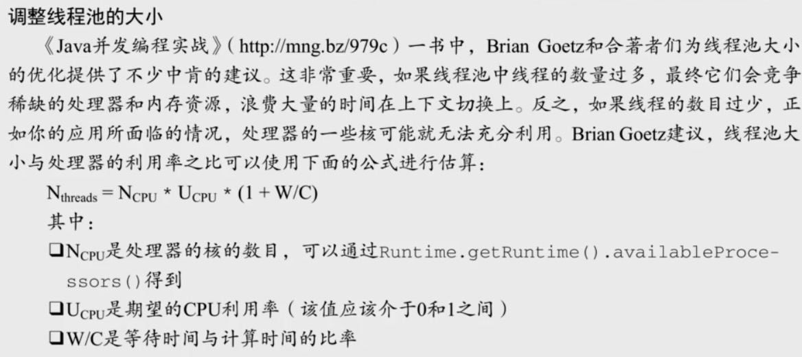

假如你这个任务并不确定他的量平稳与否，就像是任务来的时候他可能忽高忽低，但是我要保证这个任务来时有人做这个事儿，那么我们可以用Cache，当然你要保证这个任务不会堆积。那Fixed的话就是这个任务来的比较平稳，我们大概的估算了一个值，就是这个值完全可以处理他，我就直接new这个值的线程来扔在这就ok了。（阿里是都不用，自己估算，进行精确定义）

**ScheduledPool**

ScheduledPool定时任务线程池，就是我们原来学过一个定时器任务，隔一段时间之后这个任务会执行。这个就是我们专门用来执行定时任务的一个线程池。看源码，我们newScheduledThreadPool的时候他返回的是ScheduledThreadPoolExecutor，然后在ScheduledThreadPoolExecutor里面他调用了super，他的super又是ThreadPoolExecutor，它本质上还是ThreadPoolExecutor，所以并不是别的，参数还是ThreadPool的七个参数。这是专门给定时任务用的这样的一个线程池，了解就可以了。

看程序，newScheduledThreadPool核心线程是4，其实他这里面有一些好用的方法比如是scheduleAtFixedRate间隔多长时间在一个固定的频率上来执行一次这个任务，可以通过这样的方式灵活的对于时间上的一个控制，第一个参数（Delay）第一个任务执行之前需要往后面推多长时间；第二个（period）间隔多长时间；第三个参数是时间单位;	

```java
//源码
public static ScheduledExecutorService newScheduledThreadPool(int corePoolSize) {
        return new ScheduledThreadPoolExecutor(corePoolSize);
}

package com.mashibing.juc.c_026_01_ThreadPool;
import java.util.Random;
import java.util.concurrent.Executors;
import java.util.concurrent.ScheduledExecutorService;
import java.util.concurrent.TimeUnit;

public class T10_ScheduledPool {
   public static void main(String[] args) {
      ScheduledExecutorService service = Executors.newScheduledThreadPool(4);
      service.scheduleAtFixedRate(()->{
         try {
            TimeUnit.MILLISECONDS.sleep(new Random().nextInt(1000));
         } catch (InterruptedException e) {
            e.printStackTrace();
         }
         System.out.println(Thread.currentThread().getName());
      }, 0, 500, TimeUnit.MILLISECONDS);
   }
}
```


给大家分享一道阿里的面试题：假如提供一个闹钟服务，订阅这个服务的人特别多，10亿人，就意味着在每天早上七点钟的时候会有10亿的并发量涌向你这的服务器，问你怎么优化？

思想是把这个定时的任务分发到很多很多的边缘的服务器上去，一台服务器不够啊，在一台服务器上有一个队列存着这些任务，然后线程去消费，也是要用到线程池的，大的结构上用分而治之的思想，主服务器把这些同步到边缘服务器，在每台服务器上用线程池加任务队列。

到现在我们学习了四种线程池了，我们来稍微回顾一下：

1：SingleThreadPool只有一个线程的线程池；

2：FixedThreadPool固定多少个线程的线程池；

3：CachedPool有弹性的线程池，来一个启动一个，只要没闲着就启动新的来执行；

4：ScheduledPool定时任务来执行线程池；

这几个线程池底层全都是用的ThreadPoolExecutor。


自定义一个拒绝策略的例子，代码演示如下：

```java
package com.mashibing.juc.c_026_01_ThreadPool;
import java.util.concurrent.*;
public class T14_MyRejectedHandler {
    public static void main(String[] args) {
        ExecutorService service = new ThreadPoolExecutor(4, 4,
                0, TimeUnit.SECONDS, new ArrayBlockingQueue<>(6),
                Executors.defaultThreadFactory(),
                new MyHandler());
    }

    static class MyHandler implements RejectedExecutionHandler {

        @Override
        public void rejectedExecution(Runnable r, ThreadPoolExecutor executor) {
            //log("r rejected")
            //save r kafka mysql redis
            //try 3 times
            if(executor.getQueue().size() < 10000) {
                //try put again();
            }
        }
    }
}
```


我们来看这个ThreadPoolExecutor源码的解析，这个源码还是比较复杂的，给大家做一个简单的解释让大家读的时候没有那么费劲。

**ThreadPoolExecutor源码解析**

**1、常用变量的解释**

这里面有一些常用变量的解释，第一个叫control (ctl)，ctl代表两个意思，AtomicInteger是int类型，int类型是32位，高的三位代表线程池状态，低的29位代表目前线程池里有多少个线程数量。那他干嘛不用两个值，这里面肯定是自己进行了一些优化的，如果让我们自己写一定是两个值，我们线程池目前是什么状态，然后在这里面到底目前有多少个线程在运行，记录下来，只不过他把这两个值合二为一了，执行效率是会更高一些，因为这两个值都需要线程同步，所以他放在一个值里面，只要对一个线程进行线程同步就可以了，所以这里AtomicInteger在线程数量非常多，执行时间非常短的时候相对于synchronized效率会更高一些，在下面2、3是对ctl的一个计算。4是线程池的一些5种状态

RUNNING：正常运行的；

SHUTDOWN：调用了shutdown方法了进入了shutdown状态；

STOP：调用了shutdownnow马上让他停止；

TIDYING：调用了shutdown然后这个线程也执行完了，现在正在整理的这个过程叫TIDYING；

TERMINATED：整个线程全部结束；

在下面就是对ctl的一些操作了runStateOf取他的状态，workerCountOf计算有多少个线程正在工作，还有第8和第9个runStateLessThan、runStateAtLeast是帮助写代码的一些东西。

```java
// 1. `ctl`，可以看做一个int类型的数字，高3位表示线程池状态，低29位表示worker数量
private final AtomicInteger ctl = new AtomicInteger(ctlOf(RUNNING, 0));
// 2. `COUNT_BITS`，`Integer.SIZE`为32，所以`COUNT_BITS`为29
private static final int COUNT_BITS = Integer.SIZE - 3;
// 3. `CAPACITY`，线程池允许的最大线程数。1左移29位，然后减1，即为 2^29 - 1
private static final int CAPACITY   = (1 << COUNT_BITS) - 1;

// runState is stored in the high-order bits
// 4. 线程池有5种状态，按大小排序如下：RUNNING < SHUTDOWN < STOP < TIDYING < TERMINATED
private static final int RUNNING    = -1 << COUNT_BITS;
private static final int SHUTDOWN   =  0 << COUNT_BITS;
private static final int STOP       =  1 << COUNT_BITS;
private static final int TIDYING    =  2 << COUNT_BITS;
private static final int TERMINATED =  3 << COUNT_BITS;

// Packing and unpacking ctl
// 5. `runStateOf()`，获取线程池状态，通过按位与操作，低29位将全部变成0
private static int runStateOf(int c)     { return c & ~CAPACITY; }
// 6. `workerCountOf()`，获取线程池worker数量，通过按位与操作，高3位将全部变成0
private static int workerCountOf(int c)  { return c & CAPACITY; }
// 7. `ctlOf()`，根据线程池状态和线程池worker数量，生成ctl值
private static int ctlOf(int rs, int wc) { return rs | wc; }

/*
 * Bit field accessors that don't require unpacking ctl.
 * These depend on the bit layout and on workerCount being never negative.
 */
// 8. `runStateLessThan()`，线程池状态小于xx
private static boolean runStateLessThan(int c, int s) {
    return c < s;
}
// 9. `runStateAtLeast()`，线程池状态大于等于xx
private static boolean runStateAtLeast(int c, int s) {
    return c >= s;
}
```

**2、构造方法**

```java
public ThreadPoolExecutor(int corePoolSize,
                          int maximumPoolSize,
                          long keepAliveTime,
                          TimeUnit unit,
                          BlockingQueue<Runnable> workQueue,
                          ThreadFactory threadFactory,
                          RejectedExecutionHandler handler) {
    // 基本类型参数校验
    if (corePoolSize < 0 ||
        maximumPoolSize <= 0 ||
        maximumPoolSize < corePoolSize ||
        keepAliveTime < 0)
        throw new IllegalArgumentException();
    // 空指针校验
    if (workQueue == null || threadFactory == null || handler == null)
        throw new NullPointerException();
    this.corePoolSize = corePoolSize;
    this.maximumPoolSize = maximumPoolSize;
    this.workQueue = workQueue;
    // 根据传入参数`unit`和`keepAliveTime`，将存活时间转换为纳秒存到变量`keepAliveTime `中
    this.keepAliveTime = unit.toNanos(keepAliveTime);
    this.threadFactory = threadFactory;
    this.handler = handler;
}
```

**3、提交执行task的过程**

这个execute方法还算是相对简单一些，我们来简单解释大概读一下，execute执行任务的时候判断任务等于空抛异常，这个很简单，接下来就是拿状态值，拿到值之后计算这个值里面的线程数，活着的那些线程数是不是小于核心线程数，如果小于addWorker添加一个线程，addWorker是比较难的一个方法，他的第二个参数指的是，是不是核心线程，所有上来之后如果核心数不够先添加核心线程，再次检查这个值。我们原来讲过这个线程里面上来之后刚开始为0，来一个任务启动一个核心线程，第二个就是核心线程数满了之后，放到队列里。最后核心线程满了，队列也满了，启动非核心线程。小于线程数就直接加，后面执行的逻辑就是不小于了，不小于就是超过核心线程数了直接往里扔，workQueue.offer就是把他扔进去队列里，再检查状态。在这中间可能会被改变状态值，因此需要双重检查，这个跟我们之前聊过的单例模式里面的DC是一样的逻辑。isRunning，重新又拿这个状态，拿到这个状态之后这里是要进行一个状态切换的，如果不是Running状态说明执行过shutdown命令，才会把这个Running转换成别的状态，其他情况下workerCountOf如果等于0说明里面没有线程了，没有线程我线程池正常运行就添加非核心线程。这些步骤都是通过源码可以看出来的。如果添加work本身都不行就reject把他给拒绝掉。

```java
public void execute(Runnable command) {
    if (command == null)
        throw new NullPointerException();
    /*
     * Proceed in 3 steps:
     *
     * 1. If fewer than corePoolSize threads are running, try to
     * start a new thread with the given command as its first
     * task.  The call to addWorker atomically checks runState and
     * workerCount, and so prevents false alarms that would add
     * threads when it shouldn't, by returning false.
     *
     * 2. If a task can be successfully queued, then we still need
     * to double-check whether we should have added a thread
     * (because existing ones died since last checking) or that
     * the pool shut down since entry into this method. So we
     * recheck state and if necessary roll back the enqueuing if
     * stopped, or start a new thread if there are none.
     *
     * 3. If we cannot queue task, then we try to add a new
     * thread.  If it fails, we know we are shut down or saturated
     * and so reject the task.
     */
    int c = ctl.get();
    // worker数量比核心线程数小，直接创建worker执行任务
    if (workerCountOf(c) < corePoolSize) {
        if (addWorker(command, true))
            return;
        c = ctl.get();
    }
    // worker数量超过核心线程数，任务直接进入队列
    if (isRunning(c) && workQueue.offer(command)) {
        int recheck = ctl.get();
        // 线程池状态不是RUNNING状态，说明执行过shutdown命令，需要对新加入的任务执行reject()操作。
        // 这儿为什么需要recheck，是因为任务入队列前后，线程池的状态可能会发生变化。
        if (! isRunning(recheck) && remove(command))
            reject(command);
        // 这儿为什么需要判断0值，主要是在线程池构造方法中，核心线程数允许为0
        else if (workerCountOf(recheck) == 0)
            addWorker(null, false);
    }
    // 如果线程池不是运行状态，或者任务进入队列失败，则尝试创建worker执行任务。
    // 这儿有3点需要注意：
    // 1. 线程池不是运行状态时，addWorker内部会判断线程池状态
    // 2. addWorker第2个参数表示是否创建核心线程
    // 3. addWorker返回false，则说明任务执行失败，需要执行reject操作
    else if (!addWorker(command, false))
        reject(command);
}
```

**4、addWorker源码解析**

addWorker这里面涉及到了他的一些非常细节的小心思，你要读通每一个小心思完全没有必要，只要大概能理解就行了，addWorker就是添加线程，线程是要存到容器里，往里头添加线程的时候务必要知道可能有好多个线程都要往里头扔，所以一定要做同步，然后呢，由于它要追求效率不会用synchronized，他会用lock或者是自旋也就增加了你代码更复杂的一个程度。

下面我们大致读一下，他这个里面做了两步，整个addWorker源码做了两部，上面两个for循环只是做了第一步，这个就干了一件事儿，把worker的数量加1，添加一个worker。数量在32位的那个29位里面，而且是在多线程的情况下加1，所以他进行了两个死循环干这个事儿外层死循环套内层死循环，上来先拿状态值，然后进行了一堆的判断，如果状态值不符合的话就return false，这个状态值加不进去，什么时候这个状态值不符合啊，就是大于shutdown，说明你已经shutdown了，或者去除上面这些状态之外，所有的状态都可以往里加线程。加线程又是一个死循环，首先计算当前的wc线程数是不是超过容量了，超过容量就别加了，否则用cas的方式加，如果加成功了说明第一步完成了，就retry把整个全都break掉，外层循环内层循环一下全都跳出来了，如果没加成功就get，get完了之后呢重新处理，continue retry，相当于前面在不断的试，一直试到我们把这个数加到1为止。  然后，后面才是真真正正的启动这个work，new一个work，这个work被new出来之后启动线程，这个work代表一个线程，其实这个work类里面有一个线程，加锁，是在一个容器里面，多线程的状态是一定要加锁的，锁定后检查线程池的状态，为什么要检查，因为中间可能被其他线程干掉过，看这个状态是不是shutdown了等等，如果满足往里加的条件，加进去，加完这个线程后启动开始运行，这是addWorker的一个大体逻辑。

```java
private boolean addWorker(Runnable firstTask, boolean core) {
    retry:
    // 外层自旋
    for (;;) {
        int c = ctl.get();
        int rs = runStateOf(c);

        // 这个条件写得比较难懂，我对其进行了调整，和下面的条件等价
        // (rs > SHUTDOWN) || 
        // (rs == SHUTDOWN && firstTask != null) || 
        // (rs == SHUTDOWN && workQueue.isEmpty())
        // 1. 线程池状态大于SHUTDOWN时，直接返回false
        // 2. 线程池状态等于SHUTDOWN，且firstTask不为null，直接返回false
        // 3. 线程池状态等于SHUTDOWN，且队列为空，直接返回false
        // Check if queue empty only if necessary.
        if (rs >= SHUTDOWN &&
            ! (rs == SHUTDOWN &&
               firstTask == null &&
               ! workQueue.isEmpty()))
            return false;

        // 内层自旋
        for (;;) {
            int wc = workerCountOf(c);
            // worker数量超过容量，直接返回false
            if (wc >= CAPACITY ||
                wc >= (core ? corePoolSize : maximumPoolSize))
                return false;
            // 使用CAS的方式增加worker数量。
            // 若增加成功，则直接跳出外层循环进入到第二部分
            if (compareAndIncrementWorkerCount(c))
                break retry;
            c = ctl.get();  // Re-read ctl
            // 线程池状态发生变化，对外层循环进行自旋
            if (runStateOf(c) != rs)
                continue retry;
            // 其他情况，直接内层循环进行自旋即可
            // else CAS failed due to workerCount change; retry inner loop
        } 
    }
    boolean workerStarted = false;
    boolean workerAdded = false;
    Worker w = null;
    try {
        w = new Worker(firstTask);
        final Thread t = w.thread;
        if (t != null) {
            final ReentrantLock mainLock = this.mainLock;
            // worker的添加必须是串行的，因此需要加锁
            mainLock.lock();
            try {
                // Recheck while holding lock.
                // Back out on ThreadFactory failure or if
                // shut down before lock acquired.
                // 这儿需要重新检查线程池状态
                int rs = runStateOf(ctl.get());

                if (rs < SHUTDOWN ||
                    (rs == SHUTDOWN && firstTask == null)) {
                    // worker已经调用过了start()方法，则不再创建worker
                    if (t.isAlive()) // precheck that t is startable
                        throw new IllegalThreadStateException();
                    // worker创建并添加到workers成功
                    workers.add(w);
                    // 更新`largestPoolSize`变量
                    int s = workers.size();
                    if (s > largestPoolSize)
                        largestPoolSize = s;
                    workerAdded = true;
                }
            } finally {
                mainLock.unlock();
            }
            // 启动worker线程
            if (workerAdded) {
                t.start();
                workerStarted = true;
            }
        }
    } finally {
        // worker线程启动失败，说明线程池状态发生了变化（关闭操作被执行），需要进行shutdown相关操作
        if (! workerStarted)
            addWorkerFailed(w);
    }
    return workerStarted;
}
```

### 5、线程池worker任务单元

这后面是work类的一个简单的解释，他的里面包了一个线程，包了一个任务，然后记录着我这个work干过多少个任务了等等。

```java
private final class Worker
    extends AbstractQueuedSynchronizer
    implements Runnable
{
    /**
     * This class will never be serialized, but we provide a
     * serialVersionUID to suppress a javac warning.
     */
    private static final long serialVersionUID = 6138294804551838833L;

    /** Thread this worker is running in.  Null if factory fails. */
    final Thread thread;
    /** Initial task to run.  Possibly null. */
    Runnable firstTask;
    /** Per-thread task counter */
    volatile long completedTasks;

    /**
     * Creates with given first task and thread from ThreadFactory.
     * @param firstTask the first task (null if none)
     */
    Worker(Runnable firstTask) {
        setState(-1); // inhibit interrupts until runWorker
        this.firstTask = firstTask;
        // 这儿是Worker的关键所在，使用了线程工厂创建了一个线程。传入的参数为当前worker
        this.thread = getThreadFactory().newThread(this);
    }

    /** Delegates main run loop to outer runWorker  */
    public void run() {
        runWorker(this);
    }

    // 省略代码...
}
```

### 6、核心线程执行逻辑-runworker

runwork是真真正正启动线程之后是怎么样去执行这个任务的，同样的，加锁。这个比较好玩的是这个work是从AbstractQueuedSynchronizer继承出来的同时实现了Runnable，说明work可以放在线程里运行，与此同时他本身就是一把锁，就可以做同步，另外，他是可以被线程执行的一个任务 ，为什么它本身就是一把锁啊，这个work可以认为是等着执行的一个工人，是好多个任务都可以往里面去扔内容的，也就是说会有多线程去访问这个对象的，多线程访问这个对象的时候他干脆就给自己做成了一把锁，就不要自己去定义一个lock了，所以你需要往这个work里面扔任务的时候，指定我这个线程就是你执行的这个线程的时候，好，通过work自己去lock就可以了，完全没必要再去new别的lock，所以运行work的时候就先lock住，你要run他就得lock住才能执行，不然别的线程有可能把这个work给占了,	下面又是一堆的执行，执行完了之后unlock出来，执行完了之后++ 。

```java
final void runWorker(Worker w) {
    Thread wt = Thread.currentThread();
    Runnable task = w.firstTask;
    w.firstTask = null;
    // 调用unlock()是为了让外部可以中断
    w.unlock(); // allow interrupts
    // 这个变量用于判断是否进入过自旋（while循环）
    boolean completedAbruptly = true;
    try {
        // 这儿是自旋
        // 1. 如果firstTask不为null，则执行firstTask；
        // 2. 如果firstTask为null，则调用getTask()从队列获取任务。
        // 3. 阻塞队列的特性就是：当队列为空时，当前线程会被阻塞等待
        while (task != null || (task = getTask()) != null) {
            // 这儿对worker进行加锁，是为了达到下面的目的
            // 1. 降低锁范围，提升性能
            // 2. 保证每个worker执行的任务是串行的
            w.lock();
            // If pool is stopping, ensure thread is interrupted;
            // if not, ensure thread is not interrupted.  This
            // requires a recheck in second case to deal with
            // shutdownNow race while clearing interrupt
            // 如果线程池正在停止，则对当前线程进行中断操作
            if ((runStateAtLeast(ctl.get(), STOP) ||
                 (Thread.interrupted() &&
                  runStateAtLeast(ctl.get(), STOP))) &&
                !wt.isInterrupted())
                wt.interrupt();
            // 执行任务，且在执行前后通过`beforeExecute()`和`afterExecute()`来扩展其功能。
            // 这两个方法在当前类里面为空实现。
            try {
                beforeExecute(wt, task);
                Throwable thrown = null;
                try {
                    task.run();
                } catch (RuntimeException x) {
                    thrown = x; throw x;
                } catch (Error x) {
                    thrown = x; throw x;
                } catch (Throwable x) {
                    thrown = x; throw new Error(x);
                } finally {
                    afterExecute(task, thrown);
                }
            } finally {
                // 帮助gc
                task = null;
                // 已完成任务数加一 
                w.completedTasks++;
                w.unlock();
            }
        }
        completedAbruptly = false;
    } finally {
        // 自旋操作被退出，说明线程池正在结束
        processWorkerExit(w, completedAbruptly);
    }
}
```

- work类

  这个work他本身是Runnable同时又是AQS，关于AQS这块儿你可以先忽略无所谓，因为用别的方式也能实现。本身是一个Runnable你进来的任务他又用这个Runnable给你包装了一下，为什么又要包装呢，因为它里面有好多的状态需要记录，你原来这个任务里是没有的，另外这个东西必须得在线程里运行，所以呢他用Runnable又给你包装了一次。然后这个work类里面会记录着一个成员变量，这个成员变量是thread。是哪个thread正在执行我这个对象呢，很多个线程会抢，所以这个就是为什么要用AQS的原因。另外呢，在你整个执行的过程之中你也需要加锁，不然的话你别的线程进来，要求你这个work执行其他的任务也是很有可能的 ，这个时候也需要加锁，因此AQS是需要的。这是这个work类，简单的你就可以把它当成线程类，然后这个线程类执行的是你自己的任务就行了。

- submit方法

- execute

  后面是execute方法，三步

  第一步：核心线程数不够，启动核心的；

  第二步：核心线程够了加队列；

  第三部：核心线程和队列这两个都满了，非核心线程；

- addWorker做两件事儿

  第一：count先加1；

  第二：才是真正的加进任务去并且start；

**WorkStealingPool**

这个WorkStealingPool是另外一种线程池，核心非常简单，原来我们讲的线程池，一个线程的集合然后去另外一个任务的队列里头取任务，取了执行。WorkStealing指的是和原来线程池的区别每一个线程都有自己单独队列，所以任务不断往里扔的时候它会在每一个线程的队列上不断的累积，让某一个线程执行完自己的任务之后就回去另外一个线程上面偷，你给我一个拿来我用，所以这个叫WorkStealing。

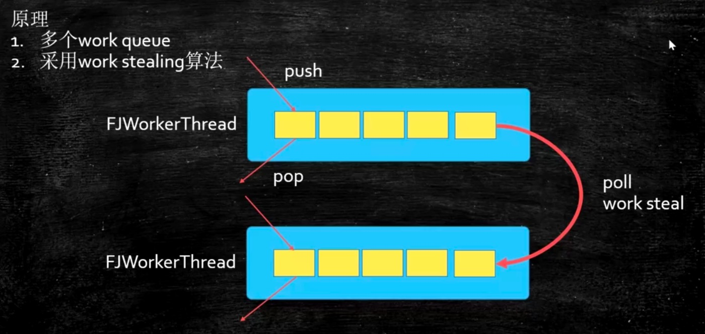

那到底这种这种线程池的方式和我们原来讲的共享同一个任务队列，他们之间有什么好的地方和不好的地方呢？就原来这种方式呢如果有某一个线程被占了好长好长时间，然后这个任务特别重，一个特别大的任务，其他线程只能空着，他没有办法帮到任务特别重的线程。但是这种就更加灵活一些，我要是任务特别重的时候，有另外一个任务要清的，没关系，我可以分一点儿任务给你，所以呢这个就是 WorkStealing这种Pool。

看这个源码，他实际上new了一个ForkJoinPool，所以本质上他是一个ForkJoinPool，所以我们只要说清楚这个ForkJoinPool之后这个WorkStealing就大概知道什么意思了，往下看。

```java
//源码
public static ExecutorService newWorkStealingPool() {
  return new ForkJoinPool
    (Runtime.getRuntime().availableProcessors(),
     ForkJoinPool.defaultForkJoinWorkerThreadFactory,
     null, true);
}

package com.mashibing.juc.c_026_01_ThreadPool;
import java.io.IOException;
import java.util.concurrent.ExecutorService;
import java.util.concurrent.Executors;
import java.util.concurrent.TimeUnit;

public class T11_WorkStealingPool {
   public static void main(String[] args) throws IOException {
      ExecutorService service = Executors.newWorkStealingPool();
      System.out.println(Runtime.getRuntime().availableProcessors());

      service.execute(new R(1000));
      service.execute(new R(2000));
      service.execute(new R(2000));
      service.execute(new R(2000)); //daemon
      service.execute(new R(2000));
      
      //由于产生的是精灵线程（守护线程、后台线程），主线程不阻塞的话，看不到输出
      System.in.read(); 
   }

   static class R implements Runnable {

      int time;

      R(int t) {
         this.time = t;
      }

      @Override
      public void run() {
         
         try {
            TimeUnit.MILLISECONDS.sleep(time);
         } catch (InterruptedException e) {
            e.printStackTrace();
         }
         System.out.println(time  + " " + Thread.currentThread().getName());  
      }
   }
}
```

**ForkJoinPool**

我们来看第二个小程序，ForkJoinPool是这样一种线程池，它适合把大任务切分成一个一个的小任务去运行，小任务还是觉得比较大，再切，不一定是两个，也可以切成三个四个。切完这个任务执行完了要进行一个汇总，如下图所示，当然也有一些打印输出的任务不需要返回值的，只不过我们很多情况是需要进行一个结果的汇总，子任务汇总到父任务，父任务最终汇总到根任务，最后我们就得到了所有的结果，这个过程叫join，因此这个线程池就叫做ForkJoinPool。

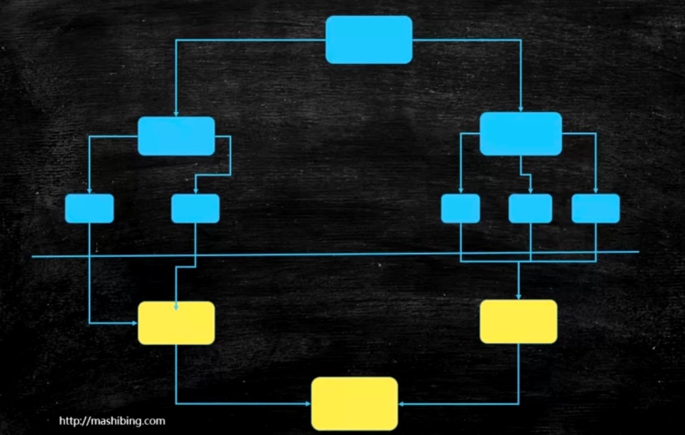

那我们怎么样定义这个任务呢？我们原来定义任务的时候是从Runnable来继承，在这里我们一般实现ForkJoinPool的时候需要定义成为特定的他的类型 ，这个类型呢是必须得能进行分叉的任务，所以他定义成是一种特殊类型的任务，这个叫ForkJoinTask，但是实际当中这个ForkJoinTask比较原始，我们可以用这个RecursiveAction，这里面有两种，第一种叫RecursiveAction递归，为什么叫递归，是因为我们大任务可以切成小任务，小任务还可以切成小任务，一直可以切到满足我的条件为止，这其中隐含了一个递归的过程，因此叫RecursiveAction，是不带返回值的任务。

来看不带返回值的任务这个小程序，我new了一个数组，这个数组长度为100万，这个数组里面装了很多数，这些数都是通过Random来new出来的，下面我要对一堆数进行总和的计算，如果我用单线程来计算可以这样来计算：Arrays.stream(nums).sum() 搞定，这是单线程，这个时间会比较长，我们可以进行多线程的计算，就像之前我们写过的FixedThreadPool，现在我们可以用ForkJoinPool来做计算，在计算的时候我要去最小的任务片这个数是不超过5万个数，你就不用在分了。	RecursiveAction是我们的任务，是用来做总和的，由于这里面是把数组进行了分片，所以定义了一个起始的位置和一个结束的位置，然后来进行compute。如果说我们这个数组里面的分片数量要比那个我们定义最小数量少了就是5万个数少了就直接进行计算就行，否则的话中间在砍掉一半，砍完了之后把当前任务在分成两个子任务，然后在让两个子任务进行分叉进行fork。这些任务有自己的一些特点，就是背后的后台线程 ，所以我需要通过一个阻塞操作让当前的main函数不退出，不然的话他一退出所有线程全退出了，ok，这个是叫做没有返回值的任务。

有返回值的任务你可以从RecursiveTask继承，看下面的AddTaskRet方法。

```java
package com.mashibing.juc.c_026_01_ThreadPool;
import java.io.IOException;
import java.util.Arrays;
import java.util.Random;
import java.util.concurrent.ForkJoinPool;
import java.util.concurrent.RecursiveAction;
import java.util.concurrent.RecursiveTask;

public class T12_ForkJoinPool {
	static int[] nums = new int[1000000];
	static final int MAX_NUM = 50000;
	static Random r = new Random();
	
	static {
		for(int i=0; i<nums.length; i++) {
			nums[i] = r.nextInt(100);
		}
		System.out.println("---" + Arrays.stream(nums).sum()); //stream api
	}
	
	static class AddTask extends RecursiveAction {
		int start, end;
		AddTask(int s, int e) {
			start = s;
			end = e;
		}

		@Override
		protected void compute() {
			if(end-start <= MAX_NUM) {
				long sum = 0L;
				for(int i=start; i<end; i++) sum += nums[i];
				System.out.println("from:" + start + " to:" + end + " = " + sum);
			} else {

				int middle = start + (end-start)/2;

				AddTask subTask1 = new AddTask(start, middle);
				AddTask subTask2 = new AddTask(middle, end);
				subTask1.fork();
				subTask2.fork();
			}
		}
	}

	
	static class AddTaskRet extends RecursiveTask<Long> {
		private static final long serialVersionUID = 1L;
		int start, end;
		
		AddTaskRet(int s, int e) {
			start = s;
			end = e;
		}

		@Override
		protected Long compute() {
			if(end-start <= MAX_NUM) {
				long sum = 0L;
				for(int i=start; i<end; i++) sum += nums[i];
				return sum;
			} 
			
			int middle = start + (end-start)/2;
			
			AddTaskRet subTask1 = new AddTaskRet(start, middle);
			AddTaskRet subTask2 = new AddTaskRet(middle, end);
			subTask1.fork();
			subTask2.fork();
			
			return subTask1.join() + subTask2.join();
		}
	}
	
	public static void main(String[] args) throws IOException {
		/*ForkJoinPool fjp = new ForkJoinPool();
		AddTask task = new AddTask(0, nums.length);
		fjp.execute(task);*/

		T12_ForkJoinPool temp = new T12_ForkJoinPool();

		ForkJoinPool fjp = new ForkJoinPool();
		AddTaskRet task = new AddTaskRet(0, nums.length);
		fjp.execute(task);
		long result = task.join();
		System.out.println(result);
		//System.in.read();
	}
}
```

到现在为止为我们把线程池讲的差不都了，我们稍微来回顾一下，前面几个SingleThreadPool、CachedPool、FixedThreadPool、ScheduledPool用的都是ThreadPoolExecutor，源码我们也读过了。那后面这两个WorkStealingPool、ForkJoinPool，其实WorkStealingPool也是用的ForkJoinPool的一个实现。

来看最后一个小程序，这个小程序的底层也是用的ForkJoinPool实现的，也是ForkJoinPool的算法来实现的，就是流式API，本身不难，就是你把一个集合里的内容想象成一个河流一样，一个一个往外流，流到我们这的时候处理一下。流式处理的方式就是大家调各种的对集合里面迭代的需要处理每个元素的时候，这种时候处理起来更方便一些。

举例，我们new了一个ArrayList往里面装了10000个数，然后我让这个数进行计算，判断他是不是质数nums.forEach这个是lambda表达式同时也是一个流式处理，forEach就是拿出一个来计算看他是不是一个质数，然后计算一个时间，下面我用的是另外一种，上面是forEach在当前线程里面拿出每一个来，下面用的是parallelStream并行流，并行流的意思是它会把里面并行的来进行处理把这个任务切分成一个个子任务，这个时候里面也是用的ForkJoinPool，两个对比就会有时间差的一个差距，所以在互相之间这个线程不需要同步的时候，你可以用这种并行流来进行处理效率会更高一些，他底层的实现也是ForkJoinPool。

```java
package com.mashibing.juc.c_026_01_ThreadPool;

import java.util.ArrayList;
import java.util.List;
import java.util.Random;

public class T13_ParallelStreamAPI {
   public static void main(String[] args) {
      List<Integer> nums = new ArrayList<>();
      Random r = new Random();
      for(int i=0; i<10000; i++) nums.add(1000000 + r.nextInt(1000000));
      
      //System.out.println(nums);
      
      long start = System.currentTimeMillis();
      nums.forEach(v->isPrime(v));
      long end = System.currentTimeMillis();
      System.out.println(end - start);
      
      //使用parallel stream api
      
      start = System.currentTimeMillis();
      nums.parallelStream().forEach(T13_ParallelStreamAPI::isPrime);
      end = System.currentTimeMillis();
      
      System.out.println(end - start);
   }
   
   static boolean isPrime(int num) {
      for(int i=2; i<=num/2; i++) {
         if(num % i == 0) return false;
      }
      return true;
   }
}
```

线程池，我们回顾一下有两种

- ThreadPoolExecutor
- ForkJoinPool

他们两个的区别，前面这个ThreadPoolExecutor多个线程共享同一个任务队列；下面这个ForkJoinPool每个线程有自己的任务队列。

Ok，到现在为止线程池我们讲完了。


# 第九节：JMH与Disruptor


今天我们讲两个内容，第一个是JMH，第二个是Disruptor。这两个内容是给大家做更进一步的这种多线程和高并发的一些专业上的处理。生产环境之中我们很可能不自己定义消息队列，而是使用Disruptor。我们生产环境做测试的时候也不是像我说的那样写一个start写一个end就测试完了。在这里给大家先介绍专业的JMH测试工具，在给大家介绍Disruptor号称最快的消息队列。 

**JMH -java Microbenchmark Harness**

微基准测试，他是测的某一个方法的性能到底是好或者不好，换了方法的实现之后他的性能到底好还是不好。

这个测试的框架是2013年发出来的，由JLT的开发人员开发，后来归到了OpenJDK下面。

**官网**

http://openjdk.java.net/projects/code-tools/jmh/

下面我们来介绍什么是一个JMH，他是用来干什么的，我们来看到底怎么使用，给大家一个简单的介绍肯定是了解不了jmh是个什么东西，已经把这个步骤给大家总结一篇文档，官网在哪里，怎么样去创建一个JMH的测试，创建一共大致有七个步骤，还有他的一些基本概念，什么叫预热，什么叫Mesurement等等的，还有进一步了解的官方地址。

## JMH Java准测试工具套件

## 什么是JMH

### 官网

 http://openjdk.java.net/projects/code-tools/jmh/ 

## 创建JMH测试

1. 创建Maven项目，添加依赖，我们需要添加两个依赖：

   1.1：jmh-core （jmh的核心)

   1.2：jmh-generator-annprocess（注解处理包） 

   ```java
   <?xml version="1.0" encoding="UTF-8"?>
   <project xmlns="http://maven.apache.org/POM/4.0.0"
            xmlns:xsi="http://www.w3.org/2001/XMLSchema-instance"
            xsi:schemaLocation="http://maven.apache.org/POM/4.0.0 http://maven.apache.org/xsd/maven-4.0.0.xsd">
       <modelVersion>4.0.0</modelVersion>
   
       <properties>
           <project.build.sourceEncoding>UTF-8</project.build.sourceEncoding>
           <encoding>UTF-8</encoding>
           <java.version>1.8</java.version>
           <maven.compiler.source>1.8</maven.compiler.source>
           <maven.compiler.target>1.8</maven.compiler.target>
       </properties>
   
       <groupId>mashibing.com</groupId>
       <artifactId>HelloJMH2</artifactId>
       <version>1.0-SNAPSHOT</version>
   
   
       <dependencies>
           <!-- https://mvnrepository.com/artifact/org.openjdk.jmh/jmh-core -->
           <dependency>
               <groupId>org.openjdk.jmh</groupId>
               <artifactId>jmh-core</artifactId>
               <version>1.21</version>
           </dependency>
   
           <!-- https://mvnrepository.com/artifact/org.openjdk.jmh/jmh-generator-annprocess -->
           <dependency>
               <groupId>org.openjdk.jmh</groupId>
               <artifactId>jmh-generator-annprocess</artifactId>
               <version>1.21</version>
               <scope>test</scope>
           </dependency>
       </dependencies>
   
   
   </project>
   ```

2. idea安装JMH插件 JMH plugin v1.0.3

   JMH这个东西你要想真正的安安静静的去运行，就不会去影响我们正常程序的执行，最好的方式就是按照官网的说法是命令行的方式，比方说你要测试某一个包里面的类的话你应该把这个类和其他的依赖类打成一个jar包，然后单独的把这个jar包放到某一个机器上，在这个机器上对这个jar包进行微基准的测试，如果对他进行测试的比较好，那说明最后的结果还可以，如果说边开发边进行这种微基准的测试实际上他非常的不准，因为你的开发环境会对结果产生影响。只不过我们自己开发人员来说平时你要想进行一些微基准的测试的话，你要是每次打个包来进行正规一个从头到尾的测试 ，完了之后发现问题不对再去重新改，效率太低了。所以在这里教大家的是怎么样在IDE里面来进行微基准的测试。idea安装JMH插件：file->Settings->Plugins->JMH-plugin。它运行的时候需要这个plugin的支持，如果你用命令行是不需要这些东西的。

3. 由于用到了注解，打开运行程序注解配置

   因为JMH在运行的时候他用到了注解，注解这个东西你自己得写一个程序得解释他，所以你要把这个给设置上允许JMH能够对注解进行处理：

   > compiler -> Annotation Processors -> Enable Annotation Processing

4. 定义需要测试类PS (ParallelStream)

   看这里，写了一个类，并行处理流的一个程序，定义了一个list集合，然后往这个集合里扔了1000个数。写了一个方法来判断这个数到底是不是一个质数。写了两个方法，第一个是用forEach来判断我们这1000个数里到底有谁是质数；第二个是使用了并行处理流，这个forEach的方法就只有单线程里面执行，挨着牌从头拿到尾，从0拿到1000，但是并行处理的时候会有多个线程采用ForkJoin的方式来把里面的数分成好几份并行的尽兴处理。一种是串行处理，一种是并行处理，都可以对他们进行测试，但需要注意这个基准测试并不是对比测试的，你只是侧试一下你这方法写出这样的情况下他的吞吐量到底是多少，这是一个非常专业的测试的工具。严格的来讲这部分是测试开发专业的。

   ```java
   package com.mashibing.jmh;
   import java.util.ArrayList;
   import java.util.List;
   import java.util.Random;
   
   public class PS {
   
   	static List<Integer> nums = new ArrayList<>();
   	static {
   		Random r = new Random();
   		for (int i = 0; i < 10000; i++) nums.add(1000000 + r.nextInt(1000000));
   	}
   
   	static void foreach() {
   		nums.forEach(v->isPrime(v));
   	}
   
   	static void parallel() {
   		nums.parallelStream().forEach(PS::isPrime);
   	}
   	
   	static boolean isPrime(int num) {
   		for(int i=2; i<=num/2; i++) {
   			if(num % i == 0) return false;
   		}
   		return true;
   	}
   }
   ```

5. 写单元测试

   > 这个测试类一定要在test package下面
   >
   > 我对这个方法进行测试testForEach，很简单我就调用PS这个类的foreach就行了，对它测试最关键的是我加了这个注解@Benchmark，这个是JMH的注解，是要被JMH来解析处理的，这也是我们为么要把那个Annotation Processing给设置上的原因，非常简单，你只要加上注解就可以对这个方法进行微基准测试了，点击右键直接run。
   >
   > ```java
   > package com.mashibing.jmh;
   > 
   > import org.openjdk.jmh.annotations.Benchmark;
   > 
   > import static org.junit.jupiter.api.Assertions.*;
   > 
   > public class PSTest {
   > @Benchmark
   > @Warmup（iteration=1, time=3）//在专业测试里面首先要进行预热，预热多少次，预热多少时间
   > @Fork(5)//意思是用多少个线程去执行我们的程序
   > @BenchmarkMode(Mode.Throughput)//是对基准测试的一个模式，这个模式用的最多的是Throughput吞吐量
   > @Measurement(iteration=1, time=3)//是整个测试要测试多少遍，调用这个方法要调用多少次 
   > public void testForEach() {
   >   PS.foreach();
   > }
   > }
   > ```

6. 运行测试类，如果遇到下面的错误：

   ```java
   ERROR: org.openjdk.jmh.runner.RunnerException: ERROR: Exception while trying to acquire the JMH lock (C:\WINDOWS\/jmh.lock): C:\WINDOWS\jmh.lock (拒绝访问。), exiting. Use -Djmh.ignoreLock=true to forcefully continue.
   	at org.openjdk.jmh.runner.Runner.run(Runner.java:216)
   	at org.openjdk.jmh.Main.main(Main.java:71)
   ```

   这个错误是因为JMH运行需要访问系统的TMP目录，解决办法是：

   打开RunConfiguration -> Environment Variables -> include system environment viables

7. 阅读测试报告

**JMH中的基本概念**

1. Warmup
   预热，由于JVM中对于特定代码会存在优化（本地化），预热对于测试结果很重要
2. Mesurement
   总共执行多少次测试
3. Timeout

4. Threads
   线程数，由fork指定
5. Benchmark mode
   基准测试的模式
6. Benchmark
   测试哪一段代码

**next**

做个是JMH的一个入门，严格来讲这个和我们的关系其实并不大，这个是测试部门干的事儿，但是你了解一下没有特别多的坏处，你也知道你的方法最后效率高或者底，可以通过一个简单的JMH插件来帮你完成，你不要在手动的去写这件事儿了。

如果说大家对JMH有兴趣，你们在工作中可能会有用的上大家去读一下官方的例子，官方大概有好几十个例子程序，你可以自己一个一个的去研究。

官方样例：
http://hg.openjdk.java.net/code-tools/jmh/file/tip/jmh-samples/src/main/java/org/openjdk/jmh/samples/


**Disruptor**

按照英文翻译的话，Disruptor应该是分裂、瓦解。这个Disruptor是一个做金融的、做股票的这样一个公司交易所来开发的，为自己来开发的这么一个底层的框架，开发出来之后受到了很多的认可，开源之后，2011年获得Duke将。如果你想把它用作MQ的话，单机最快的MQ。性能非常的高，主要是它里面用的全都是cas，另外把各种各样的性能开发到了极致，所以他单机支持很高的一个并发。

Disruptor不是平时我们学的这个redis、不是平时我们所学的kafka，他可以跟他们一样有类似的用途，但他是单机，redis、kafka也可以用于集群。redis他有这种序列化的机制，就是你可以把它存储到硬盘上或数据库当中是可以的，kafka当然也有，Disruptor没有，Disruptor就是在内存里，Disruptor简单理解就是内存里用于存放元素的一个高效率的队列。


**介绍**

关于Disruptor的一些资料，给大家列在这里。

主页：http://imax-exchange.github.io/disruptor/

源码：https://github.com/LMAX-Exchange/disruptor

GettingStarted:https://github.com/LMAX-Exchange/disruptor/wiki/Getting-Started

api:http://imax-exchange.github.io/disruptor/docs/index.html

maven:https://mvnrepository.com/artifact/com.imax/disruptor


Disruptor叫无锁、高并发、环形Buffer，直接覆盖（不用清除）旧的数据，降低GC频率，用于生产者消费者模式（如果说按照设计者角度来讲他就是观察者模式）。什么叫观察者模式，想象一下，我们在前面学各种各样的队列的时候，队列就是个容器，好多生产者往里头扔东西，好多消费者从里头往外拿东西。所谓的生产者消费者就是这个意思，为什么我们可以叫他观察者呢，因为这些消费者正在观察着里面有没有新东西，如果有的话我马上拿过来消费，所以他也是一种观察者模式。Disruptor实现的就是这个容器

**Disruptor核心与特点**

Disruptor也是一个队列，和其他队列不一样的是他是一个环形队列，环形的Buffer。一般情况下我们的容器是一个队列，不管你是用链表实现还是用数组实现的，它会是一个队列，那么这个队列生产者这边使劲往里塞，消费者这边使劲往外拿，但Disruptor的核心是一个环形的buffer。


- 对比ConcurrentLinkedQueue：链表实现

  这种环形的buffer速度就是更快，同学们可以去查一下JDK自带的容器，你会发现效率比较高的有各种各样的队列，如果不想阻塞就可以用Concurrent相关的，ConcurrentLinkedQueue是并发的用链表实现的队列，它里面大量的使用了cas，因此它的效率相对比较高，可是对于遍历来讲链表的效率一定会比数组低。

- JDK中没有ConcurrentArrayQueue

  因为数组的大小的固定的，如果想扩展的话就要把原来的数组拷贝到新数组里，每次加都要拷贝这个效率相当底，所以他并没有给大家加这个叫ConcurrentArrayQueue，但是Disruptor就非常牛X，想到了这样一个办法，就是把数组的头尾相连。

- Disruptor是用数组实现的

  这样的一个队列，你可以认为Disruptor就是用数组实现的ConcurrentArrayQueue，另外这个Queue是首尾相连的

那Disruptor用数组实现的环形的就比上面两个都牛吗，牛在哪？为啥呢？如果我们用ConcurrentLinkedQueue这里面就是一个一个链表，这个链表遍历起来肯定没有数组快，这个是一点。还有第二点就是这个链表要维护一个头指针和一个尾指针，我往头部加的时候要加锁，往尾部拿的时候也要加锁。另外链表本身效率就偏低，还要维护两个指针。关于环形的呢，环形本身就维护一个位置，这个位置称之为sequence序列，这个序列代表的是我下一个有效的元素指在什么位置上，就相当于他只有一个指针来回转。加在某个位置上怎么计算：直接用那个数除以我们整个的容量求余就可以了。

- RingBuffer是一个环形队列

- RingBuffer的序号，指向下一个可用的元素

- 采用数组实现，没有首尾指针

- 对比ConcurrentLinkedQueue，用数组实现的速度更快

  假如长度为8，当添加到第12个元素的时候在哪个序号上呢？用12%8决定

  当Buffer被填满的时候到底是覆盖还是等待，由Produce决定

  长度设为2的n次幂，利于二进制计算，例如：12%8=12&（8-1）

如果大家对于位运算有疑问的，在咱们网站上有一个菜鸟预习，里面有一部分是二进制，大家去翻看一下。

由于它会采用覆盖的方式，所以他没有必要记头指针，没有必要记尾指针。我只要记一个指针放在这就可以了。在这点上依然要比ConcurrentLinkedQueue要快。

那我生产者线程生产的特别多，消费者没来得及消费那我在往后覆盖的话怎么办？不会那么轻易的让你覆盖的，我们是有策略的，我生产者生产满了，要在生产一个的话就马上覆盖这个位置上的数了。这时候是不能覆盖的，指定了一个策略叫等待策略，这里面有8中等待策略，分情况自己去用。最常见的是BlockingWait，满了我就在这等着，什么时候你空了消费者来唤醒一下就继续。


### Disruptor开发步骤

开发步骤是比较固定的一个开发步骤。

1：定义Event-队列中需要处理的元素。

​	在Disruptor他是每一个消息都认为是一个事件，在他这个概念里就是一个事件，所以在这个环形队列里面存的是一个一个的Event。

2：定义Event工厂，用于填充队列

​	那这个Event怎么产生，就需要指定Event的工厂。

3：定义EventHandler(消费者)，处理容器中的元素

​	那这个Event怎么消费呢，就需要指定Event的消费者EventHandler。

下面我们直接看程序，先看来自官网的几个辅助程序：LongEvent这个事件里面或者说消息里面装的什么值，我只装了一个long值，但这里面可以装任何值，任何类型的都可以往里装，这个long类型的值我们可以指定他set，官网上没有toString方法，我给大家加了一段主要是为了打印消息让大家看的更清楚。

```java
package com.mashibing.disruptor;
public class LongEvent
{
  	private long value;
  
  	public void set(long value)
    {
      	this.value = value;
    }
  
  	@Override
  	public String toString(){
      	return "LongEvent{" +
          			"value=" + value +
          			"}";
    }
}
```

然后呢，我需要一个EventFactory就是怎么产生这些个事件，这个Factory非常简单，LongEventFactory去实现EventFactiry的接口，去重写它的newInstance方法直接new  LongEvent。构建这个环的时候为什么要指定一个产生事件的工厂，我直接new这个事件不可以吗？但是有的事件里面的构造方法不让你new呢，产生事件工厂的话你可以灵活的指定一些 ，这里面也是牵扯到效率的。底层比较深，我给大家解释一下：

这里牵扯效率问题，因为Disruptor初始化的时候会调用Event工厂，对ringBuffer进行内存的提前分配，GC频率会降低。

```java
package com.mashibing.disruptor;

import com.lmax.disruptor.EventFactory;
public class LongEventFactory implements EventFactiry<LongEvent>{
  	
  	@Override
  	public LongEvent newInstance(){
      	return new LongEvent();
    }
}
```

在看第三个叫LongEventHandler，Handler就是我拿到这个事件之后该怎么样进行处理，所以这里是消息的消费者，怎么处理呢，很简单，我处理完这个消息之后呢就记一个数，总共记下来我一共处理了多少消息了，处理消息的时候默认调用的是onEvent方法，这个方法里面有三个参数，第一个是你要处理的那个消息，第二个是你处理的是哪个位置上的消息，第三个是整体的消息结束没结束，是不是处理完了。你可以判断他如果是true的话消费者就可以退出了，如果是false的话说明后面还有继续消费。

```java
package com.mashibing.disruptor;

import com.lmax.disruptor.EventHandler;

public class LongEventHandler implements EventHandler<LongEvent>{
  	/**
  	*
  	*@param event
  	*@param sequence RingBuffer的序号
  	*@param endOfBatch 是否为最后一个元素
  	*@throws Exception
  	**/
  	
  	public static long count = 0;
  	
  	@Override
  	public void onEvent(LongEvent event,long sequence,boolean endOfBatch) throws Exception{
	      count++;	
      	System.out.println("["+Thread.currentThread().getName()+"]"+event+"序号："+sequence);
    }
}

```

所以我们定义了这三个类，关于这三个类在给大家解释一下，我们现在有一个环，然后这个环上每一个位置装LongEvent，怎么产生这个LongEvent通过这个LongEventFactory的newInstance方法来产生，当我拿到这个Event之后通过LongEventHandler进行处理。

到现在我们把这三个辅助类都已经定义好了，定义好的情况下我们怎么才能比较有机的结合在一起，让他在Disruptor进行处理呢，看第一个小例子程序，首先把EvenFactory给他初始化了new LongEventFactory，我们这个环应该是2的N次方1024，然后new一个Disruptor出来，需要指定这么几个参数：factory产生消息的工厂；bufferSize是指定这个环大小到底是多少；defaultThreadFactory线程工厂，指的是当他要产生消费者的时候，当要调用这个消费者的时候他是在一个特定的线程里执行的，这个线程就是通过defaultThreadFactory来产生；

继续往下看，当我们拿到这个消息之后怎么进行处理啊，我们就用这个LongEventHandler来处理。然后start，当start之后一个环起来了，每个环上指向的这个LongEvent也得初始化好，内存分配好了，整个就安安静静的等待着生产者的到来。

看生产者的代码，long sequence = ringBuffer.next()，通过next找到下一个可用的位置，最开始这个环是空的，下一个可用的位置是0这个位置，拿到这个位置之后直接去ringBuffer里面get(0)这个位置上的event。如果说你要是追求效率的极致，你应该是一次性全部初始化好，你get的时候就不用再去判断，如果你想做一个延迟，很不幸的是你每次都要做判断是不是初始化了。get的时候就是拿到一个event，这个是我们new出来的默认的，但是我们可以改里面的event.set( 值...)，填好数据之后ringBuffer.publish发布生产。

```java
package com.mashibing.disruptor;

import java.util.concurrent.Executor;
import java.util.concurrent.Executors;

import com.lmax.disruptor.dsl.Disruptor;
import com.lmax.disruptor.RingBuffer;
import com.lmax.disruptor.util.DaemonThreadFactory;
import java.nio.ByteBuffer;

public class Main01
{
  	public static void main(String[] args) thrwos Exception
    {
      	//the factory for the event
      	LongEvenFactory factory = new LongEventFactory();
      	
      	//Specify the of the ring buffer,must be power of 2.
      	int bufferSize = 1024;
      
      	//Construct the Disruptor
      	Disruptor<LongEvent> disruptor = new Disruptor<>(factory,bufferSize, Executors.defaultThreadFactory());
      
      	//Connect the handler
      	disruptor.handleEventsWith(new LongEventHandler());
      
      	//Start the Disruptor,start all threads running
      	disruptor.start();
      
      	//Get the ring buffer form the Disruptor to be used for publishing.
      	RingBuffer<LongEvent> ringBuffer = disruptor.getRingBuffer();
      
      	//官方例程
      	long sequence = ringBuffer.next();//Grab the next sequence
      	try
        {
          	LongEvent event=ringBuffer.get(sequence);//Get the entry in the Disruptor
          	//for the sequence
          	event.set(8888L);//Fill with data
        }
      	finally
        {
          	ringBuffer.publish(sequence);
        }
    }
}

```

disruptor在后面提供了一些Lambda表达式的写法，为了支持这种写法对整个消息的构建过程做了改进，读下面02小程序使用translator，就是怎么样构建这个消息，原来我们都是用消息的factory，但是下面这次我们用translator对他进行构建，就是把某一些数据翻译成消息。前面产生event工厂还是一样，然后bufferSize，后面再扔的是DaemonThreadFactory就是后台线程了，new LongEventHandler然后start拿到他的ringBuffer，前面都一样。只有一个地方叫EventTranslator不一样，我们在main01里面的代码是要写try  catch然后把里面的值给设好，相当于把这个值转换成event对象。相对简单的写法，它会把某些值转成一个LongEvent，通过EventTranslator。new出来后实现了translateTo方法，EventTranslator他本身是一个接口，所以你要new的时候你又要实现它里面没有实现的方法，translateTo的意思是你给我一个Event，我会把这个Event给你填好。ringBuffer.publishEvent(translator1) 你只要把translator1交个ringBuffer就可以了。这个translator就是为了迎合Lambda表达式的写法（为java8的写法做准备）

另外translator有很多种用法：

EventTranslatorOneArg只有带一个参数的EventTranslator。我带有一个参数，这个参数会通过我的translateTo方法转换成一个LongEvent；

既然有EventTranslatorOneArg就有EventTranslatorTwoArg、EventTranslatorThreeArg，还有EventTranslatorVararg多了去了Vararg就是有好多个值，我把里面的值全都给你加起来最后把结果set到event里面。

```java
package com.mashibing.disruptor;

import java.util.concurrent.Executor;
import java.util.concurrent.Executors;

import com.lmax.disruptor.dsl.Disruptor;
import com.lmax.disruptor.RingBuffer;
import com.lmax.disruptor.util.DaemonThreadFactory;
import java.nio.ByteBuffer;

public class Main02
{
  	public static void main(String[] args) thrwos Exception
    {
      	//the factory for the event
      	LongEvenFactory factory = new LongEventFactory();
      	
      	//Specify the of the ring buffer,must be power of 2.
      	int bufferSize = 1024;
      
      	//Construct the Disruptor
      	Disruptor<LongEvent> disruptor = new Disruptor<>(factory,bufferSize, DaemonThreadFactory.INSTANCE);
      
      	//Connect the handler
      	disruptor.handleEventsWith(new LongEventHandler());
      
      	//Start the Disruptor,start all threads running
      	disruptor.start();
      
      	//Get the ring buffer form the Disruptor to be used for publishing.
      	RingBuffer<LongEvent> ringBuffer = disruptor.getRingBuffer();
      
      	//========================================================================
      	EventTranslator<LongEvent> translator1 = new EventTranslator<LongEvent>(){
          	@Override
          	public void translateTo(LongEvent event,long sequence){ event.set(8888L); }
        };
      	ringBuffer.publishEvent(translator1);
	      //========================================================================
      	EventTranslatorOneArg<LongEvent,Long> translator2 = new EventTranslatorOneArg<LongEvent,Long>(){
          @Override
          public void translateTo(LongEvent event,long sequence,Long l){ event.set(l); }
        };
      	ringBuffer.publishEvent(translator2,7777L);
      //========================================================================
      	EventTranslatorTwoArg<LongEvent,Long,Long> translator3 = new EventTranslatorTwoArg<LongEvent,Long,Long>(){
          @Override
          public void translateTo(LongEvent event,long sequence,Long l1,Long l2){ event.set(l); }
        };
      	ringBuffer.publishEvent(translator3,10000L,10000L);
       //========================================================================
      	EventTranslatorThreeArg<LongEvent,Long,Long,Long> translator4 = new EventTranslatorThreeArg<LongEvent,Long,Long,Long>(){
          @Override
          public void translateTo(LongEvent event,long sequence,Long l1,Long l2,Long l3){ event.set(l1+ l2+ l3); }
        };
      	ringBuffer.publishEvent(translator4,10000L,10000L,10000L);
      //========================================================================
      	EventTranslatorVararg<LongEvent> translator5 = new EventTranslatorThreeArg<LongEvent>(){
          @Override
          public void translateTo(LongEvent event,long sequence,Object... objects){
          		long result = 0;
            	for(Object o : objects){
                	long l =(Long)o;
                	result +=l;
              }
          }
        };
      	ringBuffer.publishEvent(translator5,10000L,10000L,10000L,10000L);
    }
}
```

有了上面Translator之后呢，下面看Lambda表达式怎么写，这个是比较简洁的写法，连factory都省了，直接指定一个Lambda表达式LongEvent::new。继续handleEventsWith把三个参数传进来后面写好Lambda表达式直接打印，然后start， 接着RingBuffer，publishEvent原来我们还有写try...catch，现在简单了直接ringBuffer.publishEvent（第一个是lambda表达式，表达式后是你指定的几个参数），所以现在的这种写法就不定义各种各样的EventTranslator了。

```java
package com.mashibing.disruptor;

import java.util.concurrent.Executor;
import java.util.concurrent.Executors;

import com.lmax.disruptor.dsl.Disruptor;
import com.lmax.disruptor.RingBuffer;
import com.lmax.disruptor.util.DaemonThreadFactory;
import java.nio.ByteBuffer;

public class Main03
{
  	public static void main(String[] args) thrwos Exception
    {
      	//the factory for the event
      	LongEvenFactory factory = new LongEventFactory();
      	
      	//Specify the of the ring buffer,must be power of 2.
      	int bufferSize = 1024;
      
      	//Construct the Disruptor
      	Disruptor<LongEvent> disruptor = new Disruptor<>(LongEvent::new, bufferSize,DaemonThreadFactory.INSTANCE);
      
      	//Connect the handler
      	disruptor.handleEventsWith((event,sequence,endOfBatch)->System.out.println("Event:"+event));
      
      	//Start the Disruptor,start all threads running
      	disruptor.start();
      
      	//Get the ring buffer form the Disruptor to be used for publishing.
      	RingBuffer<LongEvent> ringBuffer = disruptor.getRingBuffer();
      
      
      	ringBuffer.publishEvent((event, sequence)-> event.set(10000L)); 
			
      	System.in.read();

    }
}
```

下面我们叫一些细节，这些个细节也不难，讲给大家。第一个细节是我们生产者的时候默认会有好多种生产方式，默认的是多线程生产者，但是假如你确定你整个程序里头只有一个生产者的话那你还能提高效率，就是在你指定Disruptor生产者的线程的方式是SINGLE，生产者的类型ProducerType。

**ProducerType生产者线程模式**

- ProducerType有两种模式ProducerMULTI和Producer.SINGLE
- 默认是MULTI，表示在多线程模式下产生sequence
- 如果确认是单线程生产者，那么可以指定SINGLE，效率会提升
- 如果是多个生产者（多线程），但模式指定为SINGLE，会出什么问题？

假如你的程序里头只有一个生产者还用ProducerMULTI的话，我们对序列来进行多线程访问的时候肯定是要加锁的，所以MULTI里面默认是有锁定处理的，但是假如你只有一个线程这个时候应该吧生产者指定为SINGLE，他的效率更高，因为它里面不加锁。

下面这个小程序，我这里指定的是Producer.SINGLE，但是我生产的时候用的是一堆线程，当我制定了Producer.SINGLE之后相当于内部对于序列的访问就没有锁了，它会把性能发挥到极致，它不会报错，它会把你的消息静悄悄的覆盖了，因此你要小心一点。我这里这个写法是我有50 个线程然后每个线程生产100个数，最后结果正常的话应该是有5000个消费产生。

```java
package com.mashibing.disruptor;

import java.util.concurrent.Executor;
import java.util.concurrent.Executors;

import com.lmax.disruptor.dsl.Disruptor;
import com.lmax.disruptor.RingBuffer;
import com.lmax.disruptor.util.DaemonThreadFactory;
import java.nio.ByteBuffer;

public class Main04_ProducerType{
  	public static void main(String[] args) thrwos Exception{
      //the factory for the event
      	LongEvenFactory factory = new LongEventFactory();
      	
      	//Specify the of the ring buffer,must be power of 2.
      	int bufferSize = 1024;
      
      	//Construct the Disruptor
      	//Disruptor<LongEvent> disruptor = new Disruptor<>(factory,bufferSize, Executors.defaultThreadFactory());
      	
  			Disruptor<LongEvent> disruptor = new Disruptor<>(factory,bufferSize, Executors.defaultThreadFactory(),ProducerType.SINGLE,new BlockingWaitStrategy());
      
      	//Connect the handler
      	disruptor.handleEventsWith(new LongEventHandler());
      
      	//Start the Disruptor,start all threads running
      	disruptor.start();
      
      	//Get the ring buffer form the Disruptor to be used for publishing.
      	RingBuffer<LongEvent> ringBuffer = disruptor.getRingBuffer();
  			
  			//========================================================================
  			final int threadCount = 50;
  			CycliBarrier barrier=new CycliBarrier(threadCount);
  			ExecutorService service = Executors.newCachedThreadPool();
  			for(long i=0; i<threadCount; i++){
          	final long threadNum = i; 
          	service.submit(()->{
              	System.out.printf("Thread %s ready to start!\n",threadNum);
              	try{
                   barrier.await();
                }catch(InterruptedException e){
                   e.printStackTrace();
                }catch(BrokenBarrierException e){
                   e.printStackTrace();
                }
              
              	for(int j=0; j<100;j++){
                  	ringBuffer.publishEvent((event,sequence)->{
                      	event.set(threadNum);
                      	System.out.println("生产了"+threadNum);
                    });
                }
            });
        }
  			
  			service.shutdown();
  			//disruptor.shutdown();
  			TimeUnit.SECONDS.sleep(3);
  			System.out.println(LongEventHandler.count);
    }
}
```


我们再来聊一下等待策略WaitStrategy，有好多种方法，看下面

**等待策略**

- （常用）BlockingWaitStrategy:通过线程堵塞的方式，等待生产者唤醒，被唤醒后，再循环检查依赖的sequence是否已经消费。
- BusySpinWaitStrategy：线程一直自旋等待，可能比较耗cpu
- LiteBlockingWaitStrategy：线程阻塞等待生产者唤醒，与BlockingWaitStrategy相比，区别在signalNeeded.getAndSet，如果两个线程同时访问一个访问waitfor，一个访问signalAll时，可以减少lock加锁次数
- LiteTimeoutBlockingWaitStrategy：与LiteBlockingWaitStrategy相比，设置了阻塞时间，超过时间后抛出异常
- PhasedBackoffWaitStrategy：根据时间参数和传入的等待策略来决定使用那种等待策略
- TimeoutBlockingWaitStrategy：相对于BlockingWaitStrategy来说，设置了等待时间，超过后抛出异常
- （常用）YieldingWaitStrategy：尝试100次，然后Thread.yield()让出cpu
- （常用）SleepingWaitStrategy：sleep

我们常用的BlockingWaitStrategy满了就等着；SleepingWaitStrategy满了就睡一觉，睡醒了看看能不能继续执行了；YieldingWaitStrategy让出cpu，让你消费者赶紧消费，消费完了之后我又回来看看我是不是又能生产了；一般YieldingWaitStrategy效率是最高的，但也要看实际情况适用不适用。

```java
package com.mashibing.disruptor;

import java.util.concurrent.Executor;
import java.util.concurrent.Executors;

import com.lmax.disruptor.dsl.Disruptor;
import com.lmax.disruptor.RingBuffer;
import com.lmax.disruptor.util.DaemonThreadFactory;
import java.nio.ByteBuffer;

public class Main05_WaitStrategy{
    	public static void main(String[] args) thrwos Exception{
					
          //the factory for the event
          LongEvenFactory factory = new LongEventFactory();

          //Specify the of the ring buffer,must be power of 2.
          int bufferSize = 1024;

          //Construct the Disruptor
          Disruptor<LongEvent> disruptor = new Disruptor<>(factory,bufferSize, Executors.defaultThreadFactory(),ProducerType.MULTI,new SleepingWaitStrategy());

          //Connect the handler
          disruptor.handleEventsWith(new LongEventHandler());

          //Start the Disruptor,start all threads running
          disruptor.start();

          //Get the ring buffer form the Disruptor to be used for publishing.
          RingBuffer<LongEvent> ringBuffer = disruptor.getRingBuffer();

          //========================================================================
          final int threadCount = 50;
          CycliBarrier barrier=new CycliBarrier(threadCount);
          ExecutorService service = Executors.newCachedThreadPool();
          for(long i=0; i<threadCount; i++){
              final long threadNum = i; 
              service.submit(()->{
                  System.out.printf("Thread %s ready to start!\n",threadNum);
                  try{
                     barrier.await();
                  }catch(InterruptedException e){
                     e.printStackTrace();
                  }catch(BrokenBarrierException e){
                     e.printStackTrace();
                  }

                  for(int j=0; j<100;j++){
                      ringBuffer.publishEvent((event,sequence)->{
                          event.set(threadNum);
                          System.out.println("生产了"+threadNum);
                      });
                  }
              });
          }

          service.shutdown();
          //disruptor.shutdown();
          TimeUnit.SECONDS.sleep(3);
          System.out.println(LongEventHandler.count);
      }
}
```

我们来看多个消费者怎么指定，默认的情况下只有一个消费者，你想要有多个消费者的时候也非常简单，看下面代码我定义了两个消费者h1、h2，disruptor.handleEventsWith(h1,h2)这里面是一个可变参数，所以你要想有多个消费者的时候就往里装，多个消费者是位于多个线程里面的。

```Java
package com.mashibing.disruptor;

import java.util.concurrent.Executor;
import java.util.concurrent.Executors;

import com.lmax.disruptor.dsl.Disruptor;
import com.lmax.disruptor.RingBuffer;
import com.lmax.disruptor.util.DaemonThreadFactory;
import java.nio.ByteBuffer;

public class Main06_MultiConsumer{
    	public static void main(String[] args) thrwos Exception{
					
          //the factory for the event
          LongEvenFactory factory = new LongEventFactory();

          //Specify the of the ring buffer,must be power of 2.
          int bufferSize = 1024;

          //Construct the Disruptor
          Disruptor<LongEvent> disruptor = new Disruptor<>(factory,bufferSize, Executors.defaultThreadFactory(),ProducerType.MULTI,new SleepingWaitStrategy());

          //Connect the handlers
          LongEventHandler h1 = new LongEventHandler();
          LongEventHandler h2 = new LongEventHandler();
					 disruptor.handleEventsWith(h1,h2);
        
          //Start the Disruptor,start all threads running
          disruptor.start();

          //Get the ring buffer form the Disruptor to be used for publishing.
          RingBuffer<LongEvent> ringBuffer = disruptor.getRingBuffer();

          //========================================================================
          final int threadCount = 10;
          CycliBarrier barrier=new CycliBarrier(threadCount);
          ExecutorService service = Executors.newCachedThreadPool();
          for(long i=0; i<threadCount; i++){
              final long threadNum = i; 
              service.submit(()->{
                  System.out.printf("Thread %s ready to start!\n",threadNum);
                  try{
                     barrier.await();
                  }catch(InterruptedException e){
                     e.printStackTrace();
                  }catch(BrokenBarrierException e){
                     e.printStackTrace();
                  }

                  for(int j=0; j<10;j++){
                      ringBuffer.publishEvent((event,sequence)->{
                          event.set(threadNum);
                          System.out.println("生产了"+threadNum);
                      });
                  }
              });
          }

          service.shutdown();
          //disruptor.shutdown();
          TimeUnit.SECONDS.sleep(3);
          System.out.println(LongEventHandler.count);
      }
}
```


还有disruptor最后一个问题，出了异常怎么处理

**消费者异常处理**

默认：disruptor.setDefaultExceptionHandler()

覆盖：disruptor.handleExceptionFor().with()

看下面代码，这这里方法里写了一个EventHandler是我们的消费者，在消费者里打印了event之后马上抛出了异常，当我们消费者出现异常之后你不能让整个线程停下来，有一个消费者出了异常那其他的消费者就不干活了，肯定不行。handleExceptionsFor为消费者指定Exception处理器 (h1).with后面是我们的ExceptionHandler出了异常之后该怎么办进行处理，重写三个方法，第一个是当产生异常的时候在这很简单直接打印出来了；第二个是handleOnStart如果启动的时候出异常；第三个handleOnShutdown你该怎么处理。

```java
package com.mashibing.disruptor;

import java.util.concurrent.Executor;
import java.util.concurrent.Executors;

import com.lmax.disruptor.dsl.Disruptor;
import com.lmax.disruptor.RingBuffer;
import com.lmax.disruptor.util.DaemonThreadFactory;
import java.nio.ByteBuffer;

public class Main07_ExceptionHandler{
    	public static void main(String[] args) thrwos Exception{
					
          //the factory for the event
          LongEvenFactory factory = new LongEventFactory();

          //Specify the of the ring buffer,must be power of 2.
          int bufferSize = 1024;

          //Construct the Disruptor
          Disruptor<LongEvent> disruptor = new Disruptor<>(factory,bufferSize, Executors.defaultThreadFactory(),ProducerType.MULTI,new SleepingWaitStrategy());

          //Connect the handlers
          EventHandler h1 = (event,sequence,end)->{
            	System.out.println("消费者出异常")；
          };
					 disruptor.handleEventsWith(h1);
        	
        	disruptor.handleExceptionsFor(h1).with(new ExceptionHandler<LongEvent>(){
            	@Override
            	public void handleEventException(Throwable throwable,long l,LongEvent longEvent){
                	throwable.printStackTrace();
              }
            
            	@Override
            	public void handleOnStartException(Throwable throwable){
                	System.out.println("Exception Start to Handle!");
              }
            
            	@Override
            	public void handleOnShutdownException(Throwable throwable){
                	System.out.println("Exception End to Handle!");
              }
          });
          
          //Start the Disruptor,start all threads running
          disruptor.start();

          //Get the ring buffer form the Disruptor to be used for publishing.
          RingBuffer<LongEvent> ringBuffer = disruptor.getRingBuffer();

          //========================================================================
          final int threadCount = 1;
          CycliBarrier barrier=new CycliBarrier(threadCount);
          ExecutorService service = Executors.newCachedThreadPool();
          for(long i=0; i<threadCount; i++){
              final long threadNum = i; 
              service.submit(()->{
                  System.out.printf("Thread %s ready to start!\n",threadNum);
                  try{
                     barrier.await();
                  }catch(InterruptedException e){
                     e.printStackTrace();
                  }catch(BrokenBarrierException e){
                     e.printStackTrace();
                  }

                  for(int j=0; j<10;j++){
                      ringBuffer.publishEvent((event,sequence)->{
                          event.set(threadNum);
                          System.out.println("生产了"+threadNum);
                      });
                  }
              });
          }

          service.shutdown();
          //disruptor.shutdown();
          TimeUnit.SECONDS.sleep(3);
          System.out.println(LongEventHandler.count);
      }
}
```

disruptor是一个环，然后这个环有多个生产者可以往里头生产，由于它是环形的设计效率会非常的高，我们写程序的时候是这样写的，首先你自己定义好Event消息的格式，然后定义消息工厂，消息工厂是用来初始化整个环的时候相应的一些位置上各种各样不同的消息先把它new出来，new出来之后先占好空间，我们在生产的时候只需要把这个位置上这个默认的这块空间拿出来往里头填值，填好值之后消费者就可以往里头消费了，消费完了生产者就可以继续往里头生产了，如果说你生产者消费的比较快，消费着消费的比较慢，满了怎么办，就是用各种各样的等待策略，消费者出了问题之后可以用ExceptionHandler来进行处理。

我们来复习一下第一期的多线程和高并发，大家对于多线程和高并发的一些课程有什么样的问题的话你也可以直接反馈给老师，比如下次更新的时候想听什么内容大家可以反馈给老师。下面我们稍微回顾一下

**多线程与高并发2019**

- 基本的概念

  什么是线程、线程现实、常用方法、线程状态、线程同步、synchronized锁升级等

- JUC同步工具

  cas、ReentrantLock可重入锁、Condition、Latch、CyclicBarrier等等

- 同步容器

  同步容器的演变、Maop/Set从无锁到同步、队列

- 线程池

  ThreadPool与Executor、ExecutorService、Executors、Callable、异步调用Futrre

- 高频面试加分项

  线程顺序执行控制

- JMH=java Microbenchmark Harness

  JMH解决什么问题、JMH插件安装、JMH吞吐量测试、JMH QPS/TPS测试

- 引用类型

  强引用与垃圾回收、软引用于缓存、弱引用与垃圾回收、虚引用与直接内存管理

- Disruptor

  目前性能最高的MQ，平庸架构师与高级架构师的区分、Legacy API、用Translator发布Event、使用Lambda表达式

